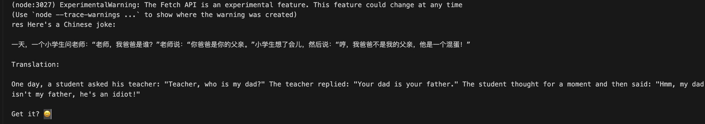
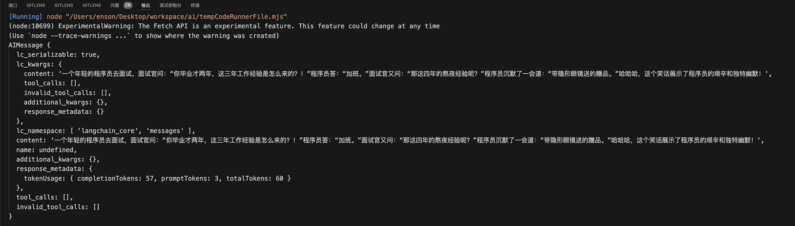

# LangChain 快速入门

## 安装

要安装这个包，你可以使用 npm 或 yarn：

```bash
yarn add langchain
```

## 安装环境

node >= 18.x

## 什么是 LCEL (LangChain Expression Language)

LangChain Expression Language is a way to create arbitrary custom chains. It is built on the [Runnable](https://v02.api.js.langchain.com/classes/langchain_core_runnables.Runnable.html) protocol.

LCEL 无论是 python 还是 js 版本都在主推的新设计，能创建自定义的链，它是基于 [Runnable](https://v02.api.js.langchain.com/classes/langchain_core_runnables.Runnable.html) 协议构建的。


## 通过 LangChain 加载大模型

### 本地大模型

在 mac 平台下，推荐用 [ollama](https://ollama.com/)，使用简单，下载好模型后，点击这个 app，就会自动在  http://localhost:11434 起一个 llm 的服务。

#### 安装 llama3 模型

可以通过 `ollama list` 查看所有的模型，然后通过 `ollama pull` 安装模型。

```bash
# 模型列表参考：https://ollama.com/library
ollama pull [model] 
```

目前下载了一个 ollama3 的模型


当我们在本地启动了一个模型后，我们就可以通过 LangChain 来调用这个模型了。

```js
import { Ollama } from '@langchain/community/llms/ollama';

const ollama = new Ollama({
  baseUrl: "http://localhost:11434", 
  model: "llama3", 
});


ollama.invoke("用中文讲一个笑话").then((res) => {
  console.log('res', res);
});

```

输出结果 👇




### 云端大模型

#### OpenAI

在调用 OpenAI 之前需要先申请一个 API Key，然后将 API Key 设置为环境变量 `OPENAI_API_KEY`。

然后通过 langchain 的 OpenAI 类来调用 OpenAI 的模型。

调用之前需要先 安装 `@langchain/openai` 包：

```bash
// 安装 openai 包
yarn add @langchain/openai
```

```js
import { OpenAI } from "@langchain/openai";

const model = new OpenAI({
  model: "gpt-3.5-turbo-instruct", // Defaults to "gpt-3.5-turbo-instruct" if no model provided.
  temperature: 0.9,
  apiKey: "YOUR-API-KEY", // In Node.js defaults to process.env.OPENAI_API_KEY
});
const res = await model.invoke(
  "What would be a good company name a company that makes colorful socks?"
);
console.log({ res });
```

#### 百度大模型

因为 OpenAI 在国内比较难访问，所以我们可以使用第三方大模型来避规访问慢的问题，这里以百度的大模型为例。

使用该嵌入模型需要 API 密钥。您可以通过 https://console.bce.baidu.com/qianfan/ais/console/applicationConsole/application 创建应用注册获取 API_KEY 和 SECRET_KEY。

请将获取的API密钥设置为名为 BAIDU_API_KEY 的环境变量，并将您的密钥设置为名为BAIDU_SECRET_KEY 的环境变量。


```js
// 您需要安装该 @langchain/community 包：
yarn add @langchain/community
```

```js
import { ChatBaiduWenxin } from "@langchain/community/chat_models/baiduwenxin";
import { HumanMessage } from "@langchain/core/messages";
import 'dotenv/config';

const ernieTurbo = new ChatBaiduWenxin({
    modelName: process.env.BAIDU_MODEL_NAME,
});

const messages = [new HumanMessage("讲一个笑话")];

const res = await ernieTurbo.invoke(messages);

console.log(res);
```




⚠️注意:
如果出现 API 调用次数有所限制，需要在 https://console.bce.baidu.com/qianfan/ais/console/onlineService 开通对应的模型服务。

## LCEL 有什么优势

LCEL 从底层设计的目标就是支持 **从原型到生产** 完整流程不需要修改任何代码，也就是我们在写的任何原型代码不需要太多的改变就能支持生产级别的各种特性（比如并行、steaming 等），具体来说会有这些优势：

- 并行: 只要是整个 chain 中有可以并行的步骤就会自动的并行，来减少使用时的延迟。
- 自动的重试和 fallback: 大部分 chain 的组成部分都有自动的重试（比如因为网络原因的失败）和回退机制，来解决很多请求的出错问题。
- 对 chain 中间结果的访问，在旧的写法中很难访问中间的结果，而 LCEL 中可以方便的通过访问中间结果来进行调试和记录。
- LCEL 会自动支持 LangSimith 进行可视化和记录。

一条 Chain 组成的每个模块都是继承自 Runnable 这个接口，而一条 Chain 也是继承自这个接口，所以一条 Chain 也可以很自然的成为另一个 Chain 的一个模块。

任意的 Runnable 对象，都有几个常用的标准调用接口:
- invoke 基础调用
- batch 批量调用
- stream 流式返回结果
- streamLog 流式返回结果，并返回中间的运行结果


# 参考文章
- https://juejin.cn/post/7359082665276440627
- https://js.langchain.com/v0.2/docs/how_to/
- https://platform.openai.com/docs/quickstart?context=node
- https://js.langchain.com/v0.2/docs/integrations/text_embedding/baidu_qianfan/
- https://js.langchain.com/v0.2/docs/integrations/chat/openai