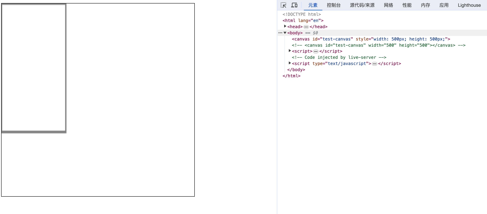
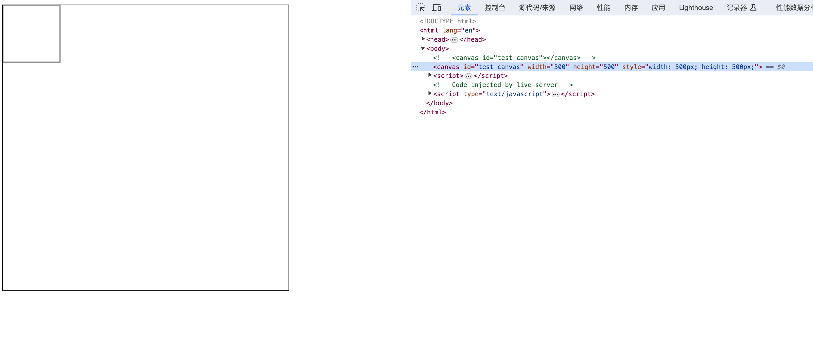
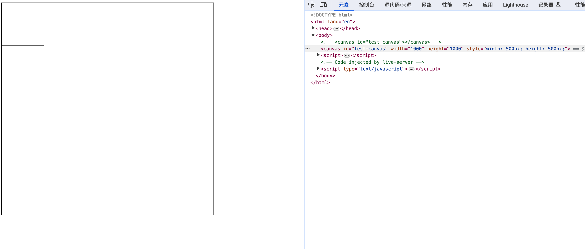

# Canvas 尺寸与分辨率矫正

## 前言
Canvas 的默认大小为 300 像素 ×150 像素（宽 × 高，像素的单位是 px）


```html
<canvas id="tutorial" width="150" height="150"></canvas>
```

canvas 看起来和 img 元素很相像，唯一的不同就是它并没有 src 和 alt 属性。实际上，canvas 标签只有两个属性**——** width和height。

## 正文
### 设置画布的 css 大小
canvas 可以使用CSS来定义大小，但在绘制时图像会伸缩以适应它的框架尺寸：如果 CSS 的尺寸与初始画布的比例不一致，它会出现扭曲。

假设一个场景，当我们给 canvas 设置了 css 的宽高 500px * 500px, 但是我们在 canvas 中绘制的图形是 100px * 100px, 那么最终的图形会被拉伸，如下图所示：
```html
<canvas id="test-canvas"></canvas>
<script>
    const canvas = document.getElementById('test-canvas');
    const ctx = canvas.getContext('2d');
    ctx.fillStyle = 'red';
    ctx.fillRect(0, 0, 100, 100);
    canvas.style.width = "500px";
    canvas.style.height = "500px";
</script>
```


因此，如果你想绘制一个 100px × 100px 的正方形，而且你的 CSS 代码中设置了 width: 500px; height: 500px;，那么最终图像将会是一个扁平的正方形。


### 设置画布的属性大小
从上面的案例我们发现，当我们设置了 canvas 的 css 大小后，canvas 会被拉伸，那么我们可以通过设置 canvas 的属性 width、height 来解决这个问题。

```html
<canvas id="test-canvas" width="500" height="500"></canvas>
<script>
    const canvas = document.getElementById('test-canvas');
    const ctx = canvas.getContext('2d');
    ctx.fillStyle = 'red';
    ctx.fillRect(0, 0, 100, 100);
    canvas.style.width = "500px";
    canvas.style.height = "500px";
</script>
```



当我们设置了 canvas 的属性 width、height 后，canvas 的大小就固定了，不会被拉伸，但是我们在 canvas 中绘制的图形是 100px * 100px, 那么最终的图形也显示正常了

`
备注： 如果你绘制出来的图像是扭曲的，尝试用 width 和 height 属性为<canvas>明确规定宽高，而不是使用 CSS。
`

### Canvas分辨率矫正
通过上面的案例，虽然我们的正方形没有变形，但是边框很模糊（图片截图可能看的不是很明显）。这是因为不同DPR下，绘制100px的图形所需要的像素不同。比如同样是100px的元素，如果在DPR为1的屏幕上，只需要100的像素，此时就很清晰。但是如果在DPR为2的屏幕上，就需要200像素，但实际上canvas绘制时，只绘制了100px。具体可以看这里。下面的代码就是用于矫正canvas的分辨率：

```html
<!DOCTYPE html>
<html lang="en">
<head>
    <meta charset="UTF-8">
    <meta name="viewport" content="width=device-width, initial-scale=1.0">
    <title>Canvas 实验</title>
    <style type="text/css">
        canvas {
            border: 1px solid black;
        }
    </style>
</head>

<body>
    <canvas id="test-canvas" width="500" height="500"></canvas>
    <script>
        const dpr = window.devicePixelRatio || 1;

        console.log(`dpr--->`, dpr);
        const canvas = document.getElementById('test-canvas');
        const ctx = canvas.getContext('2d');
        canvas.style.width = "500px";
        canvas.style.height = "500px";
        canvas.width = 500 * dpr;
        canvas.height = 500 * dpr;
        ctx.scale(dpr, dpr);
        ctx.strokeRect(0, 0, 100, 100);
    </script>
</body>
</html>
```



当我们将 canvas 的尺寸乘上像素比后，再将 canvas 的尺寸缩小到原来的 css 尺寸，这样就可以保证 canvas 1px 绘制所需要的像素一致，从而保证绘制出来的图形不会模糊。


## 参考文档
- https://developer.mozilla.org/zh-CN/docs/Web/API/Canvas_API/Tutorial
- https://developer.mozilla.org/zh-CN/docs/Web/API/Canvas_API/Tutorial/Basic_usage