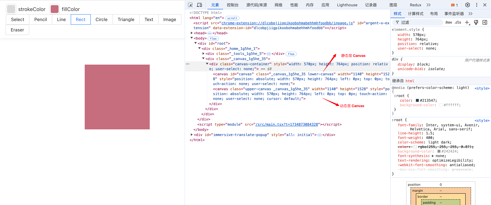
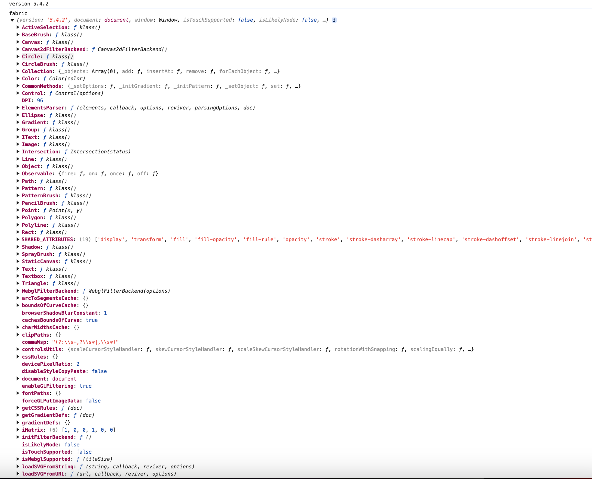
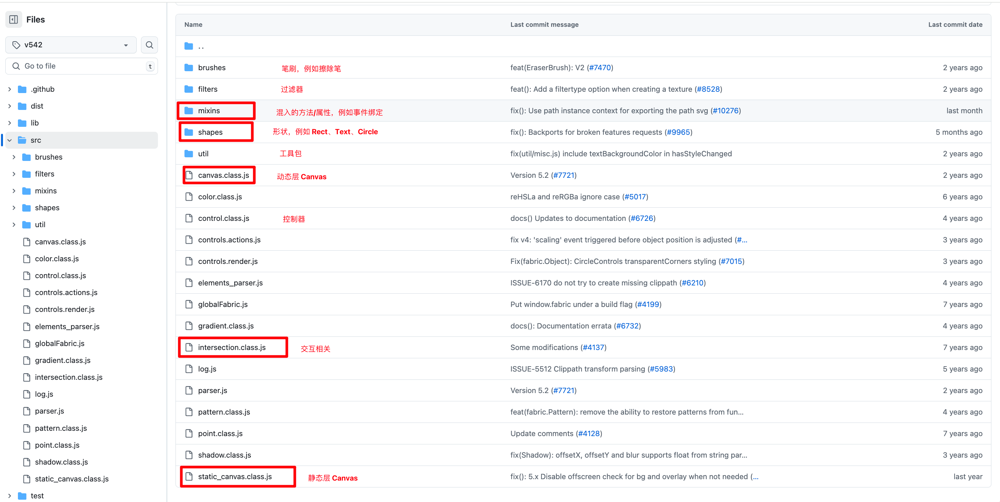

# 内部结构概述

## 使用场景上看

从使用场景上看，Fabric.js 通过对象的形式来创建图形 （源码上也充满了面向对象设计的身影）

对于使用者而言，不需要关心底层 Canvas 是如何实现的，只需要关心如何创建这些图像对象即可。

## Canvas 开发原理

Fabric 底层是通过 Canvas 进行绘制的，因此需先简单了解下 Canvas 的开发原理。

Canvas 开发的本质其实很简单，可以想象下这种少儿画板：

Canvas 的绘制其实就是在不断在画布上绘制图形，然后擦出的过程。

## Fabric.js 源码解析

### 基本原理

fabric.js 在初始化的时候会将你指定的 Canvas 元素（叫做 lowerCanvas）外面包裹上一 层 div 元素， 然后内部会插入另外一个上层的 Canvas 元素（叫做 upperCanvas），这两 个 Canvas 有如下区别

- upperCanvas 动态层Canvas，上层画布，只处理交互相关以及事件绑定
- lowerCanvas 静态层Canvas，是用来绘制图形

### 大体结构

当我们引入 fabric.js 后，再控制台打印 fabric ，可以看到如下结构：

可以看到，fabric 是一个对象，里面包含了多个属性，这些属性指向不同的模块。

Fabric的源码也是相当易读的，大部分情况下一个文件就代表一个模块，源码结构如下：

## 模块结构图

// 这里是一张设计图

## 参考
- https://keelii.com/2021/05/09/fabricjs-internals
- https://juejin.cn/post/7100846911657082893