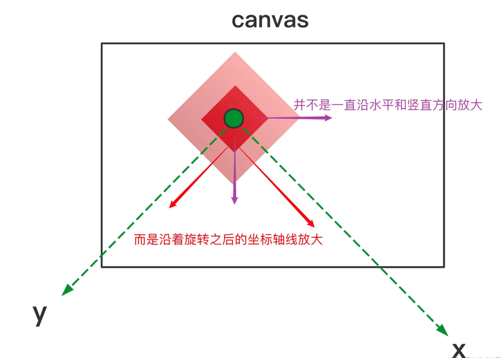
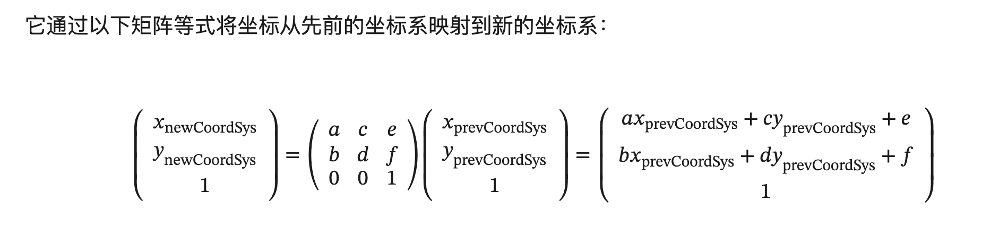
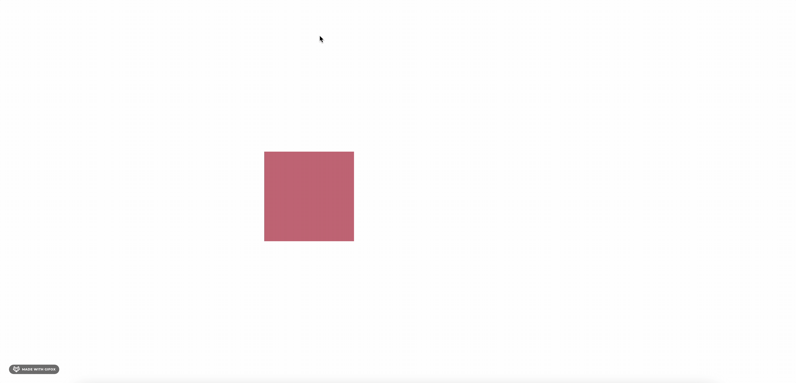

# 如何实现元素的平移、旋转、缩放

在上一节中，我们知道了元素是如何渲染到 Canvas 的画布上，这一节我们将了解如何对元素进行平移、旋转、缩放。

## 如何平移、旋转、缩放元素

在上一节我们知道，元素都继承自 fabric.Object，而 fabric.Object 的 render 方法都由各个元素实现。那么对于元素的平移、旋转、缩放，我们又需要如何抽离出通用的逻辑呢？

不妨思考一下，这个案例

`
假设要在 (100, 100) 的地方绘制一个 50*50 的矩形，并将其放大 2 倍，之后旋转 45°，该怎么画呢？
`

正常逻辑是：
1. 手动算下宽高 100 * 100
2. 手动算下旋转之后各个顶点的坐标
3. 连接四个顶点


也就是我们先手动先计算出各个转化后的坐标，通过坐标绘制出图形。

但在 Canvas 中，***要改掉这种绘制的思想，而是要通过并善用变换坐标系来绘制物体***

思路如下:
1 绘制一个 50*50 的矩形
2 转化坐标系

代码如下:
```js
ctx.save(); // 之前提到过了，你要修改 ctx 上的一些配置或者画一个物体，最好先 save 一下，这是个好习惯
ctx.translate(100, 100); // 此时原点已经变到了 (100, 100) 的地方
ctx.scale(2, 2); // 坐标系放大两倍
ctx.rotate(Util.degreesToRadians(45)); // 注意 canvas 中用的都是弧度（弧度 / 2 * Math.PI = 角度 / 360)，所以需要简单换算下
ctx.fillRect(-width/2, height/2, width, height); // 绘制矩形的方法固定不变，宽高一般也不会去修改
ctx.restore(); // 画完之后还原 ctx 状态，这是个好习惯
```




***尽量不去改变物体的宽高和大小，而是通过各种变换来达到所需要的效果***


## 矩阵运算

在 Fabric.js 中，并不是通过 translate、scale、rotate 这些方法来实现元素的平移、旋转、缩放，而是通过矩阵运算来实现。

通过 transform api 做矩阵变化，参数 是一个数组，里面有6个元素，默认值是 [1, 0, 0, 1, 0, 0]。

```js
[0]: 水平缩放（x轴方向）
[1]: 水平倾斜（x轴方向）
[2]: 垂直倾斜（y轴方向）
[3]: 垂直缩放（y轴方向）
[4]: 水平移动（x轴方向）
[5]: 垂直移动（y轴方向
```
1 修改 viewportTransform[0]、viewportTransform[3] 达到缩放横纵坐标的值
2 修改 viewportTransform[4]、viewportTransform[5] 达到平移画布的效果





对于上面这个例子，我们只需要修改 viewportTransform 的值，然后重新渲染画布就好了。

```js

const width = 50;
const height = 50;
const angle = (45 / 180) * Math.PI; // Math.PI / 4
ctx.save();
ctx.transform( // 旋转
  2 * Math.cos(angle),
  Math.sin(angle),
  -Math.sin(angle),
  2 * Math.cos(angle),
  100,
  100,
);
ctx.fillRect(-width/2, height/2, width, height); // 绘制矩形的方法固定不变，宽高一般也不会去修改
ctx.restore();
```


同样的，在 fabric.js 中，在 render 方法中，会调用 transform 方法，将 viewportTransform 的值设置为 transform 的值，以达到对元素进行平移、旋转、缩放的效果。

## 如何实现漫游

通过监听滚轮事件，然后修改 viewportTransform 的值，以达到对画布进行平移的效果。

```js
canvas.on("mouse:wheel", function (opt) {
   onsole.log("opt", opt);
   const deltaY = opt.e.deltaY;
   const deltaX = opt.e.deltaX;
   zoom *= 0.999 ** deltaY;
   if (zoom > 20) zoom = 20;
   if (zoom < 0.01) zoom = 0.01;
   const vpt = this.viewportTransform;
   console.log("vpt", vpt);
   vpt[0] = zoom; // 在 X 轴方向上的偏移量。
   vpt[3] = zoom; // 在 Y 轴方向上的偏移量。
   vpt[4] += deltaX; // 俩个点的位置差
   vpt[5] += deltaY; // 俩个点的位置差
   this.requestRenderAll();
   this.setViewportTransform(this.viewportTransform);

   // let zoom = canvas.getZoom();
   // zoom *= 0.999 ** delta;
   // if (zoom > 20) zoom = 20;
   // if (zoom < 0.01) zoom = 0.01;
   // canvas.zoomToPoint({ x: opt.e.offsetX, y: opt.e.offsetY }, zoom);
   opt.e.preventDefault();
   opt.e.stopPropagation();
});

```


演示效果👇:




演示地址: https://enson0131.github.io/mini-fabric-whiteboard/


## 仓库案例

https://github.com/enson0131/mini-fabric-whiteboard/blob/master/mini-fabric/src/fabric/FabricObject.ts#L212


## 参考文档
- https://medium.com/@sagarmohanty2k00/creating-a-digital-whiteboard-element-with-react-js-d4924ee2c58e
- https://fabricjs.com/docs/old-docs/fabric-intro-part-5/
- https://juejin.cn/post/7106023188831666206
- https://juejin.cn/post/7142664492122374158?from=search-suggest
- https://developer.mozilla.org/zh-CN/docs/Web/SVG/Attribute/transform#matrix