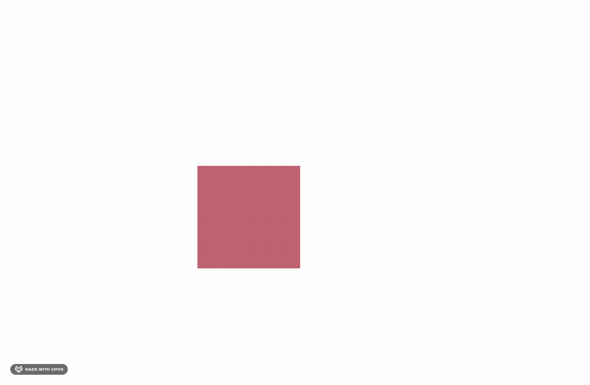
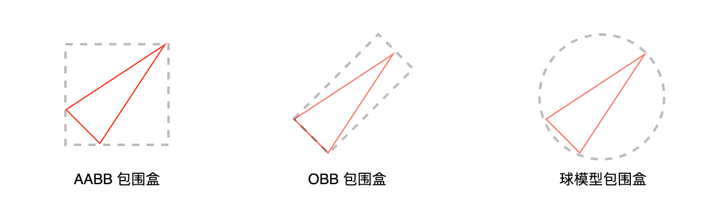
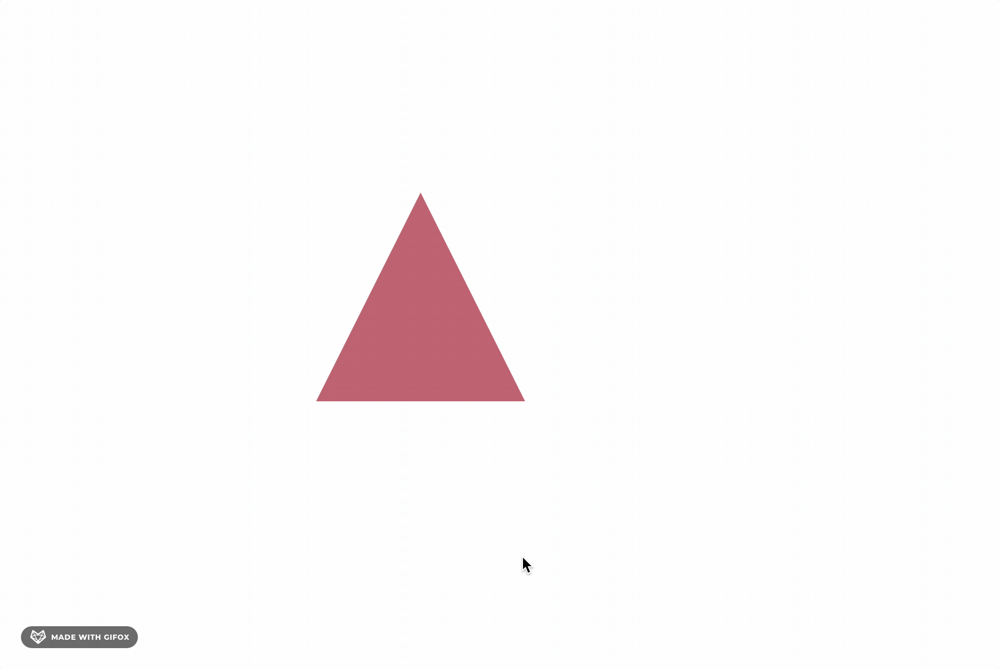
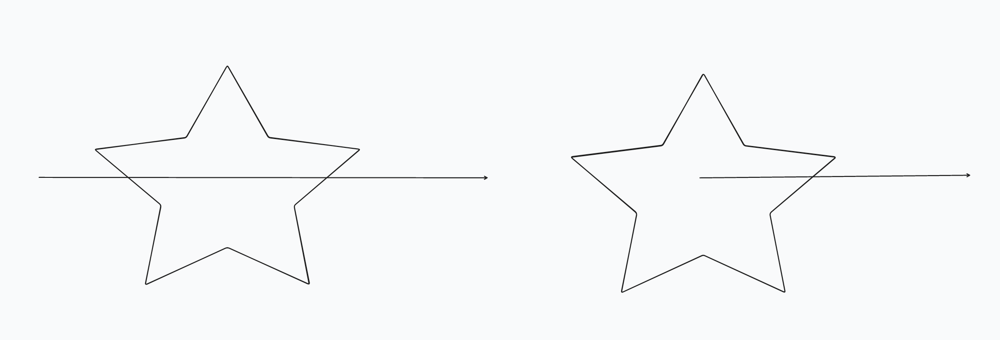
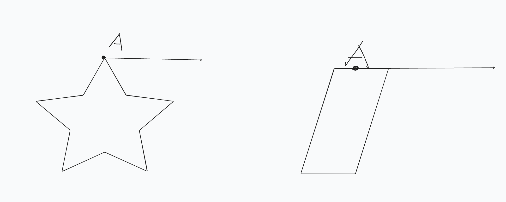

# 如何实现点选物体

上一节，我们了解了在 Fabric.js 中，可以通过 `transform` 进行矩阵运算，从而达到平移、旋转、缩放的目的。

接下来我们将了解如何对一个物体进行点选，在 Fabric.js 的表现即鼠标移动到元素上，呈现hover状态，移出则显示默认状态。

## 判断是否在矩形内部

如果对于矩形元素来说, 我们可以获取到四个顶点的坐标，进而判断当前的鼠标坐标是否在顶点坐标之内即可。

例如矩形的左上角顶点坐标是 left、top

那么我们只需要判断 `left <= x <= left + width && top <= y <= top + height` 即可。

基于此，在 Fabric.js 静态层 Canvas 会有一个  `_objects` 数组，存储了所有图形的数据，

此时可以通过从后往前遍历（因为最后添加元素位于数组最后）判断鼠标点是否在元素上。

## 包围盒

对于其他图形，例如三角形等，可以引入包围盒的概念，将其他图形转化为矩形进行判断。

常见的有 OBB、AABB、球模型包围盒

| **类型**              | **特点**                           | **优点**                     | **缺点**                     | **应用场景**                     |
|-----------------------|------------------------------------|-----------------------------|-----------------------------|---------------------------------|
| **AABB（轴对齐包围盒）** | 边与坐标轴对齐，由最小点和最大点定义 | 计算简单，存储效率高           | 对旋转物体可能不紧凑，浪费空间   | 静态场景筛选，粗略碰撞检测         |
| **OBB（方向包围盒）**   | 可任意旋转，由中心点、尺寸向量和旋转矩阵描述 | 更紧凑地包围旋转物体             | 计算复杂度高                 | 精确碰撞检测，动态物体包围         |
| **球模型包围盒**    | 以中心点和半径定义                 | 旋转无影响，检测简单             | 对非球状物体浪费较多空间         | 初步碰撞检测，三维场景快速筛选     |

我们不难发现，在 Fabric.js 中也是通过 AABB 包围盒进行点选物体的。

演示地址: https://enson0131.github.io/mini-fabric-whiteboard/

## 点射法

对于矩形，我们可以很方便地计算出点是否在矩形内，在不借助包围盒的情况下，是否可以判断点在多边形内呢？

显然是可以的，常见的算法是 `点射法`，这种方法的核心思想是通过从待测点发射一条射线（通常是直线或半直线），然后统计射线与几何区域的边或面相交的次数。

1. 如果射线与边/面的交点数是奇数，点在多边形内部。
   
2. 如果交点数是偶数，点在多边形外部。

大致可以在脑海里想象下👇

应该有不少同学已经想象到一些边界场景：

1. 点在图形的顶点上

2. 点的射线穿过图形的一条边

## 点在多边形内的其他方法

1. 用 canvas 自身的 api isPointInPath

2. 将多边形切割成多个三角形，然后判断点是否在某个三角形内部

3. 转角累加法（点连接各个顶点，计算夹角是否等于 360）

4. 面积法 （点连接各个顶点形成三角形，计算面积是否等于图形的面积等）

## 优化
1 记录最近的这个物体，下次再次判断这个物体。
2 判断是否是透明区域

## 参考

- https://developer.mozilla.org/zh-CN/docs/Games/Techniques/3D_collision_detection
- https://kenshin.tech/page/2/