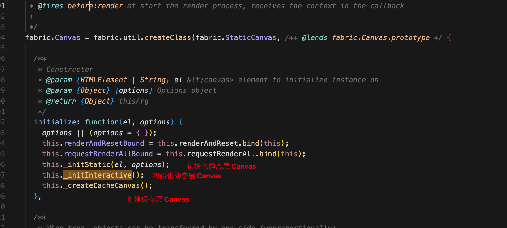
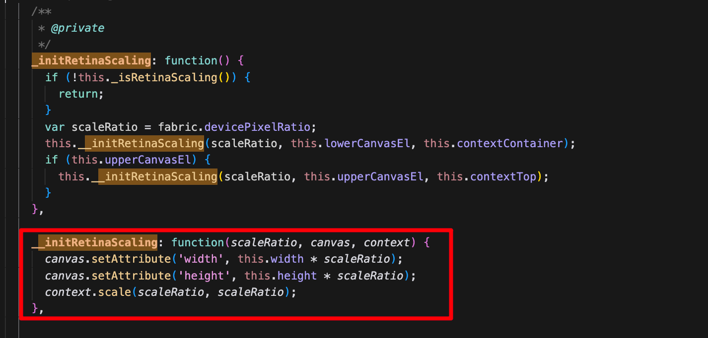
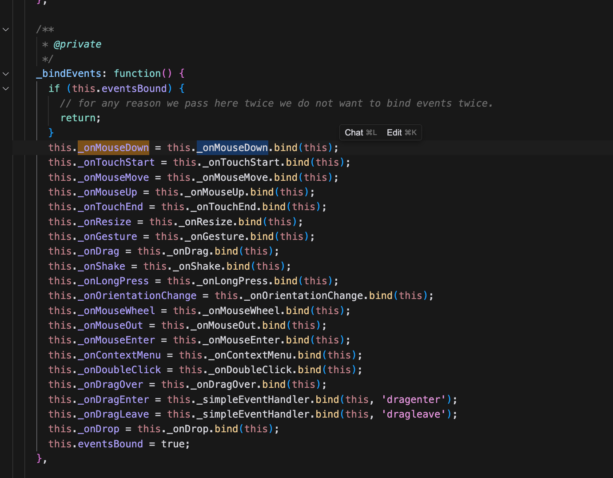
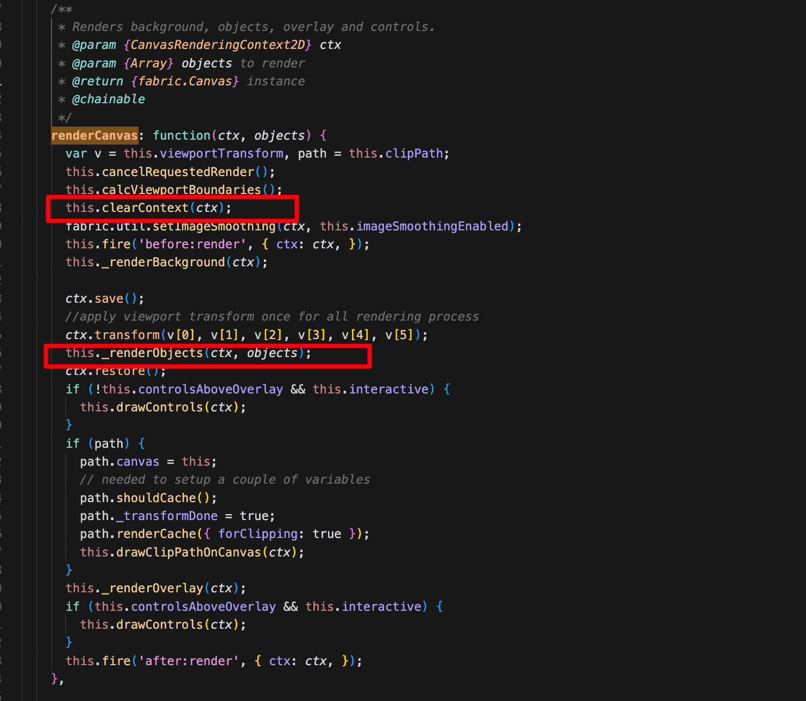
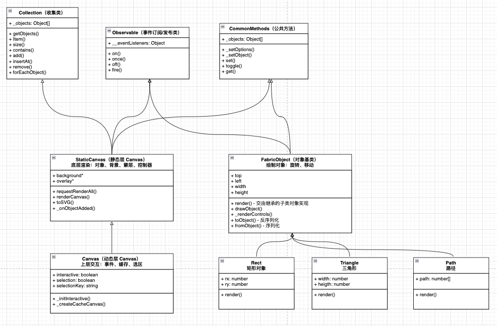

# 如何绘制一个图形

上一节中，大致了解了 Fabric 的内部结构，并且知道 Fabric.js 拥有俩层 Canvas。

上层 Canvas 称之为动态层，用于处理交互相关以及事件绑定

下层 Canvas 称之为静态层，用于获取数据，通过数据绘制图形

之前有编写过 React 的同学应该对父子组件的单向数据流有一定的印象，而 Fabric.js 的分层结构设计就很类似于这种单向数据流思想，

动态层用于获取数据输出到静态层进行渲染。

在这一节中，我们将以绘制矩形为例，了解 Fabric.js 是如何实现矩形的绘制的？

## Fabric.js 是如何绘制矩形的

在 Fabric.js 中绘制矩形也非常简单，只需要初始化画布，添加矩形对象即可，代码如下👇:

```html
<!-- html -->
<canvas id="canvas"></canvas>
```

```js
// js
const canvas = new fabric.Canvas('canvas');
canvas.setWidth(window.innerWidth);
canvas.setHeight(window.innerHeight);


const rect = new fabric.Rect({
    left: 0, //距离左边的距离
    top: 0, //距离上边的距离
    fill: "red", //填充的颜色
    width: 200, //矩形宽度
    height: 200, //矩形高度
});

canvas.add(rect);
```

通过代码可以看到，Fabric.js 通过实例化对象的方式将 Canvas 的绘制逻辑进行的隐藏，使用者只需要关心传入对应的参数即可在 Canvas 中绘制出相对应的元素。


## 初始化画布

在源码中， new Fabric.Canvas 会初始化动态层、静态层以及缓冲层 Canvas。



进而对 Canvas 进行分辨率矫正的操作，为何需要做分辨率矫正，可以通过这篇文章 [Canvas 尺寸与分辨率矫正](https://enson0131.github.io/vitePress-blob/guide/canvas/Canvas%E5%B0%BA%E5%AF%B8%E5%8F%8A%E5%88%86%E8%BE%A8%E7%8E%87%E7%9F%AB%E6%AD%A3) 查看 



动态层 Canvas 还会做事件绑定的逻辑操作👇



而静态层 Canvas 将控制渲染 👇

```js
fabric.StaticCanvas = fabric.util.createClass(fabric.CommonMethods, {
    initialize: function (el, options) {
        options || (options = {});
        this.renderAndResetBound = this.renderAndReset.bind(this);
        this.requestRenderAllBound = this.requestRenderAll.bind(this);
        this._initStatic(el, options);
    },
})
```

这里面最主要的逻辑就是 `requestRenderAll`, 这个方法就会调用 `renderCanvas` 的方法



在 _renderObjects 中将遍历所有的元素，进行渲染。

```js
_renderObjects: function(ctx, objects) {
    var i, len;
    for (i = 0, len = objects.length; i < len; ++i) {
    objects[i] && objects[i].render(ctx);
    }
}
```

## 实例化对象

虽然我们已经明白了 canvas 的绘制原理，但是一个对象（2d元素）到底是怎么绘制到 canvas 上去的，它们的移动怎么实现的？具体细节我们还不是很清楚。 


fabric.Object 是元素的根类型，因此需要从 fabric.Object 根类型看起了。

由于 fabric 中的 2d 元素都是以面向对象的形式实现的, 而 Rect （矩形类） 继承 fabric.Object，实现了自己的 render 方法，

我们将通过一张 UML 类图更直观的方便我们的理解。




从图中可以看出各个元素类将实现自己的 render 方法，通过调用 render 方法，将各自图形绘制到 Canvas 中。

而在执行 canvas.add 的时候，会将元素对象 push 到一个数据数组内，进行遍历渲染。

## 参考
- https://juejin.cn/post/7103457175413981191
- https://keelii.com/2021/05/09/fabricjs-internals