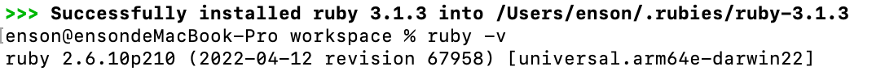

# 如何调试 Fabric.js

为了更好的学习 Fabric.js 的源码，我们需要了解如何调试 Fabric.js。


## 第一步：下载源码

首先，我们需要下载 Fabric.js 的源码。Fabric.js 的源码托管在 [GitHub](https://github.com/fabricjs/fabricjs.com) 上，我们可以通过 `git clone` 命令将源码下载到本地。

```bash
git clone https://github.com/fabricjs/fabricjs.com.git
```

## 第二步：安装依赖

Fabric.js 使用 Jekyll 来提供页面服务，因此我们需要安装 [Jekyll](https://jekyllrb.com/docs/installation/#install-with-rubygems)。

Jekyll 提供了多种安装方式，在下将以 macOS 为例

Step 1: Install Homebrew

```bash
/bin/bash -c "$(curl -fsSL https://raw.githubusercontent.com/Homebrew/install/HEAD/install.sh)"
```

Step 2: Install chruby and the latest Ruby with ruby-install

```bash
brew install chruby ruby-install xz
```

Step 3: Install Ruby

```bash
ruby-install ruby 3.1.3
```

Step 4: 检查 ruby 是否安装成功

```bash
ruby -v
```

它应该显示 ruby​​ 3.1.3p185（2022-11-24 修订版 1a6b16756e）或更新版本。


Step 5: 安装 Jekyll

```bash
gem install jekyll
```

Step 6: 运行环境
安装完成后，在项目仓库根目录中运行命令 `jekyll serve` 即可.在此命令的控制台输出中，您将看到 Server address: <base_url> ，在浏览器中访问此 base_url ，您将看到 fabricjs.com 上的内容以及本地更改应用。


