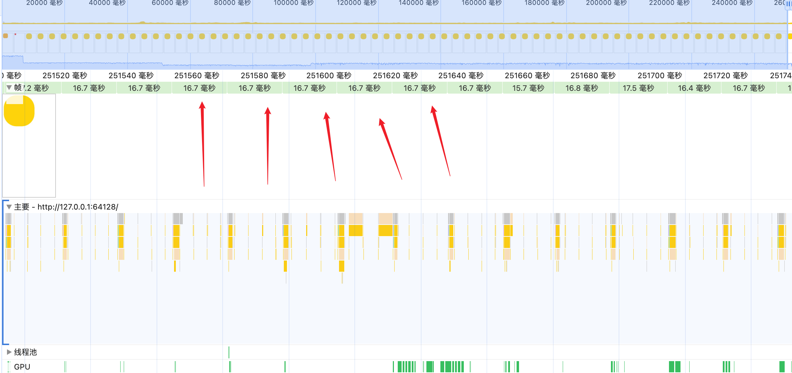
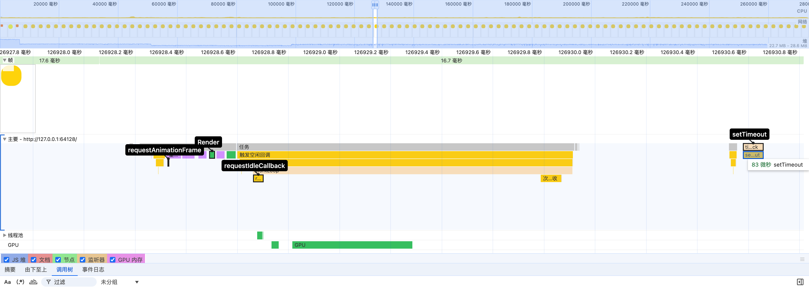
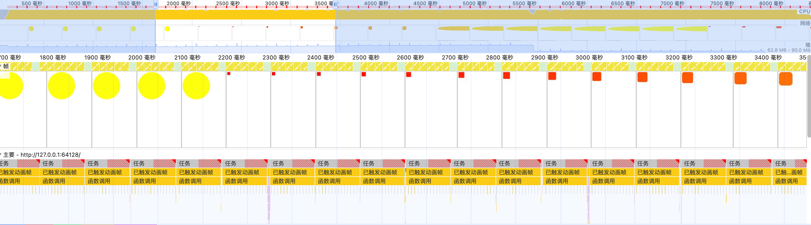
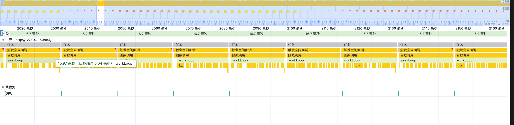
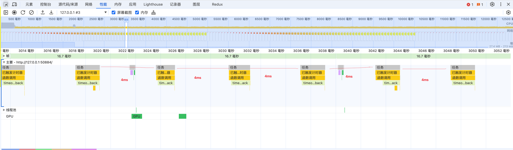
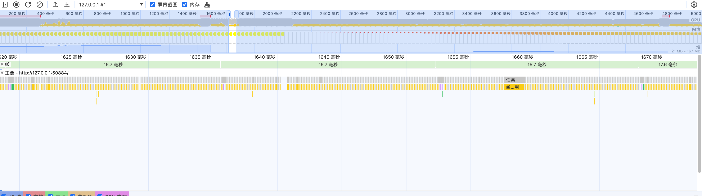
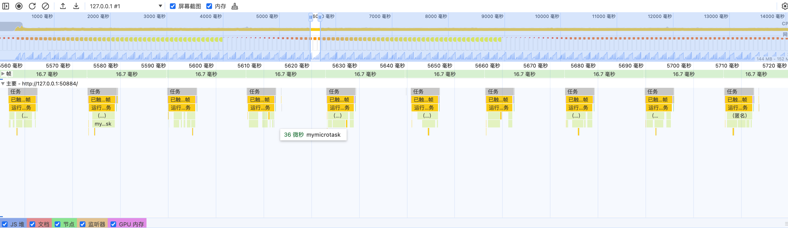

# [React Scheduler] Essential Knowledge for Scheduling API

## Introduction

This article summarizes key points about Scheduling API (e.g., requestAnimationFrame, requestIdleCallback, setTimeout, MessageChannel, microTask ( Promise, MutationObserver )). 

## Screen Refresh Rate

The screen refresh rate is the number of times the screen is updated per second. The screen refresh rate is usually 60Hz, which means the screen is updated 60 times per second.

In The browser, it will try to match the screen refresh rate with the frame rate of the web page.

If the frame rate is higher than 60HZ, the browser will skip some frames.

If the frame rate is lower than the screen refresh rate, the browser will render the same frame multiple times, which will cause the screen to block.

The budgeted time what is rendering per frame is 16.66 ms (1 second /60), so when writing code, be careful to take lower than 16ms of work per frame. Within each frame, the browser does the following:

1. Execute Macro Task、Micro Task、Event Handler and so on.
2. Execute requestAnimationFrame.
3. Update Render Tree
4. Execute requestIdleCallback if there is time left.

```html
<!DOCTYPE html>
<html lang="en">
  <head>
    <meta charset="utf-8" />
    <title>Frame</title>
    <meta
      name="viewport"
      content="width=device-width, initial-scale=1, minimum-scale=1, maximum-scale=1"
    />
    <style>
      #animation {
        width: 30px;
        height: 30px;
        background: red;
        animation: myfirst 5s infinite;
      }
      @keyframes myfirst {
        from {
          width: 30px;
          height: 30px;
          border-radius: 0;
          background: red;
        }
        to {
          width: 300px;
          height: 300px;
          border-radius: 50%;
          background: yellow;
        }
      }
    </style>
  </head>
  <body>
    <div id="animation">test</div>
  </body>
  <script>
    function rafCallback(timestamp) {
      window.requestAnimationFrame(rafCallback);
    }
    window.requestAnimationFrame(rafCallback);

    function timeoutCallback() {
      setTimeout(timeoutCallback, 0);
    }
    setTimeout(timeoutCallback, 0);

    const timeout = 1000;
    requestIdleCallback(workLoop, { timeout });
    function workLoop(deadline) {
      requestIdleCallback(workLoop, { timeout });
      const start = new Date().getTime();
      while (new Date().getTime() - start < 2) {}
    }
  </script>
</html>

```

By performace, we can see that the Frame is called every 16.66ms.



In 16.66ms, the browser will execute the following tasks:
- Execute requestAnimationFrame.
- Update Render Tree
- Execute requestIdleCallback
- Execute setTimeout




## requestAnimationFrame

`requestAnimationFrame` is a browser API that will to be executed before the next repaint.

it cause not browser to block in recursion. 

For example, after each raf callback is executed, the js engine returns control to the browser and waits until the next frame.

```js
function rafCallback(timestamp) {
  const start = new Date().getTime();
  while (new Date().getTime() - start < 2) {}
  window.requestAnimationFrame(rafCallback);
}
window.requestAnimationFrame(rafCallback);
```


But if you modify code like this in the above code, the browser will block.

```js
function rafCallback(timestamp) {
  const start = new Date().getTime();
  while (new Date().getTime() - start < 100) {} // change 2 to 100
  window.requestAnimationFrame(rafCallback);
}
window.requestAnimationFrame(rafCallback);
```



In the above example, the browser will block because the while loop takes more than 16.66ms to execute.

## requestIdleCallback

`requestIdleCallback` is a browser API that will be executed when the browser is idle.

use `deadline.timeRemaining() > 0 || deadline.didTimeout` to check if the browser is idle.

you can modify the code like this:

```js
const timeout = 1000;
requestIdleCallback(workLoop, { timeout });
function workLoop(deadline) {
  while (deadline.timeRemaining() > 0 || deadline.didTimeout) {}
  requestIdleCallback(workLoop, { timeout });
}
```



In the above example, tasks is squeezed completely in 16.66ms. （like you at work 😄）

## setTimeout

`setTimeout` is a Macro Task, it will be executed after the specified time.

We modify the code like this:

```js
function work() {
  const start = new Date().getTime();
  while (new Date().getTime() - start < 2) {}
  setTimeout(work, 0);
}
setTimeout(work, 0);
```



In the above example, it cause not browser to block in recursion. 

In addition, the setTimeout will be executed for at least 4ms.

## MessageChannel

Like setTimeout, `MessageChannel` is a Macro Task.

We can modify the code like this:

```js
var channel = new MessageChannel();
var port1 = channel.port1;
var port2 = channel.port2;
port1.onmessage = work;
function work() {
  port2.postMessage(null);
}
port2.postMessage(null);
```



In the above example, it cause not browser to block in recursion.

In addition, MessageChannel is executed more times than setTimeout in the same time.


## MicroTask ( Promise, MutationObserver )

`MicroTask` is a short function which is executed after the function or program which created it exits and only if the JavaScript execution stack is empty, but before returning control to the event loop being used by the user agent to drive the script's execution environment. 

`Promise` and `MutationObserver` are MicroTask.

We can modify the code like this:

```js
let count = 0;
function mymicrotask() {
  Promise.resolve(1).then((res) => {
    count++;
    if (count < 100000) {
      mymicrotask();
    }
  });
}
function rafCallback(timestamp) {
  mymicrotask();
  count = 0;
  window.requestAnimationFrame(rafCallback);
}
window.requestAnimationFrame(rafCallback);
```



In the above example, MicroTask is finished before the next frame.

if we modify the code like this:

```js
let count = 0;
function mymicrotask() {
  Promise.resolve(1).then((res) => {
      mymicrotask();
  });
}
function rafCallback(timestamp) {
  mymicrotask();
  count = 0;
  window.requestAnimationFrame(rafCallback);
}
window.requestAnimationFrame(rafCallback);
```

In the above example, the browser will block because control is returned to the browser only after the microtask is executed.


## Summarize

`requestAnimationFrame`、`requestIdleCallback`、`setTimeout`、`MessageChannel` can used to schedule tasks in the browser, becaus they are returning control to the browser after the task is executed.

However, `Microtasks` are continuously executed until the microtask queue on the event loop is empty which means a higher-pri task such as one for user interaction would be blocked by React.

## QA

### Why is requestAnimationFrame unsuitable for React Sheduler?

- Instability: requestAnimationFrame is executed before the next repaint, which means unexpected behavior in lower frame rates. However, others posts a message event and performs a small amount of work (5ms) before returning control to the browser. At the end of the event, if there's work left over, it posts another message event.
  
- Not trigger: requestAnimationFrame calls are paused in most browsers when running in background tabs or hidden iframes, in order to improve performance and battery life.

### Why is webwork unsuitable for React Sheduler?

Browser layout is currently only available from the main thread.

### 

## Reference
- [React Sheduler](https://github.com/lizuncong/mini-react/blob/master/docs/schedule/%E5%93%AA%E4%BA%9BAPI%E9%80%82%E5%90%88%E7%94%A8%E4%BA%8E%E4%BB%BB%E5%8A%A1%E8%B0%83%E5%BA%A6.md)
- [requestAnimationFrame](https://developer.mozilla.org/zh-CN/docs/Web/API/Window/requestAnimationFrame)
- [requestIdleCallback](https://developer.mozilla.org/zh-CN/docs/Web/API/Window/requestIdleCallback)
- [setTimeout](https://developer.mozilla.org/zh-CN/docs/Web/API/WindowOrWorkerGlobalScope/setTimeout)
- [MessageChannel](https://developer.mozilla.org/zh-CN/docs/Web/API/MessageChannel)
- [MutationObserver](https://developer.mozilla.org/zh-CN/docs/Web/API/MutationObserver)
- [React Issue](https://github.com/facebook/react/pull/16214)
- [React Issue](https://github.com/facebook/react/issues/3092)


The demo corresponding to this section can be found [here](https://github.com/enson0131/mini-react/commit/82e916799703c097a96e88ca8765f4b392e6a1b5).


