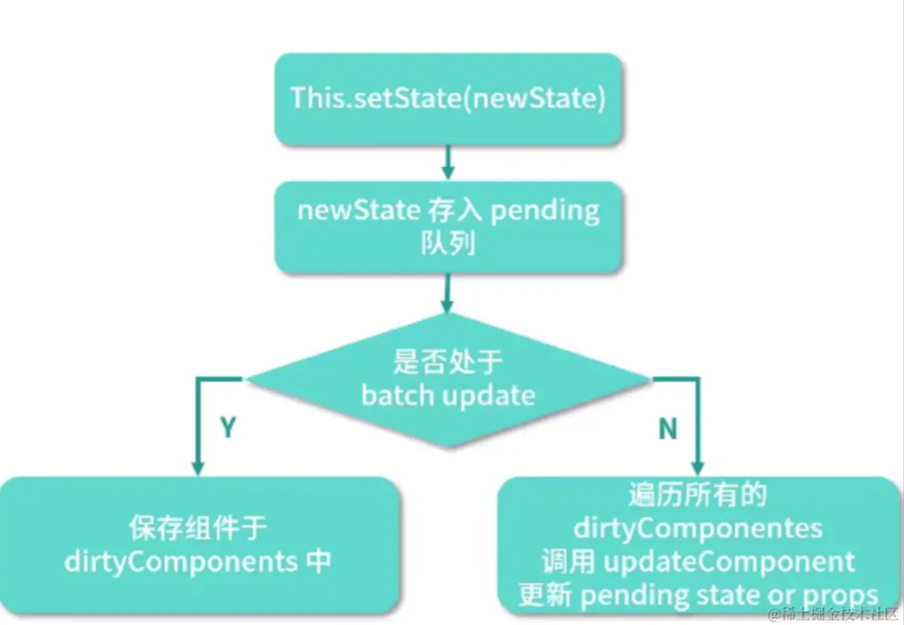

# setState 是同步还是异步的？- React18的版本

## 案例代码1
```jsx
import { Component } from "react";

export default class Test extends Component {
  state = {
    count: 0
  };

  componentDidMount() {
    this.setState(
      {
        count: 1
      },
      () => {
        console.log(`this.state.count1`, this.state.count); // 1
      }
    );
    console.log(`this.state.count0`, this.state.count); // 0
  }

  render() {
    {/* 页面显示 1 */}
    return <div>count: {this.state.count}</div>;
  }
}
```

最终将输出
```
this.state.count0 0
this.state.count1 1
```

通过这个案例我们发现 setState 是异步的

## 案例代码2
```jsx
import { Component } from "react";

export default class Test extends Component {
  state = {
    count: 0
  };

  componentDidMount() {
    this.setState(
      {
        count: this.state.count + 1
      },
      () => {
        console.log(`this.state.count0`, this.state.count); // 1
      }
    );

    this.setState(
      {
        count: this.state.count + 1
      },
      () => {
        console.log(`this.state.count1`, this.state.count); // 1
      }
    );
  }

  render() {
    {/* 页面显示 1 */}
    return <div>count: {this.state.count}</div>;
  }
}

```

最终将输出
```
this.state.count0 1
this.state.count1 1
```

### 案例代码3
```jsx
import { Component } from "react";

export default class Test extends Component {
  state = {
    count: 0
  };

  componentDidMount() {
    this.setState(
      (preState) => ({
        count: preState.count + 1
      }),
      () => {
        console.log(`this.state.count0`, this.state.count); // 2
      }
    );

    this.setState(
      (preState) => ({
        count: preState.count + 1
      }),
      () => {
        console.log(`this.state.count1`, this.state.count); // 2
      }
    );
  }

  render() {
    {/* 页面显示 2 */}
    return <div>count: {this.state.count}</div>;
  }
}

```

最终将输出
```
this.state.count0 2
this.state.count1 2
```

### 案例代码4
```jsx
import { Component } from "react";

export default class Test extends Component {
  state = {
    count: 0
  };

  componentDidMount() {
    this.setState({
      count: this.state.count + 1
    });
    console.log(`【案例4】this.state.count0`, this.state.count);
    setTimeout(() => {
      this.setState({
        count: this.state.count + 1
      });
      console.log(`【案例4】this.state.count1`, this.state.count);
    }, 0);
  }

  render() {
    {
      /** 页面显示2 */
    }
    return <div>count: {this.state.count}</div>;
  }
}
```


## 总结
### React 18 版本
在 React 18 版本所有的 setState 都是异步批量操作

异步批量操作的原因是为了提高性能，减少重复渲染
还有一个好处就是保持数据一致性，如果是同步更新的话，可能会出现数据不一致的情况（比如 state 更新了，但是 Fiber 还没有更新）
还有一个好处就是 setState 异步更新可以平滑地过渡新老页面

### React 18以前的版本



setState 同步还是异步取决于是否处于 batchUpdate 阶段，处于的话就是异步，否则就是同步

在原生事件、setTimeout、setInterval 中属于同步更新的场景


## 参考资料
- https://github.com/facebook/react/issues/11527#