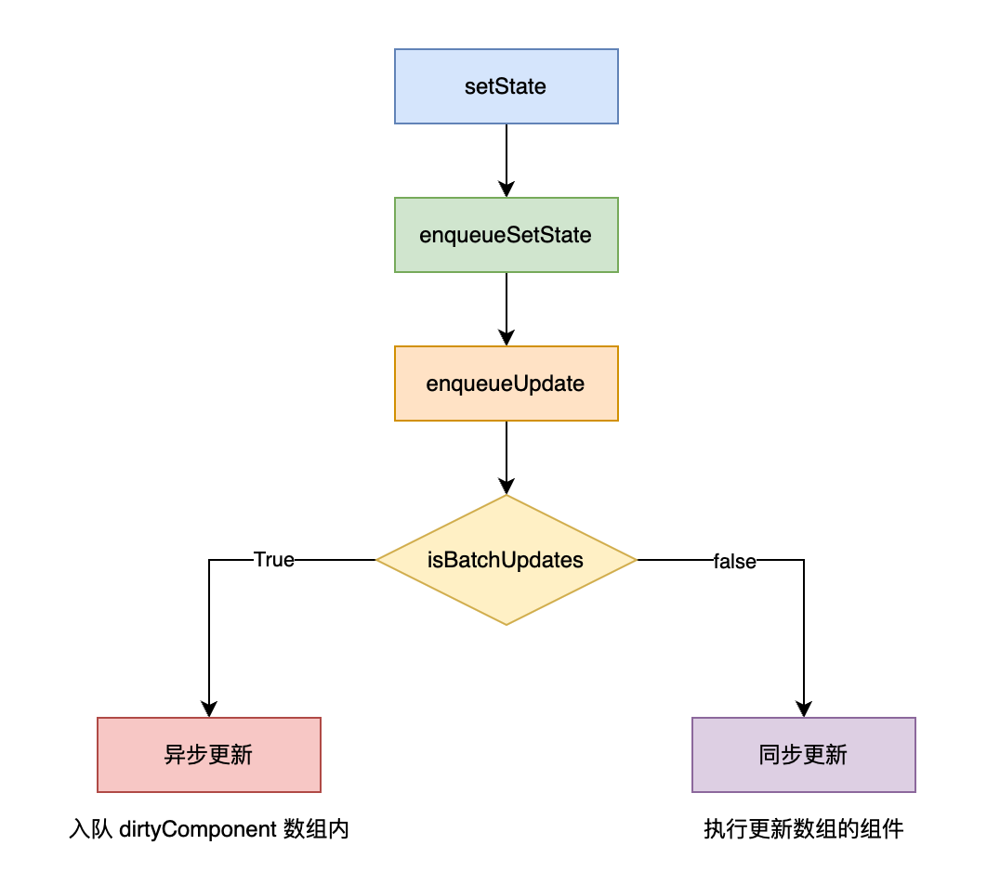

# setState 是同步还是异步的？

## 概要
setState 用于状态变更，触发组件的重新渲染，更新视图。

在 React 18 以前，setState 同步还是异步取决于是否处于 isBatchUpdates 字段，true 的话就是异步，否则就是同步

在 React 18 版本所有的 setState 都是异步批量操作



```js
// React 15
function enqueueUpdate (component) {
  // isBatchingUpdates 判断当前是否处理批量更新操作
  if (!batchingStrategy.isBatchingUpdates) { // 锁管理器
    // 更新组件
    batchingStrategy.batchedUpdates(enqueueUpdate, component);
    return;
  }

  // 将组件添加到 dirtyComponents 数组中，等待更新
  dirtyComponents.push(component);
}

// 锁管理器
var ReactDefaultBatchingStrategy = {
  // 全局唯一锁标识
  isBatchingUpdates: false,

  // 发起更新动作的方法
  batchedUpdates: function (callback, a, b, c, d, c) {
    // 获取当前的锁的状态
    var alreadyBatchingUpdates = ReactDefaultBatchingStrategy.isBatchingUpdates;

    // 把锁锁上 true
    ReactDefaultBatchingStrategy.isBatchingUpdates = true;

    if (alreadyBatchingStrategy) {
      callback(a, b, c, d, e);
    } else {
      // 开启事务，将 callback 放入事务里面执行
      transaction.perform(callback, null, a, b, c, d, e);
    }
  }
}

```

在 React 18 版本所有的 setState 都是异步批量操作

### React 18 版本
在 React 18 版本所有的 setState 都是异步批量操作

异步批量操作的原因是为了提高性能，减少重复渲染 (减少 re-render 次数)
还有一个好处就是保持内部数据一致性，如果是同步更新的话，可能会出现数据不一致的情况（比如 state 更新了，但是还没有执行 render 方法，可能导致 state 和 作为其他组件的props 数据不一致的情况）

### React 18以前的版本

setState 同步还是异步取决于是否处于 isBatchUpdates 字段，true 的话就是异步，否则就是同步

在`原生事件`、`setTimeout`、`setInterval` 中属于同步更新的场景，因为它们逃脱了 React 的控制，React 无法知道这些事件什么时候触发，所以只能同步更新

## 案例代码 - React18的版本
### 案例代码1
```jsx
import { Component } from "react";

export default class Test extends Component {
  state = {
    count: 0
  };

  componentDidMount() {
    this.setState(
      {
        count: 1
      },
      () => {
        console.log(`this.state.count1`, this.state.count); // 1
      }
    );
    console.log(`this.state.count0`, this.state.count); // 0
  }

  render() {
    {/* 页面显示 1 */}
    return <div>count: {this.state.count}</div>;
  }
}
```

最终将输出
```
this.state.count0 0
this.state.count1 1
```

通过这个案例我们发现 setState 是异步的

### 案例代码2
```jsx
import { Component } from "react";

export default class Test extends Component {
  state = {
    count: 0
  };

  componentDidMount() {
    this.setState(
      {
        count: this.state.count + 1
      },
      () => {
        console.log(`this.state.count0`, this.state.count); // 1
      }
    );

    this.setState(
      {
        count: this.state.count + 1
      },
      () => {
        console.log(`this.state.count1`, this.state.count); // 1
      }
    );
  }

  render() {
    {/* 页面显示 1 */}
    return <div>count: {this.state.count}</div>;
  }
}

```

最终将输出
```
this.state.count0 1
this.state.count1 1
```

### 案例代码3
```jsx
import { Component } from "react";

export default class Test extends Component {
  state = {
    count: 0
  };

  componentDidMount() {
    this.setState(
      (preState) => ({
        count: preState.count + 1
      }),
      () => {
        console.log(`this.state.count0`, this.state.count); // 2
      }
    );

    this.setState(
      (preState) => ({
        count: preState.count + 1
      }),
      () => {
        console.log(`this.state.count1`, this.state.count); // 2
      }
    );
  }

  render() {
    {/* 页面显示 2 */}
    return <div>count: {this.state.count}</div>;
  }
}

```

最终将输出
```
this.state.count0 2
this.state.count1 2
```

### 案例代码4
```jsx
import { Component } from "react";

export default class Test extends Component {
  state = {
    count: 0
  };

  componentDidMount() {
    this.setState({
      count: this.state.count + 1
    });
    console.log(`【案例4】this.state.count0`, this.state.count);
    setTimeout(() => {
      this.setState({
        count: this.state.count + 1
      });
      console.log(`【案例4】this.state.count1`, this.state.count);
    }, 0);
  }

  render() {
    {
      /** 页面显示2 */
    }
    return <div>count: {this.state.count}</div>;
  }
}
```

最终将输出
```
this.state.count0 0
this.state.count1 1
```

## 参考资料
- https://github.com/facebook/react/issues/11527#