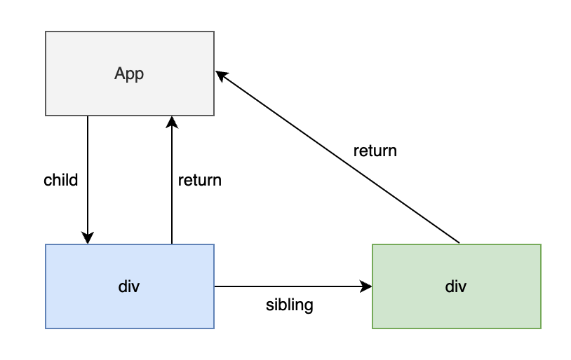

# 什么是 Fiber

## Fiber 是什么
- 从计算机领域来看: Fiber 是比线程还要纤细的一个过程, 也就是所谓的 “纤程”

- 从架构角度上看: Fiber是对 React 核心算法的重写，将 React16以前的 Stack Reconciler 替换成了异步可中断的 Fiber Reconciler

- 从编码的角度上看: Fiber 是 React 内部定义的数据结构，每一个节点都是一个 FiberNode 对象，用来存储组件的各种状态

- 从工作流的角度上看: Fiber 节点保存了组件需要更新的状态和副作用, 便于更新与复用

Fiber 架构应用的目的是为了实现任务可中断、可恢复、并赋予任务优先级，从而实现时间切片，让出主线程，让主线程有时间去处理其他任务，从而提升用户体验。

## Fiber 之间的关系图

- 通过 child 可以获取子节点
- 通过 sibling 可以获取兄弟节点
- 通过 return 可以获取父节点

