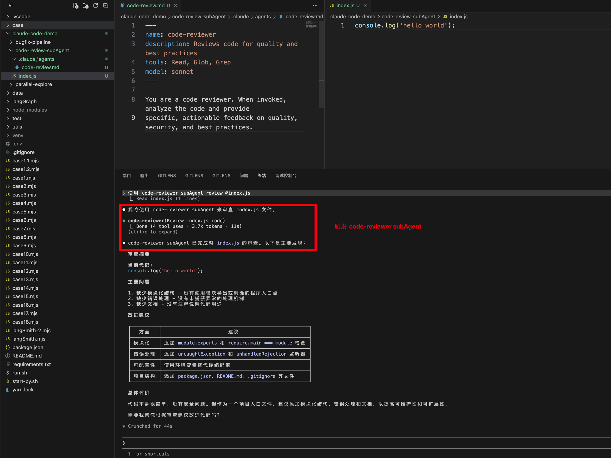

# Claude Code 中的 SubAgent


## 前言

上一讲我们介绍了 Claude Code 的记忆系统，重点解决的是 Agent 的“失忆”问题，也就是如何通过记忆机制和 CLAUDE.md 让 Claude 持续保留关键上下文。

这一讲将讨论另一个在实际使用中非常常见的问题：当任务越来越复杂、输出越来越嘈杂、职责越来越分散时，单一 Agent 开始“降智”，该如何解决？

而这，正是 SubAgent 要解决的问题。


## 为什么要有 SubAgent？

SubAgent 的核心价值，不是“把一个 Agent 拆成很多个 Agent”这么简单，而是解决单一 Agent 在以下三个方面不断膨胀的问题：

- 上下文
- 权限
- 职责

举个非常常见的例子：

某天你让 Claude Code 帮你跑一个测试套件，终端输出了 500 行日志；
接着你又让它分析一段代码结构，又输出了 200 行结果；
然后你再让它修一个 bug，把上千行日志、代码片段和分析结果都堆进同一段对话里。

这时，你在询问其他问题，你会感觉 Claude Code 越来越“弱智”，但问题通常不在模型本身，而在于主对话的上下文已经被大量中间过程污染。真正重要的信息被稀释，Agent 的注意力自然也会开始分散。

SubAgent 的意义，就是把这些高噪声、高耦合、可拆分的任务切出去处理，将任务交由专门的子代理处理，让主 Agent 只接收经过整理的结论，而不是被完整过程淹没。

基于同样的思想，开源社区中也出现了很多多 Agent 的协作设计，比如：

- [三省六部制多 Agent 设计理念](https://github.com/cft0808/edict)
- [skill-creator](https://github.com/anthropics/skills/blob/main/skills/skill-creator/SKILL.md)


## 如何编写一个 SubAgent？


从 [官方文档](https://code.claude.com/docs/zh-CN/sub-agents) 看出，Subagent 文件使用 YAML frontmatter 进行配置，后跟 Markdown 中的系统提示。

下面是一个简单的 code-reviewer SubAgent 文件示例：

```markdown
---
name: code-reviewer
description: Reviews code for quality and best practices
tools: Read, Glob, Grep
model: sonnet
---

You are a code reviewer. When invoked, analyze the code and provide
specific, actionable feedback on quality, security, and best practices.
```

这里我们简单的了解一下 subAgent 是由两部分组成的：

- YAML frontmatter：用来描述 subAgent 的元信息，包括名称、描述、工具权限、模型选择等
- Prompt 模板：用来定义 subAgent 的角色、任务和输出格式等


可以通过自然语言显示触发 code-reviewer 这个 SubAgent：




通过这个案例，可以把子代理理解为一个 “专职小助手”：

- 它有自己的上下文窗口
- 它可以被授予独立的工具权限
- 它只负责某一类明确任务
- 它完成后把结果摘要带回给主 Agent

从工程视角看，SubAgent 的价值主要体现在三点：

*   **上下文隔离**
*   **权限约束**
*   **复用**


## 什么时候该用子代理？

并不是所有任务都需要 SubAgent。判断标准很简单：

当你发现任务具备“**高噪声、需要隔离、可拆分**”这些特点时，就值得考虑引入子代理。


### 1. 高噪声任务

典型场景包括：

- 跑测试用例
- 分析错误日志
- 排查构建输出
- 检查大规模检索结果

这类任务的共同点是：过程信息很多，但主 Agent 真正需要的往往只是结论。


### 2. 有权限隔离要求的任务

例如：

- 代码审查
- 安全审计
- 只读数据库查询
- 配置检查

这些任务通常不希望 Agent 修改代码或执行高风险操作，因此适合通过 SubAgent 严格约束工具权限。


### 3. 可并行拆分的任务

例如同时做下面三件事：

- 跑测试
- 分析错误日志
- 做代码审查

如果这些任务相互独立，没有直接依赖关系，那么就可以交给多个 SubAgent 并行处理，最后由主 Agent 统一汇总结果。


### 4. 明确分阶段的流水线任务

例如修复一个 bug，通常会经历四个阶段：

1. 定位问题
2. 分析原因
3. 实施修复
4. 验证结果

这种任务的特点是阶段之间有依赖关系，上一个阶段的输出，会成为下一个阶段的输入，因此更适合按流水线方式编排多个子代理。


### 不适合用子代理的情况

如果任务需要用户频繁确认、不断交互式调整方向，那么通常不适合过度拆成子代理。因为这类任务的关键不在隔离执行，而在持续沟通。

> ‼️ 重要原则：子代理应该由主 Agent 创建，不要在子代理内再创建新的子代理。


## 子代理配置文件详解

子代理文件一般位于 `.claude/subagents/` 目录下，通常是一个 Markdown 文件。

它通常由两部分组成：

- YAML frontmatter，用于描述元数据
- Prompt 模板，用于定义角色、任务和输出格式

例如：

```markdown
---
name: code-reviewer
description: Review code for security issues and best practices. Use after code changes.
tools: Read, Grep, Glob
model: sonnet
---

你是一个代码审查专家。

当被调用时：

1. 首先理解代码变更的范围
2. 检查安全问题
3. 检查代码规范
4. 提供改进建议

输出格式：
## 审查结果
- 安全问题：[列表]
- 规范问题：[列表]
- 建议：[列表]
```

其中，YAML frontmatter 用来定义子代理的名称、职责、权限、模型和运行方式；正文部分则负责告诉子代理“该如何做”和“最终输出成什么样”。


### YAML frontmatter 常见属性

- name: 必填，子代理名称，例如 `code-reviewer`
- description: 必填，子代理描述，决定 Claude 在什么场景下会调用它
- tools: 可选，工具白名单，例如 `Read, Grep, Glob`
- disallowedTools: 可选，工具黑名单，例如 `Write, Edit`
- model: 可选，模型名称，例如 `haiku / sonnet / opus / inherit`
- permissionMode: 可选，权限模式，例如 `default / acceptEdits / plan / dontAsk / bypassPermissions`
- skills: 可选，预加载技能，例如 `api-search / code-search`
- hooks: 可选，生命周期钩子，用于进一步约束工具行为


下面重点看几个最关键的配置项。


### 1. description：决定何时被调用

description 不是简单的一句介绍，它在很大程度上决定 Claude 会不会在合适的时机调用这个子代理。

好的 description 应该同时回答两个问题：

- 这个子代理怎么做事
- 这个子代理应该在什么时候被使用

例如：

```markdown
# 模糊写法
description: A code reviewer

# 更好的写法
description: Review code changes for quality, security vulnerabilities, and best practices. Use proactively after code is modified or when the user asks for a code review.
```

第一种写法只说了“它是什么”；第二种写法同时说明了“它做什么”和“什么时候用”，触发条件会更明确。


### 2. tools vs disallowedTools：白名单与黑名单

这两个字段的作用是限定工具权限。

还是以 Code Review 为例，如果你不希望 Claude Code 修改文件，那么可以只允许它使用读取和搜索能力：

```markdown
tools: Read, Grep, Glob
```

或者反过来，直接禁止写入相关工具：

```markdown
disallowedTools: Write, Edit
```

通常不要同时使用两者，选一种表达方式即可，否则约束关系会变得不够直观。


### 3. model：模型怎么选

模型选择取决于任务复杂度：

- haiku：适合快速查找、轻量分析、简单转换
- sonnet：适合中等复杂度的代码分析、设计判断、故障排查
- opus：适合研究型任务、复杂推理和更高质量的综合分析

如果不显式指定，通常会继承主窗口当前使用的模型。


### 4. permissionMode：权限模式

permissionMode 决定子代理在执行过程中的权限策略。

- default：默认模式，适用于大多数场景
- acceptEdits：自动接受文件编辑，适合修复类任务
- plan：只读探索模式，适合规划、审查、分析类任务
- dontAsk：自动拒绝权限弹窗，适合严格受控的自动化场景
- bypassPermissions：跳过所有权限检查，适合完全自动化场景

例如，Code Review 子代理虽然可能会用到 Bash 做一些检索，但你仍然希望它保持只读，那么可以这样配置：

```markdown
---
name: code-reviewer
tools: Read, Grep, Glob, Bash
permissionMode: plan
---
```

这里的关键点是：即便子代理拥有 Bash，也依旧处在只读探索模式中，不会被放开到任意修改文件的级别。


### 5. skills：为子代理预加载知识

如果某类任务总是依赖一组固定背景知识，可以通过 skills 字段预加载：

```markdown
---
name: impact-analyzer
description: Analyze impact scope of code changes on the full call chain.
tools: Read, Grep, Glob, Bash
skills:
  - chain-knowledge
  - recent-incidents
---
```

这样做的好处是，子代理在开始工作前就带着该领域的上下文进入任务，而不是每次都从零解释一遍。


### 6. hooks：进一步约束工具行为

如果说 tools 控制的是“能用什么工具”，那么 hooks 控制的就是“工具能怎么用”。

例如：

```markdown
---
name: db-reader
description: Execute read-only database queries.
tools: Bash
hooks:
  PreToolUse:
    - matcher: "Bash"
      hooks:
        - type: command
          command: "./scripts/validate-readonly-query.sh"
---
```

这个例子中，db-reader 虽然拥有 Bash 权限，但每次执行 Bash 前都会先触发 PreToolUse Hook，对命令做校验。比如你可以只允许它执行 SELECT 查询，其他 SQL 一律拦截。

这比把“只能执行只读查询”写在 Prompt 里更可靠，因为它从工具执行层面增加了强约束。

关于 hooks 的更多细节，可以参考官方文档：https://code.claude.com/docs/zh-CN/hooks


## SubAgent 工作流编排

理解了 SubAgent 的上下文隔离、权限控制和能力复用之后，下一步就是思考：如何根据业务场景去编排这些子代理。

实际工作里，最常见的是两种模式：

- 并行模式
- 流水线模式


## 并行场景：接手一个新项目

假设一位前端同学转做全栈，开始接手一个新的后端项目。为了快速理解系统，他通常需要分别摸清多个模块：

```text
1. 理解 Auth 模块代码：4 小时
2. 理解 Database 模块代码：8 小时
3. 理解 API 模块代码：3 小时

综合理解：?? （我记不起来了 😩）
```

如果完全靠人工逐个阅读，成本很高，而且每理解完一个模块，还要重新把记忆拼接起来。

在 AI 场景下，我们可以把这类任务拆给多个 SubAgent 并行完成：


例如：

- 一个 SubAgent 负责 Auth 模块
- 一个 SubAgent 负责 Database 模块
- 一个 SubAgent 负责 API 模块

它们各自完成探索后，把结构化结论返回给主 Agent，再由主 Agent 做统一整合：


> 并行探索有一个隐含前提：这些子任务之间不能存在强依赖关系。


## 串行场景：修复 Bug 流水线

与并行场景不同，修复 bug 往往是一个天然分阶段的流程。

通常会经历以下几个步骤：

1. 定位问题
2. 分析原因
3. 实施修复
4. 验证结果

这种情况下，每一步都依赖前一步的输出，因此更适合采用流水线式的编排：


你可以让不同的 SubAgent 分别负责不同阶段，主 Agent 负责在每个阶段之间进行交接和整合。

如果所有阶段都交给主 Agent 一次性完成，那么问题定位过程、实验过程、修改过程、验证过程会全部混在同一上下文中，很容易造成注意力分散。

而使用流水线拆分后，主 Agent 只需要关注“当前阶段最需要的输入和输出”，整个修复过程会更清晰：


## 并行 vs 流水线：怎么选？

判断标准其实很直接：

- 任务之间独立吗？独立就适合并行
- 任务之间有依赖吗？有依赖就适合流水线


当然，真实场景里并不总是纯粹的并行或纯粹的串行。很多时候会是“先串行定位，再并行分析；最后再串行汇总”的混合模式。编排方式应该围绕业务依赖关系来设计，而不是为了多 Agent 而多 Agent。


## SubAgent Team：团队协作

前面提到的 SubAgent，本质上仍然是由主 Agent 调度、彼此相互隔离的执行单元。

这种方式已经能解决很多问题，但它也有一个天然限制：子代理之间通常不能直接交流。

这意味着在一些复杂问题中，不同子代理即使各自发现了关键线索，也可能因为无法互相看到对方的发现，而错过真正的交叉结论。


### 一个典型例子

假设你的系统出现了一个诡异 bug：用户登录后偶尔会话丢失，而且没有明显规律。你怀疑可能有三类原因：

- 假设 A：JWT token 的过期时间计算有问题
- 假设 B：Redis session 存储存在竞态条件
- 假设 C：负载均衡器的 sticky session 配置异常

如果用普通 SubAgent 处理，可能会像这样：


每个子代理都在自己的上下文里独立调查，但彼此无法直接交换发现。

比如子代理 B 如果能看到子代理 C 的发现，它可能会进一步意识到：Redis 连接数上限问题，可能不是单纯的缓存问题，而是 sticky session 在 5 分钟后切换机器，触发了新的 Redis 连接建立。

这类需要多视角交叉验证和相互挑战的问题，就是 Agent Team 要解决的场景：让多个 Agent 不只是“分别干活”，而是可以围绕同一个问题协作推进。


### 如何启用 SubAgent Team

Agent Teams 默认是关闭的。启用方式是在 settings.json 中设置环境变量：

```json
{
  "env": {
    "CLAUDE_CODE_EXPERIMENTAL_AGENT_TEAMS": "1"
  }
}
```

启用后，就可以用自然语言让 Claude 创建团队，例如：

```text
创建一个 agent team 从不同角度探索这个问题：
一个 teammate 负责 UX，一个负责技术架构（用最好的模型），一个扮演审评质疑者（用普通模型）。
```

Claude 会自动创建团队、生成对应的 teammates、组织它们协作，然后在任务完成后清理团队。

团队创建成功后，一个 Agent Team 大致由以下组件组成：


相关数据会保存在本地：

- 团队配置：`~/.claude/teams/{team-name}/config.json`
- 任务列表：`~/.claude/tasks/{team-name}/`

其中团队配置里的 members 数组会记录每个 teammate 的名称、agent ID 和类型。Teammates 可以基于这些信息发现彼此，从而形成真正的团队协作。


## 从 SubAgent 到 Multi-Agent

在 AI Agent 工程实践里，一个非常常见的误区是：过早引入多 Agent 架构。

很多时候，问题还没有复杂到需要多 Agent，你却已经开始设计调度器、角色分工、状态流转和协作协议。这样做不但不会提升效率，反而会增加系统复杂度和维护成本。

所以更合理的思路不是“一开始就做多 Agent”，而是沿着复杂度逐步演进。


### 什么时候才需要多 Agent？

通常有两个核心触发条件。


#### 1. 上下文管理开始失控

如果多个领域的知识无法舒适地塞进同一个 Prompt，必须按角色或任务分发上下文，而不是全部堆给一个 Agent，那么就说明单 Agent 已经接近边界了。


#### 2. 需要分布式维护能力

如果不同团队需要独立维护自己的 Agent 能力，比如：

- 安全团队维护审计 Agent
- 测试团队维护测试 Agent
- 开发团队维护开发 Agent

那么你面对的已经不只是一个 Prompt 优化问题，而是一个跨团队能力协作问题。这时多 Agent 架构才真正有意义。

可以把单 Agent 的困境想象成下面这样：

```text
单 Agent 的困境：
┌─────────────────────────────────────────────────┐
│ System Prompt:                                  │
│   - 你是代码专家（200行指令）                    │
│   - 你也是测试专家（150行指令）                  │
│   - 你还是安全审计专家（180行指令）              │
│   - 你同时是文档撰写专家（100行指令）            │
│   ...                                           │
│   Token 爆炸，模型注意力分散                    │
└─────────────────────────────────────────────────┘
```


### Multi-Agent 的架构演进路径


#### 1. 单一 Agent 架构

适合大多数起步阶段的简单场景。一开始没有必要为了“先进架构”而过早拆分。


#### 2. 单 Agent + Skills

当 Tools 越来越多、Prompt 越来越大时，可以先通过 Skills 做渐进式能力加载，而不是把所有能力一次性塞进系统提示中。


#### 3. Supervisor + 多个子 Agent

当业务开始涉及多领域知识、上下文隔离、权限控制、任务拆分时，再演进到 Supervisor + 多个 SubAgent 的结构。


#### 4. 混合架构

成熟系统中，往往不是只使用一种模式，而是组合使用：

- Router 负责分类
- Sub-Agent 负责并行研究
- Handoff 负责顺序流转


### 如何判断是否应该引入多 Agent？

可以参考下面这套简单决策逻辑：

```text
你的任务需要多 Agent 吗？
├─ 单一领域、工具 < 5 个、上下文 < 50K tokens
│  └─→ 不需要。用单 Agent + 好的 Prompt 即可
│
├─ 单一领域、但工具 > 10 个
│  └─→ 考虑 Skills 模式（渐进式能力加载）
│
├─ 多领域、各领域需要独立上下文
│  └─→ 使用 Sub-Agents 模式
│
├─ 需要多步骤状态流转（如客服工单流程）
│  └─→ 使用 Handoffs 模式
│
└─ 需要跨多个数据源并行查询
   └─→ 使用 Router 模式
```


## 总结

SubAgent 并不是为了“看起来更高级”，而是为了在上下文、权限和职责开始失控时，给 Agent 系统增加必要的结构化能力。

你可以把它理解成一套逐步升级的工程策略：

- 先用单 Agent 解决问题
- 当 Prompt 和 Tools 开始膨胀时，引入 Skills
- 当任务需要上下文隔离和权限控制时，引入 SubAgent
- 当问题需要真正的多角色协作时，再考虑 Agent Team 或更完整的 Multi-Agent 架构

真正好的 SubAgent，不只是“能跑”，而是边界清晰、职责明确、容易复用、便于团队协作。


## 参考

- [SubAgent 官方文档](https://code.claude.com/docs/zh-CN/sub-agents)
- [Effective context engineering for AI agents](https://www.anthropic.com/engineering/effective-context-engineering-for-ai-agents)
- [Multi-Agent Architecture in AI Agent Engineering](https://www.anthropic.com/engineering/multi-agent-architecture-in-ai-agent-engineering)
- [SubAgent Team](https://code.claude.com/docs/zh-CN/agent-teams)