# Claude Code 中的 SubAgent

## 前言

上一讲我们介绍了 Claude Code 的记忆系统，了解了如何解决 Claude 的失忆症问题以及如何写好 CLAUDE.md。

本讲我们主要介绍 Claude Code 中的 SubAgent.


## 为什么要有 Sub-Agents？

SubAgent 主要解决单一 Agent 在**上下文、权限、职责**无法无限膨胀的问题。


例如某天，你让 Claude Code 帮你跑一个测试套件，结果输出了 500 行日志；然后你想让它分析一下代码结构，又输出了 200 行；接着你想让它改一个 bug，丢给它上千行的日志信息，你的对话上下文已经被各种“中间过程”塞满了，真正重要的信息被淹没在茫茫的输出海洋里。

此时，如果你觉得 Claude Code 越用越“健忘”，并不是模型退化了，而是你的对话上下文，已经被一次次中间过程污染了，稀释了真正重要的信息，这正是子代理要解决的核心问题。

而 SubAgent 的出现，可以做到隔离上下文、权限、职责，从而避免单一 Agent 在上下文过渡膨胀，导致无法聚焦核心任务。

基于这个思想，开源社区也出现了三省六部制多 Agent 设计理念。

例如👉 : [三省六部制多 Agent 设计理念](https://github.com/cft0808/edict)


## 什么是子代理？
子代理相当于一个“专职小助手”，带着自己的权限、上下文窗口，去完成某一类任务，然后把“结果摘要”带回来给主 Agent。

子 Agent 核心价值有三点:
- 隔离
- 约束
- 负责


### 隔离 - 解决上下文污染问题

主要解决单一 Agent 在上下文无限膨胀，稀释 Agent 注意力的问题。

例如，让 Agent 分析了错误日志，又让它跑测试用例，中间过程会输出大量日志信息，这些日志信息会残留在上下文窗口中，稀释了 Agent 的注意力，导致无法聚焦后续的核心任务。

而 SubAgent 可以做到隔离上下文，将分析后的结果带回给主 Agent，让主 Agent 做的更少，做的更对。

### 约束 - 权限隔离问题

当你让 Claude Code 进行 code Review 时，Claude Code 可能会修改代码，而你只是想让他进行代码 Review，而不是修改代码。
而 SubAgent 可以做到约束权限，只让 Agent 进行代码 Review 时只有 Read （读）, Grep（搜索）, Glob（匹配文件） 权限，而不是有修改代码的权限（Write）。

```
allowed-tools: Read, Grep, Glob
```

### 复用 - 避免重复工作

SubAgent 可以沉淀成一个文件，纳入版本控制，团队共享，避免重复开发。


## 什么时候该用子代理？

### 处理高噪声的任务 - 例如跑测试用例、分析错误日志

当任务的输出结果包含大量噪声时，使用子代理可以避免主 Agent 被噪声淹没，从而更好地聚焦核心任务。

### 有权限隔离的需求 - 例如代码审查

例如代码审查不需要修改代码的权限

### 多任务并行处理 - 例如跑测试用例、分析错误日志、代码审查

当需要同时处理多个任务时，使用子代理并行处理，最后将结果返回给主 Agent 进行整合。

### 流水线任务 - 例如修复 bug 

例如修复 bug 可以拆成定位问题、分析问题、解决问题，验证问题 4个子任务，每个任务执行完后，才能执行下一个任务。

这类任务的关键在于每一个阶段的目标、权限和输出都是明确的，且下一个阶段依赖于上一个阶段的输出。


**如果需要用户频繁确认的任务，则不适合使用子代理。**

> ‼️ 重要原则：子代理应该由主 Agent 创建，子代理不要创建新的子代理，

## 子代理的配置文件详解

子代理文件一般位于 `.claude/subagents/` 目录下，是一个 Markdown 文件。

文件内容由以下几部分组成：
- YAML frontmatter 格式
- Prompt 模版

例如👇
```
---
name: code-reviewer
description: Review code for security issues and best practices. Use after code changes.
tools: Read, Grep, Glob
model: sonnet
---

你是一个代码审查专家。

当被调用时：

1. 首先理解代码变更的范围
2. 检查安全问题
3. 检查代码规范
4. 提供改进建议

输出格式：
## 审查结果
- 安全问题：[列表]
- 规范问题：[列表]
- 建议：[列表]
```

YAML frontmatter 格式（--- 之间的内容）用于定义子代理的名称、职责、权限、上下文窗口等元数据。

Prompt 模版用于定义子代理的 Prompt，包括输入、输出、工具等。


### YAML frontmatter 属性

- name: 必填，子代理的名称，例如 `code-reviewer`
- description: 必填，子代理的描述，例如 `Review code for security issues and best practices. Use after code changes.`
- tools: 可选，工具白名单，例如 `Read, Grep, Glob`
- disallowedTools: 可选，工具黑名单，例如 `Write, Edit`
- model: 可选，模型名称，例如 `haiku / sonnet / opus / inherit`
- permissionMode: 可选，权限模式，例如 `default / plan / bypassPermissions`
- skills: 可选，技能列表，例如 `api-search / code-search`
- hooks: 可选，钩子列表，例如 `preToolUse`

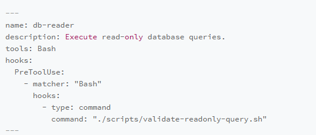

接下来我们介绍几个关键的属性

#### 1. description 描述

description 主要决定了 Claude 何时进行调用

好的 description 描述应该是具体的，而不是模糊的，例如套用模版 “怎么做” + “何时做” 进行描述

例如👇

```
# 写的模糊
description: A code reviewer

# 好的写法: 怎么做 + 何时做
description: Review code change for quality，security vulnerabilities，and best practices. Use proactively after code is modified or when user asks for code review.

```

以代码 review 的 description 为例子，好的 description 应该包含 ***怎么做 CodeReview*** + ***何时做 CodeReview*** 

#### 2. tools vs disallowedTools：白名单与黑名单

还是以 CodeReview 为例子，在代码 review 的过程中，我们不需要 Claude Code 对代码进行修改，因此可以使用 disallowedTools: Write、Edit，禁用写、编辑工具。

而可以对文件进行读操作、文件查找、文件匹配，因此可以配置 Tools: Read、Grep、Glob

不要同时使用两者——选一种即可

#### 3. model：模型选择与默认值

模型的选择具体看业务场景。
- 如果是快速查找、没有复杂的业务逻辑，可以采用 haiku
- 如果是相对复杂的逻辑、代码分析，可以采用 sonnet
- 如果是研究型任务、复杂推理场景，可以采用 opus

默认是跟随主窗口的模型


#### 4. permissionMode：权限模式

permissionMode：权限模式

- default 模式，默认配置，适用于大部分场景
- acceptEdits 模式，自动接受文件编辑，适用于修复类的场景
- plan 模式，只读探索模式，适用于做规划、审查类的场景
- dontAsk 模式，自动拒绝权限弹窗，适用于有严格权限控制的自动化场景
- bypassPermissions: 跳过所有权限检查，适用于完全自动化场景

例如子代理跑 code Review时，不能修改文件，那么可以给他配置

```markdown
---
name: code-reviewer
tools: Read, Grep, Glob, Bash
permissionMode: plan          # 强制只读模式，即使有 Bash 也无法写入
---
```

#### 5. skills：为子代理预加载知识

子代理可以通过 skills 字段预加载，例如👇

```markdown
---
name: impact-analyzer
description: Analyze impact scope of code changes on the full call chain.
tools: Read, Grep, Glob, Bash
skills:
  - chain-knowledge        # 链路拓扑和 SLA 约束
  - recent-incidents         # 近期事故记录
---
```

#### 6. hooks：子代理专属的生命周期 Hook

通过定义生命周期 hooks 可以对 Agent 进行更多个性化的管控，hooks 钩子具体可参考 https://code.claude.com/docs/zh-CN/hooks 

举个例子

```markdown
---
name: db-reader
description: Execute read-only database queries.
tools: Bash
hooks:
  PreToolUse:
    - matcher: "Bash"
      hooks:
        - type: command
          command: "./scripts/validate-readonly-query.sh"
---
```

例如这个 db-reader 数据库查询子 Agent，每次在执行 Bash 命令查询数据库时，会触发 PreToolUse Hook 检查当前命令是否是 SELECT，只有 SELECT 才能通过。

这个比直接写在 Prompt 中更有约束力。

通过 hooks 我们发现子代理不仅可以控制有哪些工具，还可以控制工具能做什么操作，例如上面的例子中，我们控制了 Bash 命令只能执行 SELECT 操作。

当我们了解了 subAgent 强大的自控力后，我们可以在 上下文、权限、技能、钩子等等 基础上对 SubAgent 进行编排，让任务做的更快、更好。


## SubAgent 工作流编排

当我们了解了 subAgent 强大的自控力后，我们可以根据业务场景，对 SubAgent 进行编排，让任务完成地更加高效。


## 并行场景: 接手一个新的项目

例如一位前端同学转行做全栈，接手一个新的后端项目，需要快速了解项目代码，以往传统方式，需要人工对各个模块进行阅读，费时费力。

```
1. 理解 Auth 模块代码 : 4 小时
2. 理解 DataBase 模块代码 : 8 小时
3. 理解 Api 模块代码 : 3 小时

综合理解: ?? （我记不起来了 😩）
```

在 AI 时代下，我们可以通过 Agent 帮助我们理解代码，通过编排 SubAgent 并行处理，更加高效。例如👇

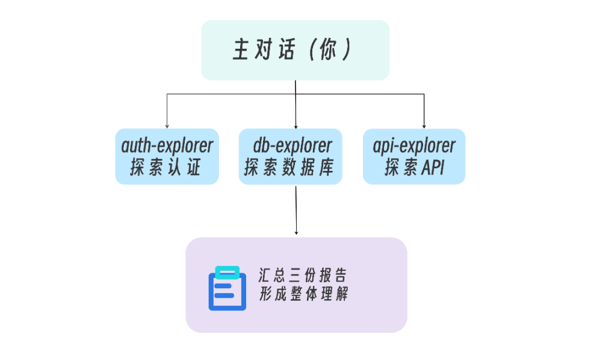

三个 SubAgent 并行处理，最后将结果返回给主 Agent 进行整合。

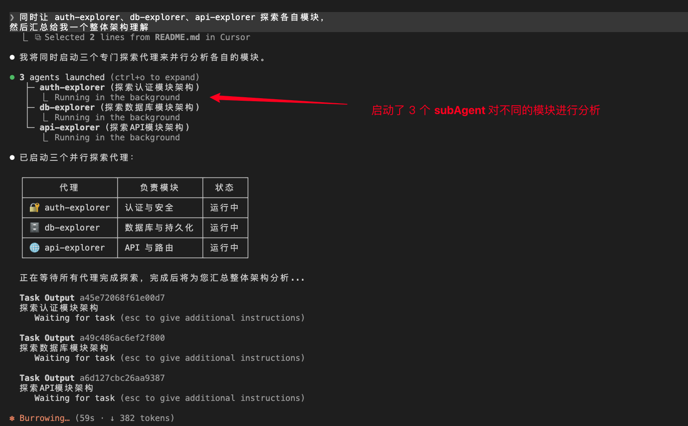


> 并行探索的隐含前提：各子代理的探索任务之间不能有信息依赖


## 串行场景: 修复 Bug 流水线

在修复 bug 过程中，我们会经历以下几个阶段：
1. 定位问题
2. 分析问题
3. 解决问题
4. 验证问题
   
基于此，我们可以将修复 bug 过程拆分成多个子任务，每个子任务由一个 SubAgent 完成。例如👇

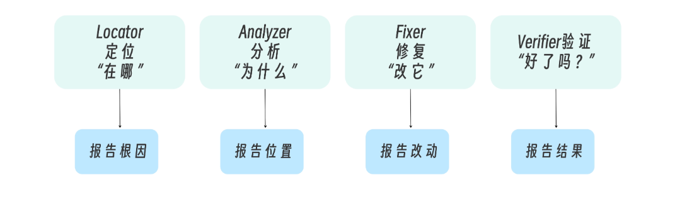

四个 SubAgent 分别处理，每一个 SubAgent 的输出后，将结果返回给主 Agent 进行整合，主 Agent 再派发下一个 SubAgent 进行处理。

如果全部由主 Agent 处理，上下文膨胀，注意力分散，可能导致无法聚焦核心任务，从而影响任务完成效率。

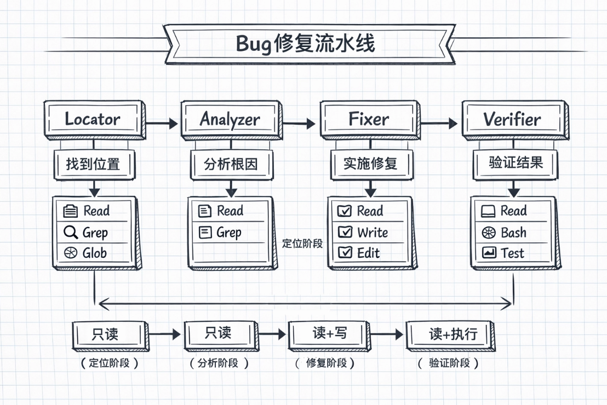


## 并行 vs 流水线：什么时候用什么模式

核心判断标准是：
- 任务之间独立吗？→ 并行
- 任务之间有依赖吗？→ 流水线

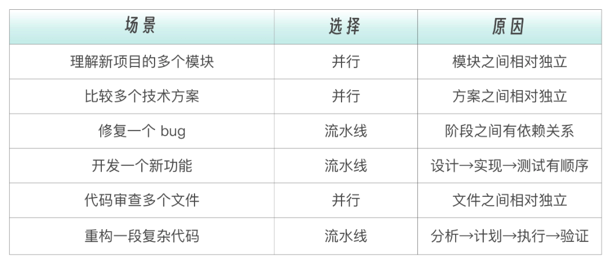


在实际的业务场景中，可能并不是单纯的串行 或者 并行，可能是串行后有并行、并行后又串行等等，这种组合模式需要根据业务场景进行设计。

## subAgent Team: 团队协作

聪明的同学可能已经发现了，在编排 SubAgent 时，因 SubAgent 之间无法直接通信，可能会遗漏一些关键信息，导致任务无法完成。

因此，我们可以通过 subAgent Team 来解决这个问题。

### 案例
你的系统出现了一个奇怪 bug——用户登录后偶尔会话丢失，没有明确的规律。你怀疑可能是：
- 假设 A：JWT token 过期时间计算有问题
- 假设 B：Redis session 存储的竞态条件
- 假设 C：负载均衡器的 sticky session 配置
  
如果用子代理，情况可能是这样。👇


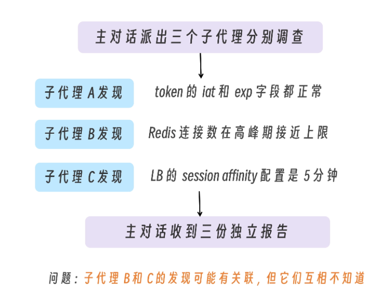

如果子代理 B 能看到子代理 C 的发现，它可能会说：等等，Redis 连接数上限问题可能是因为 sticky session 5 分钟后切换了服务器，导致新的 Redis 连接被创建。这正是 Agent Teams 要解决的问题——让代理之间能够直接交流、互相挑战、协作推进。

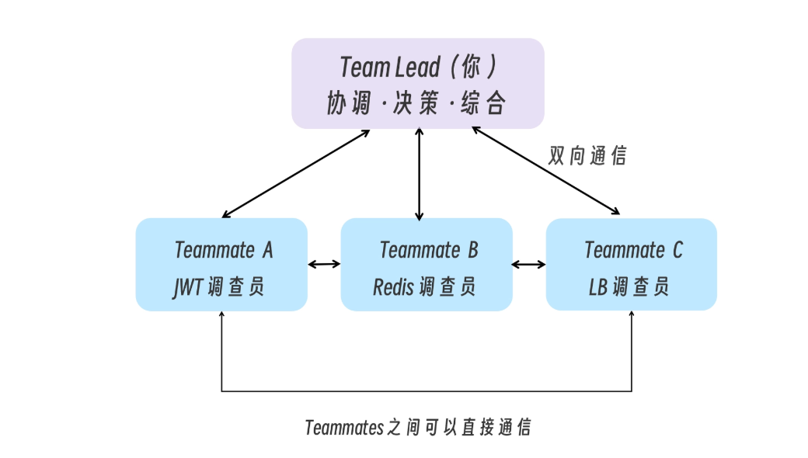


### 如何启用 subAgent Team


Agent Teams 默认是关闭的，启用方式是在 settings.json 中设置环境变量：

```
{
  "env": {
    "CLAUDE_CODE_EXPERIMENTAL_AGENT_TEAMS": "1"
  }
}
```


启用后，用自然语言告诉 Claude 创建团队并描述任务：

```
创建一个 agent team 从不同角度探索这个问题：
一个 teammate 负责 UX，一个负责技术架构（用最好的模型），一个扮演审评质疑者（用普通模型）。
```

Claude 会建团队，生成指定的 Teammates 让它们探索问题，然后综合各方发现，完成后清理团队。团队成功创建后，一个 Agent Team 由以下组件构成:

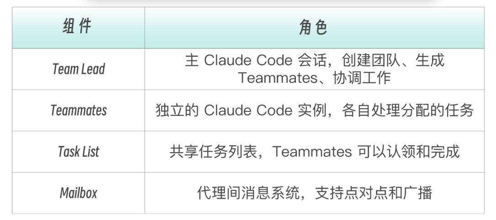

团队和任务相关的数据会存储在本地。

- 团队配置：~/.claude/teams/{team-name}/config.json
- 任务列表：~/.claude/tasks/{team-name}/

团队配置包含  members  数组，记录每个 Teammate 的名称、agent ID 和类型。Teammates 可以读取这个文件来发现其他团队成员。这些都是 Claude Code 自行搞定的，不需要我们操心去存放。

## 从 SubAgents 到 Multi-Agent

在 AI Agent 的工程实践中，有一个经典的误区——过早引入 ***多 Agent 架构***，实际上，在大多数场景下，单一 Agent 已经足够应对需求，过早引入多 Agent 架构反而会引入复杂度，导致团队协作成本上升。

只有当系统确实触及单 Agent 的架构边界时， 才考虑采用多 Agent 的设计模式。

那什么时候需要引入多 Agent 架构呢？

### 两个核心触发条件

#### 1. 上下文管理挑战

多个领域的上下文知识无法舒适地填充到单一的 Prompt 中，**需要策略性地分发上下文**, 而不是堆在一起，导致上下文膨胀，稀释 Agent 注意力。


#### 2. 分布式开发需求

当多个团队需要独立拥有和维护各自的 Agent 能力时。比如安全团队维护审计 Agent，测试团队维护测试 Agent，开发团队维护开发 Agent，各团队可以独立迭代而不互相干扰，此时需要跨越单 Agent 的能力边界时，需要引入多 Agent 架构。

```
单 Agent 的困境：
┌─────────────────────────────────────────────────┐
│ System Prompt:                                  │
│   - 你是代码专家（200行指令）                       │
│   - 你也是测试专家（150行指令）                     │
│   - 你还是安全审计专家（180行指令）                  │
│   - 你同时是文档撰写专家（100行指令）                │
│   ...                                           │
│   Token 爆炸，模型注意力分散                       │
└─────────────────────────────────────────────────┘
```


### Multi-Agent 的架构演进路径


#### 1. 单一 Agent 架构

适合前期大多数简单的场景，一开始没必要引入多 Agent 架构。

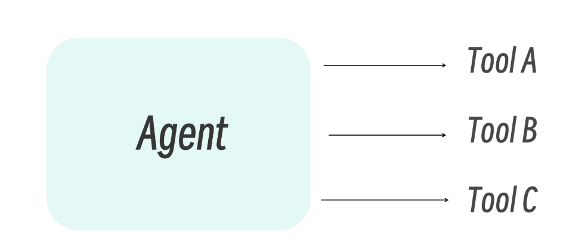


#### 2. 单 Agent + Skills

随着业务发展，Tools 越来越多、Prompt 越来越膨胀时，可以使用 SKILL 做渐进式加载，避免一次性加载太多，导致模型注意力分散。

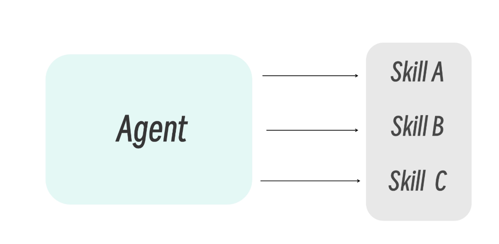

#### 3. Supervisor + 多个子 Agent

当业务变得复杂，需要做不同领域的知识、上下文隔离、权限控制等等时，采用 Supervisor + 多个子 Agent 架构。

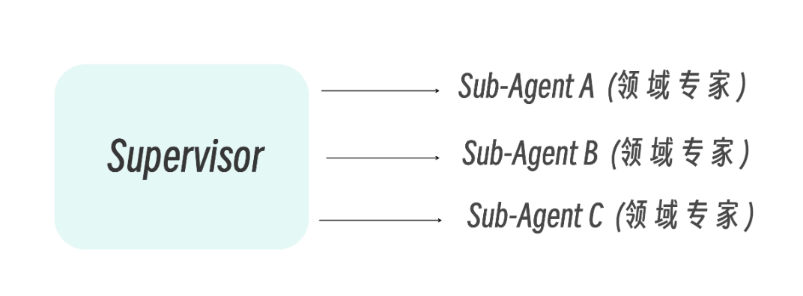

#### 4. 混合架构

成熟系统中，不同类型的任务流可能采用不同的模式。Router 处理分类，Sub-Agent 处理并行研究，Handoff 处理顺序流程。

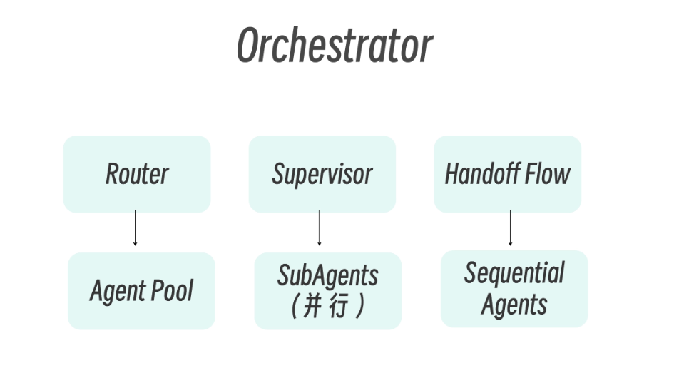


### 如何决策是否应该引入多 Agent 架构

当系统确实触及单 Agent 的架构边界时， 才考虑采用多 Agent 的设计模式。可以参考下图进行决策：

```
你的任务需要多 Agent 吗？
├─ 单一领域、工具 < 5 个、上下文 < 50K tokens
│  └─→ 不需要。用单 Agent + 好的 prompt 即可
│
├─ 单一领域、但工具 > 10 个
│  └─→ 考虑 Skills 模式（渐进式能力加载）
│
├─ 多领域、各领域需要独立上下文
│  └─→ 使用 Sub-Agents 模式
│
├─ 需要多步骤状态流转（如客服工单流程）
│  └─→ 使用 Handoffs 模式
│
└─ 需要跨多个数据源并行查询
   └─→ 使用 Router 模式
```


## 总结

如今市面上会有很多创建 SubAgent 的工具，SKILL 也好模版也好，但如何判断这个 SubAgent 是否好，不仅需要有大量的实践经验，也需要有我们对 SubAgent有体系化的认知，有自己的判断标准。


## 参考
- [SubAgent 官方文档](https://code.claude.com/docs/zh-CN/sub-agents)
- [Effective context engineering for AI agents](https://www.anthropic.com/engineering/effective-context-engineering-for-ai-agents)
- [Multi-Agent Architecture in AI Agent Engineering](https://www.anthropic.com/engineering/multi-agent-architecture-in-ai-agent-engineering)
- [SubAgent Team](https://code.claude.com/docs/zh-CN/agent-teams)