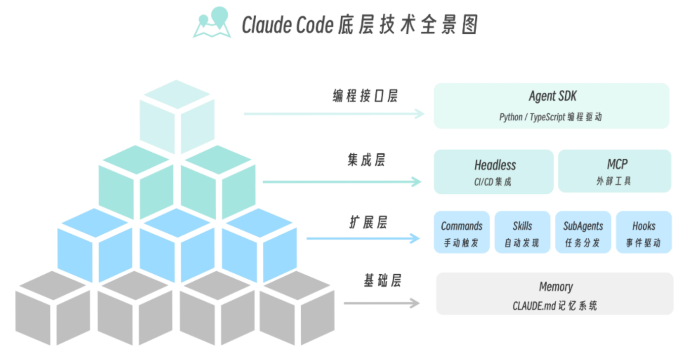
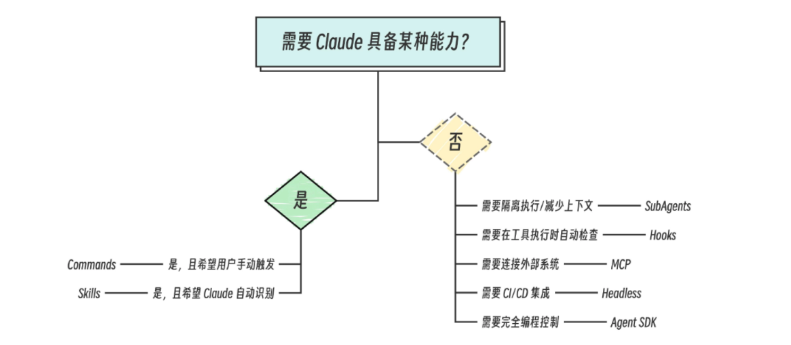

# Claude Code 技术全景概览

## 技术全览图

整体可划分为四层：**基础层**、**拓展层**、**集成层**、**编程接口层**，从下到上依次体现记忆与知识、能力扩展、对外集成与编程控制。

---

### 基础层

基础层包含 **Memory（记忆系统）**，通常是一个 **CLAUDE.md** 文件，作用类似 Cursor 的 Cursor Rule，相当于项目的「手册」：约定技术栈、目录结构、提交规范、编码习惯等，让 Claude 在对话中始终遵循同一套上下文与规范。

---

### 拓展层

拓展层包含四大核心组件：**Commands（手动触发）**、**Skills（自主发现）**、**SubAgents（任务分发）**、**Hooks（事件驱动）**，对应 Agent 执行与感知任务的四种方式。

#### Commands

- **Commands** 适合**标准化、可重复**的操作，例如：git commit 格式、固定部署流程、固定代码检查命令等。由用户通过固定关键词或指令显式触发，执行相对固化的标准流程。

#### SubAgents

- **SubAgents** 适合**隔离执行**的任务，例如：从大量日志中筛选错误日志、在独立上下文中跑测试、做单一步骤的代码分析等。减少主 Agent 的上下文与职责膨胀，保证主会话聚焦、子任务边界清晰。

#### Skills

- **Skills** 是可被**语义化加载**的技能包：不依赖固定关键词，Claude 会根据当前对话与任务上下文判断是否需要调用某个 Skill，从而**自主编排**何时用哪项能力。

- **Skill 和 MCP 的区别**
  - **MCP** 解决的是「大模型与外部世界如何交互」：调用 API、读库、执行命令等。
  - **Skills** 解决的是「大模型该如何执行任务」：约束步骤、规范、决策方式，是执行策略与工作流层面的能力。

- **Command 和 Skill 的区别**
  - **Commands**：依赖固定关键词或指令，**显式触发**，适合可复用、相对固化的标准流程。
  - **Skills**：依赖**上下文**而非固定关键词，由模型判断是否适用并决定如何执行，适合「在合适场景下自动用上」的能力。

SubAgents 与 Skills 的出现，都是为了应对单一 Agent 在**上下文、权限、职责**无法无限膨胀的问题。更重要的是，Skill 带来的重要变化是：从**人类预先编排工作流**，转向 **Agent 根据上下文自主编排工作流**。

#### Hooks

- **Hooks** 是在**特定事件**发生时自动触发的钩子，例如：在每次工具执行前后做检查、在会话开始时加载规则、在提交前做校验等，实现事件驱动的自动化行为。

---

### 集成层

集成层包含：

- **Headless**：与 **CI/CD** 集成，在流水线中无界面、脚本化地调用 Claude Code 能力。
- **MCP（Model Context Protocol）**：连接**外部工具与系统**（数据库、API、内部服务等），扩展 Agent 可调用的能力边界。

---

### 编程接口层

编程接口层包含 **Agent SDK**（如 Python / TypeScript），提供**编程式控制 Agent、编排工作流**的能力，适合需要完全由代码驱动、与现有系统深度集成的场景。

---

## 如何抉择

当你在「用哪种方式用」之间做选择时，可以按下面流程判断：是「需要 Claude 具备某种能力」，还是「需要隔离/事件/集成/编程控制」等非能力型需求，再对应到 Commands、Skills、SubAgents、Hooks、MCP、Headless 或 Agent SDK。

- **需要某种能力且希望用户手动触发** → 选 **Commands**。
- **需要某种能力且希望 Claude 自动识别、按上下文执行** → 选 **Skills**。
- **需要隔离执行或控制上下文/职责** → 选 **SubAgents**。
- **需要在工具执行等事件时自动检查或执行逻辑** → 选 **Hooks**。
- **需要连接外部系统、数据源或工具** → 选 **MCP**。
- **需要在 CI/CD 中集成** → 选 **Headless**。
- **需要完全由代码编排与控制 Agent** → 选 **Agent SDK**。

---

## 总结

这篇文章介绍了 Claude Code 的技术全景与选型思路：从基础记忆到拓展能力，再到集成与编程接口，按需求对号入座即可做出清晰抉择。
