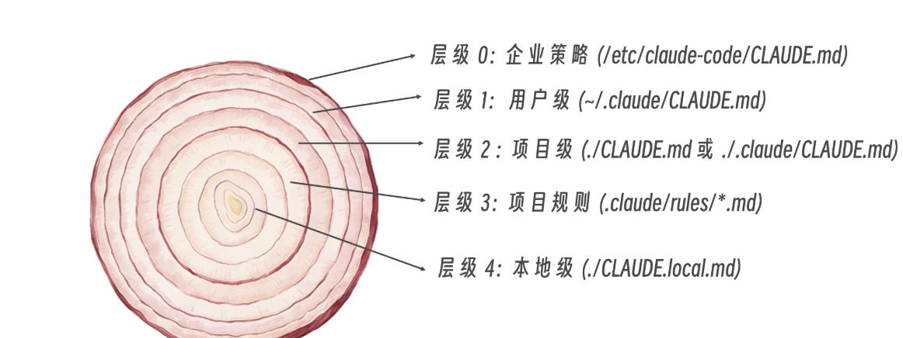
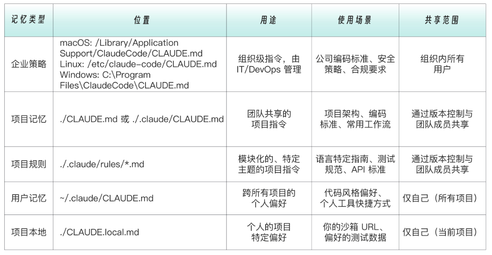

# Claude Code 记忆系统与 CLAUDE.md

## 痛点

案例：

```
第一次对话：
你：帮我写一个用户登录接口
Claude：好的，这是一个基础的登录接口...（使用 Express + JavaScript）
你：我们项目用的是 Egg 和 TypeScript
Claude：好的，让我重新写...


（新的窗口）第二次对话：
你：帮我写一个登录的页面
Claude：好的，这是一个基础的登录接口...（使用传统的 CSS）
你: 我们项目有用 tailwindcss...
Claude：好的，让我重新写...
```

刚开始使用 Claude Code 时，这种情况十分常见。对于小项目，多说几次需求，倒也无所谓。但随着时间推移，项目逐渐复杂，如果每次新对话 Claude 都让你从零开始——它不记得你的项目用什么技术栈、什么代码风格、什么团队规范——这种"失忆症"会让人抓狂。

而 **CLAUDE.md** 就是治疗这种失忆症的良药。

它是一份给 Claude 的「项目入职手册」—— Claude 每次开始对话时，都会自动阅读这份手册，了解你的项目背景，明确它在干活时应该遵循的一系列底层规则。

## 记忆系统的加载流程

当你在项目目录启动 Claude Code 时，记忆系统的初始化流程如下：

```
启动 Claude Code
       │
       ▼
加载企业策略  /etc/claude-code/CLAUDE.md
       │
       ▼
加载用户级    ~/.claude/CLAUDE.md
       │
       ▼
加载项目级    ./CLAUDE.md 或 ./claude/CLAUDE.md
       │
       ▼
加载项目规则  .claude/rules/*.md（条件加载）
       │
       ▼
加载本地级    ./CLAUDE.local.md
       │
       ▼
进入对话，所有规则生效
```


  

就像新员工的入职手册一样，Claude Code 每次对话时都会完成上述初始化加载，确保它始终"记得"你的项目上下文。

## 五层记忆架构

类似于常见的缓存分层设计（内存缓存 → Redis 缓存 → 数据库），Claude Code 的记忆系统支持 **5 层记忆**，按层级结构组织，高层级的文件优先加载，为底层文件提供基础约束。

```
┌─────────────────────────────────┐  优先级最高
│  企业策略  /etc/claude-code/     │
├─────────────────────────────────┤
│  用户级    ~/.claude/            │
├─────────────────────────────────┤
│  项目级    ./CLAUDE.md           │
├─────────────────────────────────┤
│  项目规则  .claude/rules/        │
├─────────────────────────────────┤
│  本地级    ./CLAUDE.local.md     │  优先级最低
└─────────────────────────────────┘
```




### 企业策略

- **存放位置**：`/etc/claude-code/CLAUDE.md`
- **使用场景**：公司编码标准、安全策略、合规要求

这一层由公司 IT 或平台团队统一维护，适合在组织层面强制执行的规范，例如禁止提交密钥、代码审查流程要求等。所有成员的 Claude Code 都会自动加载，无需手动配置。

### 用户级

- **存放位置**：`~/.claude/CLAUDE.md`
- **使用场景**：个人偏好、通用习惯设置

无论你在哪个项目工作，这里的配置都会生效，适合放置个人的通用偏好：

```markdown
# 个人偏好

## 沟通方式
- 使用中文回复
- 代码注释使用中文

## 通用代码风格
- 优先使用 async/await

## 注意事项
- superpowers 相关的能力不主动触发，需要手动触发
```

### 项目级

- **存放位置**：`./CLAUDE.md` 或 `./claude/CLAUDE.md`
- **使用场景**：项目架构、编码规范、常见工作流

这是最常用的一层，通常随代码一起提交到版本库，让整个团队共享同一份"项目说明书"。典型内容包括：

```markdown
# 项目说明

## 技术栈
- 后端：Egg.js + TypeScript
- 前端：Vue 3 + Vite + Tailwind CSS
- 数据库：MySQL + Redis

## 代码规范
- 接口统一返回 `{ code, message, data }` 格式
- 错误处理使用自定义 AppError 类
- 所有异步函数必须有 try/catch

## 常用命令
- 启动开发环境：`npm run dev`
- 运行测试：`npm run test`
- 构建：`npm run build`
```

### 项目规则

- **存放位置**：`.claude/rules/*.md`
- **使用场景**：支持条件作用域，适用于规则文件过长、不同文件类型需要不同规范、前后端分离等场景

当 CLAUDE.md 内容越来越多，开始影响上下文效率时，可以将规则拆分到独立文件中：

```
.claude/
└── rules/
    ├── typescript.md      # TypeScript 规范
    ├── testing.md         # 测试规范
    ├── api-design.md      # API 设计规范
    └── security.md        # 安全规范
```

**条件作用域**是这一层最关键的特性——通过 `paths` 字段声明该规则只在特定文件被编辑时才加载，避免无关规则占用上下文空间。

示例：`.claude/rules/testing.md`

```markdown
---
paths:
  - "src/**/*.test.ts"
  - "tests/**/*.ts"
---

# 测试规范

## 命名
- 单元测试: `*.test.ts`
- 集成测试: `*.integration.test.ts`

## 结构
使用 Arrange-Act-Assert 模式：

```typescript
describe('OrderService', () => {
  describe('createOrder', () => {
    it('should create order when stock is available', async () => {
      // Arrange
      const mockProduct = createMockProduct({ stock: 10 });

      // Act
      const order = await orderService.createOrder(mockProduct.id, 1);

      // Assert
      expect(order.status).toBe('created');
    });
  });
});
```

## 覆盖率要求
- 业务逻辑: > 80%
- 工具函数: > 90%
- 路由/控制器: 可以较低
```

`paths` 字段让这个规则**只在编辑测试文件时生效**，不会浪费其他场景的上下文空间。

### 个人本地级

- **存放位置**：`./CLAUDE.local.md`
- **使用场景**：个人本地环境配置，不提交到版本库（加入 `.gitignore`）

这一层适合存放只与你本地环境相关的内容，例如本地服务地址、调试用的数据库配置等：

```markdown
# 本地开发笔记

## 我的环境
- 本地 API: http://localhost:3000
- 测试数据库: order_service_dev
- Redis: localhost:6379
```

## 小结


| 层级   | 路径                           | 作用域  | 是否提交 Git |
| ---- | ---------------------------- | ---- | -------- |
| 企业策略 | `/etc/claude-code/CLAUDE.md` | 全公司  | —        |
| 用户级  | `~/.claude/CLAUDE.md`        | 个人全局 | —        |
| 项目级  | `./CLAUDE.md`                | 整个项目 | ✅        |
| 项目规则 | `.claude/rules/*.md`         | 条件加载 | ✅        |
| 本地级  | `./CLAUDE.local.md`          | 个人本地 | ❌        |


CLAUDE.md 的本质是**将隐性的项目知识显性化**。你越早为项目建立这份手册，Claude Code 就越能像一位真正熟悉项目的团队成员一样工作，而不是每次都需要你从头介绍。