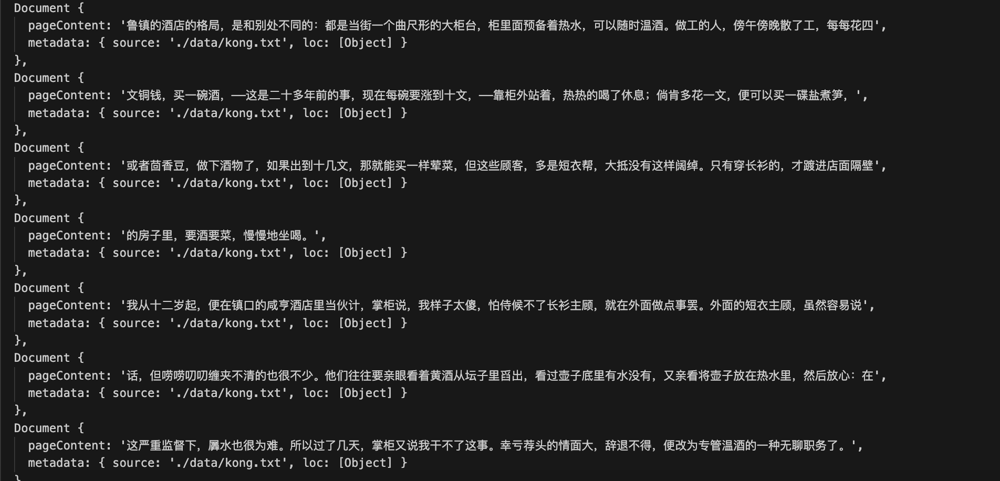

# Embedding 之大规模数据拆分

受限于常见 LLM 的上下文大小，例如 gpt3.5t 是 16k、gpt4t 是 128k，我们并不能把完整的数据整个塞到对话的上下文中。

即使数据源接近于 LLM 的上下文窗口大小，llm 在读取数据时很容易出现分神，或者忽略其中部分细节的问题。

因此，我们需要对数据进行拆分，然后将最关联的内容输入给 LLM，以便 LLM 能够更好的理解数据。

## 分割数据

对于分割来说，将数据分割成具有独立逻辑的段落是比较好的选择，段落分割的质量越高，意味着 RAG 的效果越好，LLM 返回数据的质量就越好。

langchain 目前提供的切分工具有：

- Recursive: 根据给定的切分字符（例如 \n\n、\n等），递归的切分
- HTML: 根据 html 特定字符进行切分
- Markdown: 根据 md 的特定字符进行切分
- Code: 根据不同编程语言的特定字符进行切分
- Token: 根据文本块的 token 数据进行切分
- Character: 根据用户给定的字符进行切割

## RecursiveCharacterTextSplitter

RecursiveCharacterTextSplitter 默认的分隔符列表是 ["\n\n", "\n", " ", ""], 你可以理解为它将文本分割后，在根据设置的 chunk 大小进行组装。

最影响切分质量的就是两个参数：

- chunkSize: 定义切分块的大小
- chunkOverlap: 定义块与块之间重叠的大小。较大的重叠可能会导致分割的内容重复，较小的重叠可能会导致分割的内容不完整。

```js

// RecursiveCharacterTextSplitter 对文本进行分割
// https://chunkviz.up.railway.app/
import { RecursiveCharacterTextSplitter } from 'langchain/text_splitter';
import { TextLoader } from 'langchain/document_loaders/fs/text';

const text = new TextLoader('./data/kong.txt');
const docs = await text.load();

const splitter = new RecursiveCharacterTextSplitter({
    chunkSize: 64, // 分块的大小
    chunkOverlap: 0, // 块之间的重叠
});

const splitDocs = await splitter.splitDocuments(docs);

console.log(splitDocs);

```




##  
