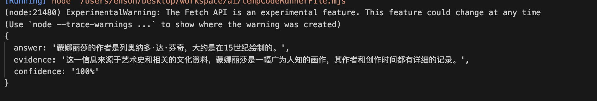

# OutputParser

OutputParser是一个用于解析模型输出的工具类，它可以帮助用户将模型输出解析为用户需要的格式。


## String Output Parser

StringOutputParser是OutputParser的一个实现类，它可以将模型输出解析为字符串。

前面的例子中，我们使用了StringOutputParser来解析模型输出，这里就不过多赘述了。

## StructuredOutputParser （结构化的输出）

StructuredOutputParser是OutputParser的另一个实现类，它可以将模型输出解析为结构化的数据。

例如，我们可以将模型输出解析为JSON格式的数据，这样我们就可以更方便地处理模型输出。

下面是一个使用StructuredOutputParser的例子：

```js
import { StructuredOutputParser } from "langchain/output_parsers";
import { PromptTemplate } from "@langchain/core/prompts";

const parser = StructuredOutputParser.fromNamesAndDescriptions({
  answer: "用户问题的答案",
  evidence: "你回答用户问题所依据的答案",
  confidence: "问题答案的可信度评分，格式是百分数",
});

```

定义这个 praser 的时候，我们需要指定我们需要的 Json 输出的 key 和对应的描述。注意这里的描述要写完整，包括你的要求的格式（比如我们这里写的格式是百分数），越清晰 LLM 越能返回给你需要的数值。


我们通过调用 `getFormatInstructions` 方法来获取格式化指令：
```js
console.log(parser.getFormatInstructions())
```

输入结果如下 👇

```js
You must format your output as a JSON value that adheres to a given "JSON Schema" instance.

"JSON Schema" is a declarative language that allows you to annotate and validate JSON documents.

For example, the example "JSON Schema" instance {{"properties": {{"foo": {{"description": "a list of test words", "type": "array", "items": {{"type": "string"}}}}}}, "required": ["foo"]}}}}
would match an object with one required property, "foo". The "type" property specifies "foo" must be an "array", and the "description" property semantically describes it as "a list of test words". The items within "foo" must be strings.
Thus, the object {{"foo": ["bar", "baz"]}} is a well-formatted instance of this example "JSON Schema". The object {{"properties": {{"foo": ["bar", "baz"]}}}} is not well-formatted.

Your output will be parsed and type-checked according to the provided schema instance, so make sure all fields in your output match the schema exactly and there are no trailing commas!

Here is the JSON Schema instance your output must adhere to. Include the enclosing markdown codeblock:
` ``json
{"type":"object","properties":{"answer":{"type":"string","description":"用户问题的答案"},"evidence":{"type":"string","description":"你回答用户问题所依据的答案"},"confidence":{"type":"string","description":"问题答案的可信度评分，格式是百分数"}},"required":["answer","evidence","confidence"],"additionalProperties":false,"$schema":"http://json-schema.org/draft-07/schema#"}
` ` `
```


这里我们可以看到，这个指令首先会告知 LLM 输出的类型。

其次，会通过 few-shot（一种 prompt 技巧），也就是用示例告诉 LLM 什么是 JSON Schema，什么情况会被解析成功，什么情况不会被解析成功。

最后，会告知我们的 JSON Schema 是什么，我们的输出必须符合这个 Schema，否则会解析失败。

通过这样一系列的 prompt，就能保证大模型以指定的格式输出，我们完成 Chain 的其他部分看看效果：

```js
import { StructuredOutputParser } from "langchain/output_parsers";
import { PromptTemplate } from "@langchain/core/prompts";
import ollama from './utils/ollama-llm.mjs';
import baidu from './utils/baidu-llm.mjs';

const model = baidu;

const parser = StructuredOutputParser.fromNamesAndDescriptions({
  answer: "用户问题的答案",
  evidence: "你回答用户问题所依据的答案",
  confidence: "问题答案的可信度评分，格式是百分数",
});

// console.log(parser.getFormatInstructions());

const prompt = PromptTemplate.fromTemplate("尽可能的用中文回答用户问题 \n{instructions} \n{question}")

const chain = prompt.pipe(model).pipe(parser)
const res = await chain.invoke({
    question: "蒙娜丽莎的作者是谁？是什么时候绘制的？",
    instructions: parser.getFormatInstructions()
})
                               
console.log(res)
```




## List Output Parser

控制大模型输出是数组

```js
import { CommaSeparatedListOutputParser } from "@langchain/core/output_parsers";
import { PromptTemplate } from "@langchain/core/prompts";
import ollama from './utils/ollama-llm.mjs';
import baidu from './utils/baidu-llm.mjs';

const model = baidu;

const parser = new CommaSeparatedListOutputParser();

const prompt = PromptTemplate.fromTemplate("列出3个 {country} 的著名的互联网公司.\n{instructions}")

const chain = prompt.pipe(model).pipe(parser);

const res = await chain.invoke({
    country: "中国",
    instructions: parser.getFormatInstructions()
});

console.log(res); // eg: [ '百度，阿里巴巴，腾讯。' ]
```

## Auto Fix Parser

当 LLM 返回的格式有问题时，可以通过 Auto Fix Parser 重新校验格式。

首先，我们需要使用 zod，一个用来验证 js/ts 中类型是否正确的库。先使用 zod 定义一个我们需要的类型，这里我们指定了评分需要是一个数字，并且是 [0, 100] 的数字。

例如这个例子👇：

```js
// Auto Fix Parser

import { z } from "zod"; // zod 是一个可以验证 js/ts 是否符合类型的库
import { StructuredOutputParser, OutputFixingParser } from "langchain/output_parsers";
import { PromptTemplate } from "@langchain/core/prompts";
import ollama from "./utils/ollama-llm.mjs";

const schema = z.object({
    answer:  z.string().describe("用户问题的答案"),
    confidence: z.number().min(0).max(100).describe("问题答案的可信度评分，满分 100")
});

const parser = StructuredOutputParser.fromZodSchema(schema);
const prompt = PromptTemplate.fromTemplate("尽可能的回答用户问题 \n{instructions} \n{question}");

const model = ollama;
const chain = prompt.pipe(model).pipe(parser);

const res = await chain.invoke({
    question: "蒙娜丽莎的作者是谁？是什么时候绘制的",
    instructions: parser.getFormatInstructions()
});

console.log(res);

const wrongOutput = {
    "answer": "蒙娜丽莎的作者是达芬奇，大约在16世纪初期（1503年至1506年之间）开始绘制。",
    "sources": "90%" 
};
  

// 自动校正
const fixParser = OutputFixingParser.fromLLM(model, parser);
const output = await fixParser.parse(JSON.stringify(wrongOutput));

console.log(output);
```


可能会有朋友问，如果我把用户的问题也给 fixParser，这样不就得到一个正确的答案和正确的格式了么？ 在我们的 demo 中当然是可以的，但实际工程中，引导 llm 返回数据的 prompt 可能非常巨大，非常消耗 token，我们使用 fixParser 就是用较少的成本去修复这个输出，来节约重复调用的成本。所以把原文也给 fixParser 的话，就达不到成本节约的目的了。

在进一步节约成本的背景下，我们是可以用对 GPT4 的错误输出用 GPT3.5 的 fixer 来修复，甚至是用一些开源模型来进行修复，因为在这个场景下，并不需要模型具有太高的质量，通过多模型的协同来降低成本。

