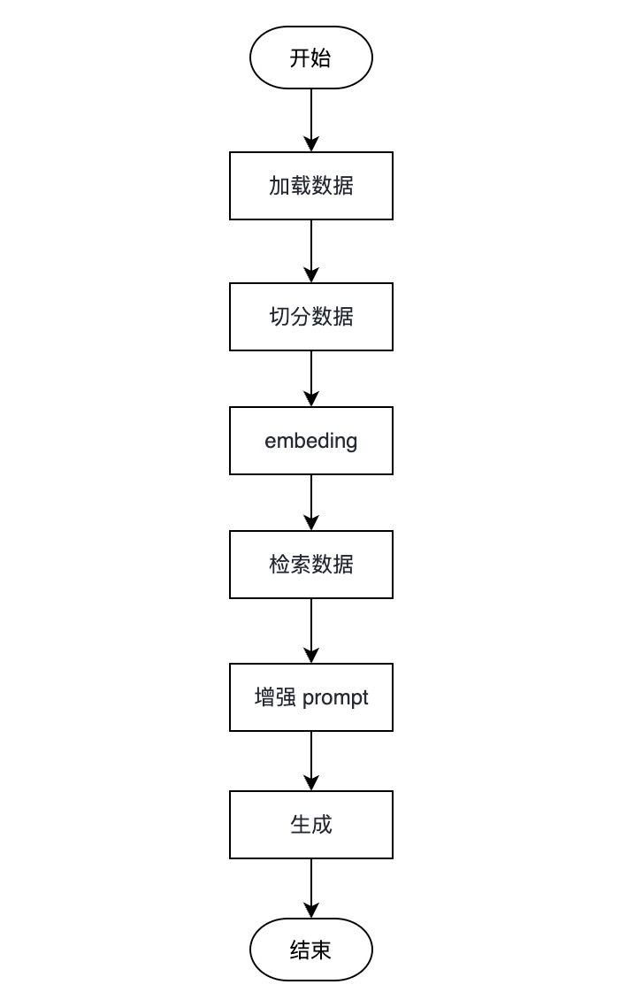

# RAG 检索增强生成的流程

RAG 其全称是 Retrieval Augmented Generation，可以被翻译成 检索增强生成技术，从标题上也能了解其核心的流程 检索 => 增强 => 生成。

## LLM 的局限

在介绍 RAG 之前，我们先来了解一下 LLM 的局限性。

首先是幻觉问题（hallucination），LLM 底层还不具备真正的逻辑推理能力，是根据大量的数据进行概率性预测，所以在某些情况下，LLM 会生成一些不合理的答案。

其次是对领域知识的欠缺，造成这个问题主要是俩个原因，第一个是对知识的更新慢，另一个是对专业领域的知识训练样本不足导致。

## RAG 的优势

当我们了解了 LLM 的局限性后，RAG 会尽可能提供与答案相关的上下文，来增强它正确输出的可能性。

RAG 的优势主要体现在以下几个方面： 

1. 用户输入提问
2. 检索：根据用户提问对 向量数据库 进行相似性检测，查找与回答用户问题最相关的内容
3. 增强：根据检索的结果，生成 prompt。 一般都会涉及 “仅依赖下述信息源来回答问题” 这种限制 LLM 参考信息源的语句，来减少幻想，让回答更加聚焦
4. 生成：将增强后的 prompt 传递给 LLM，返回数据给用户

所以 RAG 就是哪里有问题解决哪里，既然大模型无法获得最新和内部的数据集，那我们就使用外挂的向量数据库为 LLM 提供最新和内部的数据库。既然大模型有幻想问题，我们就将回答问题所需要的信息和知识编码到上下文中，强制大模型只参考这些内容进行回答。

注意：LLM 是逻辑推理引擎，而不是信息引擎。所以，由外挂的向量数据库提供最有效的知识，然后由 LLM 根据知识进行推理，提供有价值的回复。

## RAG 流程

后续章节，我们将针对 RAG 的各个流程做详细的介绍。

