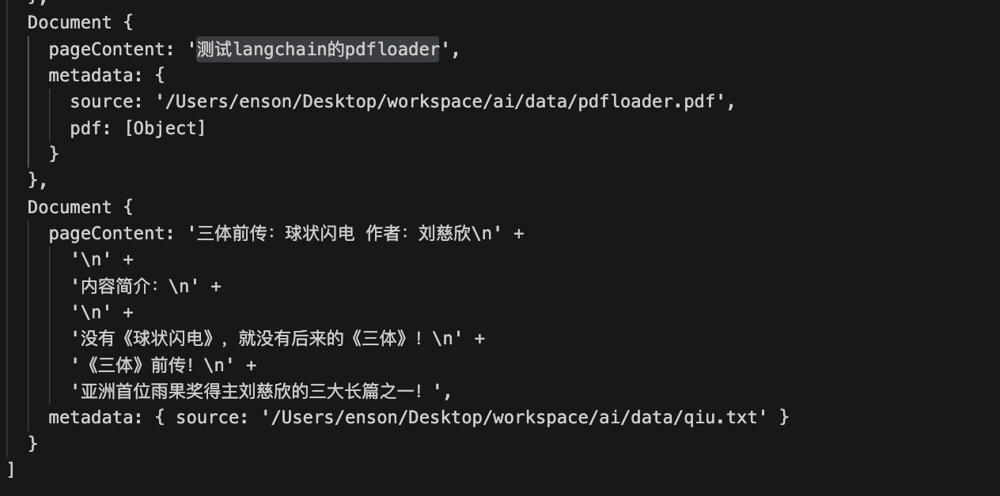
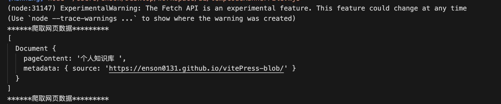
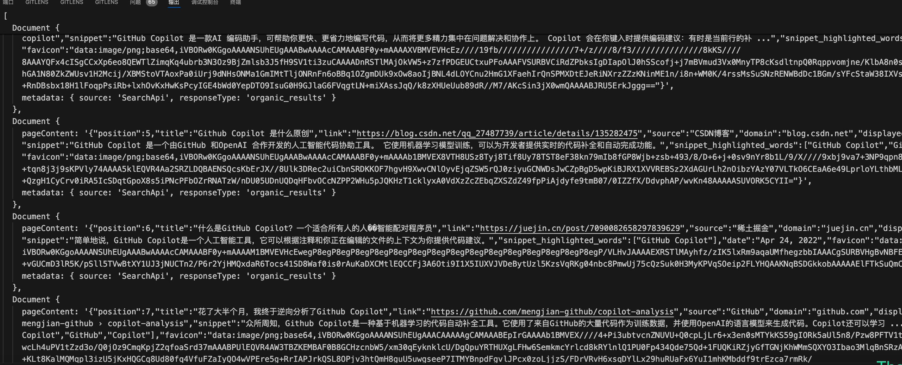

# RAG 之加载数据

因为 RAG 本质是给 Chat Bot 额外挂在数据源，而数据源存在的形式是多种多样的，有可能是文件/网页/数据库/代码等等其情况。

针对这个情况，langchain 提供了一系列开箱即用的数据加载器 （loader），方便用户快速加载数据。

## Document 对象

Document 对象你可以理解成 langchain 对所有类型的数据的一个统一抽象，其中包含

pageContent 文本内容，即文档对象对应的文本数据
metadata 元数据，文本数据对应的元数据，例如 原始文档的标题、页数等信息，可以用于后面 `Retriever` 基于此进行筛选。

```TypeScript
// Document 对象的定义
interface Document {
  pageContent: string;
  metadata: Record<string, any>;
}
```


## Loader

RAG 的第一步就是加载数据，而加载数据的方式有很多种，langchain 提供了一系列的 loader，方便用户快速加载数据。

下面将简单举一俩个 loader 的例子，更多的 loader 可以查看 [传送门](https://js.langchain.com/v0.2/docs/how_to/#document-loaders)

### DirectoryLoader

根据目录加载不同的文件数据

```js
// DirectoryLoader 加载文件夹内的文件内容

import { DirectoryLoader } from "langchain/document_loaders/fs/directory";
import { TextLoader } from "langchain/document_loaders/fs/text";
import { PDFLoader } from "langchain/document_loaders/fs/pdf";

const loader = new DirectoryLoader(
    "./data",
    {
      // 通过文件后缀名来指定加载器
      ".pdf": (path) => new PDFLoader(path, { splitPages: false }),
      ".txt": (path) => new TextLoader(path),
    }
  );
const docs = await loader.load();

console.log(docs); 
```

输出结果如下：👇




### WebLoader

对于 LLM 所需要提取的信息是网页中`静态`的信息时，一般使用 Cheerio 用来提取和处理 html 内容，类似于 python 中的 BeautifulSoup。 这两者都是只能针对静态的 html，无法运行其中的 js, 对大部分场景都是够用的。

```js
import { CheerioWebBaseLoader } from "@langchain/community/document_loaders/web/cheerio";
import "cheerio";

const loader = new CheerioWebBaseLoader(
  "https://enson0131.github.io/vitePress-blob/",
  {
    selector: "h3",
  }
);

const docs = await loader.load();

console.log(`******爬取网页数据*********`);
console.log(docs);
console.log(`******爬取网页数据*********`); 
```




## Search API

在 langchain 中 SearchApiLoader 和 SerpAPILoader 这个两个提供的都是接入搜索的能力，免费计划都是每个月 100 次 search 能力，除了 google 外，也支持 baidu/bing 等常用的搜索引擎。

首先我们需要在 [SearchAPI](https://www.searchapi.io/) 注册一个账号，然后获取到 API Key，然后将 API Key 设置为环境变量 `SEARCH_KEY`

```js
import { SearchApiLoader } from "@langchain/community/document_loaders/web/searchapi";
import 'dotenv/config'
// https://js.langchain.com/v0.2/docs/integrations/document_loaders/web_loaders/searchapi
const apiKey = process.env["SEARCH_KEY"]
const question = "什么 github copliot"
const searchLoader = new SearchApiLoader({ q: question, apiKey, engine: "google" });
const searchRes = await searchLoader.load();
```

输出结果如下：👇




# 参考文档
- https://js.langchain.com/v0.2/docs/how_to/document_loader_directory/
- https://js.langchain.com/v0.2/docs/integrations/document_loaders/web_loaders/searchapi
