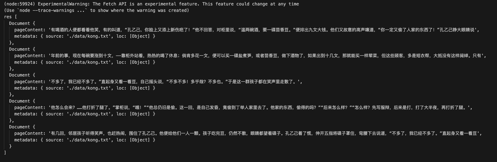

# Retriever 常见的优化方式

上一节我们通过厂商提供的 Embedding 算法去制作匹配向量，通过 Facebook 提供的 Faiss 作为向量数据库，将数据存储到向量数据库中。

接下来我们将优化 Retriever 检索数据的方式


## MultiQueryRetriever

MultiQueryRetriever 思路，或者说其他解决 llm 缺陷的思路基本都是一致的：加入更多 llm。

而 MultiQueryRetriever 是其中比较简单的一种解决方案，它使用 LLM 去将用户的输入改写成多个不同写法，从不同的角度来表达同一个意思，来克服因为关键词或者细微措词导致检索效果差的问题。

```js
// MultiQueryRetriever: 
import "dotenv/config";
import { FaissStore } from "@langchain/community/vectorstores/faiss";
import { BaiduQianfanEmbeddings } from "@langchain/community/embeddings/baidu_qianfan";
import { MultiQueryRetriever } from "langchain/retrievers/multi_query";
import { TextLoader } from "langchain/document_loaders/fs/text";
import { RecursiveCharacterTextSplitter } from 'langchain/text_splitter';
import ollama from './utils/ollama-llm.mjs';
import ernieTurbo from './utils/baidu-llm.mjs';

const loader = new TextLoader('./data/kong.txt');

const docs = await loader.load();

const splitter = new RecursiveCharacterTextSplitter({
    chunkSize: 100, // 分块的大小
    chunkOverlap: 20, // 块之间的重叠
});

const splitDocs = await splitter.splitDocuments(docs); // 对文章进行切片

const embedding = new BaiduQianfanEmbeddings(); // Embedding-V1是基于百度文心大模型技术的文本表示模型，将文本转化为用数值表示的向量形式，用于文本检索、信息推荐、知识挖掘等场景。

const vectorStore = await FaissStore.fromDocuments(splitDocs, embedding); // 从文档中创建一个向量存储

const retriever = MultiQueryRetriever.fromLLM({ // 通过 LLM 去生存不同的检索
    llm: ernieTurbo, // 传入的 LLM 模型
    retriever: vectorStore.asRetriever(3), // 向量数据库的 retriever
    queryCount: 3, // 生成 3 条不同的描述
    verbose: true, // 设置为 true 会打印出 chain 内部的详细执行过程方便 debug
});

const res = await retriever.invoke("茴香豆是做什么用的"); // 一共会生成 9 条数据，再做去重

console.log(`res`, res);
```

执行上面的代码我们可以看到，通过 LLM 目前，可以将我们的描述生成 3 条不同的描述，避免语意偏差。

```js
茴香豆的主要用途是什么？
茴香豆通常用于哪些场合或文化中？
茴香豆在烹饪中有什么作用？
```

因为用户的原始输入是 `茴香豆是做什么用的`，这是一个非常模糊和有歧义性的问题，作为写这个问题的用户，他可能了解想要的答案是 “茴香豆是下酒用的”，但因为自然语言的特点，这是有歧义的的。 

MultiQueryRetriever 的意义就是，找出这句话所有可能的意义，然后用这些可能的意义去检索，避免因为歧义导致检索错误。


## ContextualCompressionRetriever

Retriever 另一个问题是，如果我们设置了 K 值（每次检索返回的文档数量）较小，那么返回的结果可能并不是最佳的效果，就想搜索引擎第一条结果并不一定是问题最高质量的结果一样。

而如果 K 值设置过大，可能返回的结果会有很多，撑爆了 LLM 的上下文大小。

因此，我们可以通过 `ContextualCompressionRetriever` 通过 LLM 去压缩检索结果，然后再返回给用户。

```js
 const model = new ChatOpenAI();
 const compressor = LLMChainExtractor.fromLLM(model);
 const retriever = new ContextualCompressionRetriever({
    baseCompressor: compressor,
    baseRetriever: vectorstore.asRetriever(2),
 });
```


通过结果可以看到，通过 LLM 去压缩检索结果，然后再返回给用户。

## ScoreThresholdRetriever

前面我们提到了，K 值的设置可能会导致检索结果不准确，不同的数据中 K 值不一定是固定的，而通过 ScoreThresholdRetriever 可以动态调整 K 值。

```js
const retriever = ScoreThresholdRetriever.fromVectorStore(vectorstore, {
    minSimilarityScore: 0.4, // 相似度
    maxK: 5, // 最大 K 值
    kIncrement: 1, // K 值每次增加的步长
});
```



# 参考文章
- https://js.langchain.com/v0.1/docs/modules/data_connection/retrievers/similarity-score-threshold-retriever/#usage
- https://js.langchain.com/v0.1/docs/modules/data_connection/retrievers/contextual_compression/


