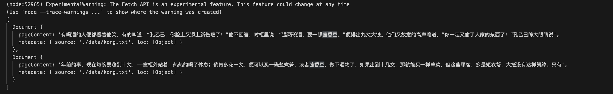

# Retriever 之向量数据库

经过前面的学习，我们知道了如何对 数据进行加载和切割，接下来我们就要学习如何将数据通过 Embedding 算法转化为向量加载到向量数据库中。

## Embedding

这里我们用最简单的词袋（words bag）模型来描述一下最简单的 embedding 过程，让大家更具象化的理解这个。

简单地说，词袋模型首先将一篇文章拆分成一个个单词，然后将其放入袋子里面。

例如我们有十篇文章，我们可以将文章拆分成一个个单词，然后统计单词出现的次数

```js

第一篇文章:
enson: 10  cool: 5  handsome: 8

第二篇文章:
monkey: 8  cute: 2 handsome: 4

```

那我们尝试构建一个向量，也就是一个数组，每个位置有一个值，代表每个单词在这个文章中出现的次数

`[enson, cool, handsome, monkey, cute]`

那每篇文章，都能用一个变量来表示

```js
[10, 5, 8, 0, 0]
[0, 0, 8, 8, 4]
```

可以用最简单的余弦定理去计算两个向量之间的夹角，以此确定两个向量的距离。 这样，我们就有了通过向量和向量之间的余弦夹角的，来衡量文章之间相似度的能力。

回到我们 RAG 流程中，我们将切分后的每一个文档块使用 embedding 算法转换成一个向量，存储到向量数据库中（vector store）中。这样，每一个原始数据都有一个对应的向量，可以用来检索。

在企业开发中，一般会使用厂商提供的 Embedding 服务，例如 


## VectorStore

Vector store 提供提供的是存储向量和原始文档，并且提供基于向量进行相关性检索的能力。

因为 js 并不是一个面向后端和机器学习相关的语言，所以原生的 vector store 并不多，大多数还是以支持 python 为主。目前也有像 [lanceDB](https://lancedb.com/) 原生支持 js 的，但毕竟是少数。

我们将使用由 facebook 开源的 [faiss](https://github.com/facebookresearch/faiss) 向量数据库，目前有 27.7k star，是向量数据库中非常流行的开源解决方案。选择这个的原因是其可以将向量数据库导出成文件，并且提供了 python 和 nodejs 的处理方式。


```js
// 安装 faiss
yarn add faiss-node
```


```js
// https://js.langchain.com/v0.2/docs/integrations/vectorstores/faiss/#create-a-new-index-from-texts
import "dotenv/config";
import { FaissStore } from "@langchain/community/vectorstores/faiss";
import { TextLoader } from "langchain/document_loaders/fs/text";
import { RecursiveCharacterTextSplitter } from 'langchain/text_splitter';
import { BaiduQianfanEmbeddings } from "@langchain/community/embeddings/baidu_qianfan"; // 开通千帆 Embedding 模型, https://cloud.baidu.com/doc/VDB/s/Nltgvlg7k

const loader = new TextLoader('./data/kong.txt');

const docs = await loader.load();

const splitter = new RecursiveCharacterTextSplitter({
    chunkSize: 100, // 分块的大小
    chunkOverlap: 20, // 块之间的重叠
});

const splitDocs = await splitter.splitDocuments(docs);

const embedding = new BaiduQianfanEmbeddings(); // Embedding-V1是基于百度文心大模型技术的文本表示模型，将文本转化为用数值表示的向量形式，用于文本检索、信息推荐、知识挖掘等场景。

const vectorStore = await FaissStore.fromDocuments(splitDocs, embedding);

const retriever = vectorStore.asRetriever(2); // 获取最相关的俩个文档片段
const res = await retriever.invoke("茴香豆是做什么用的");

console.log(res);

```




