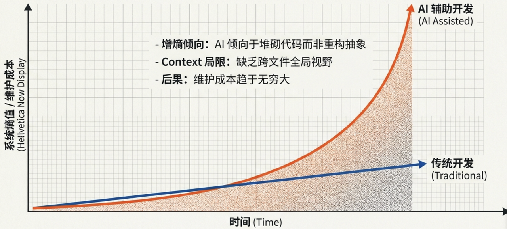
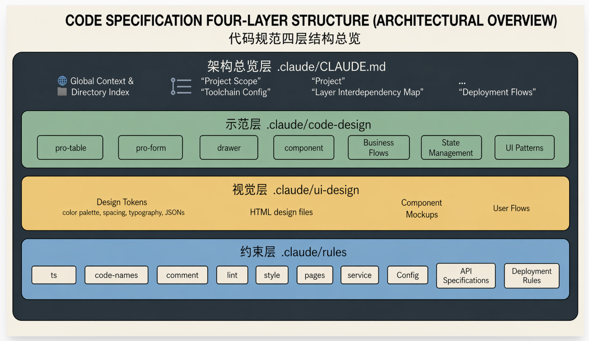
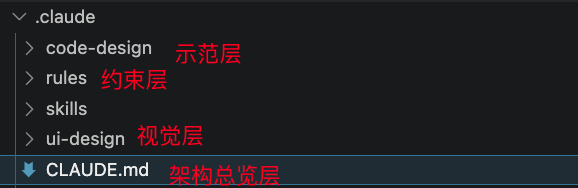
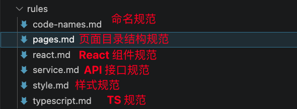
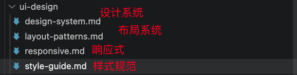
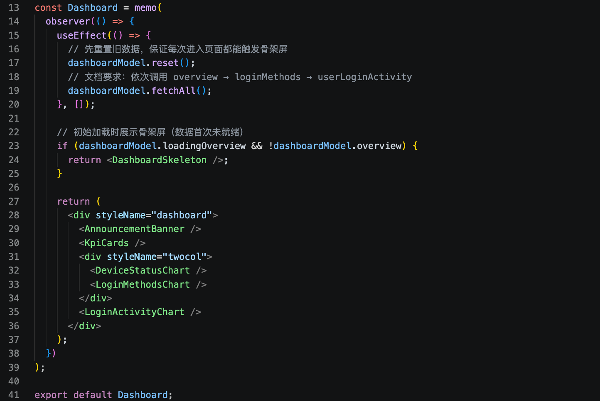
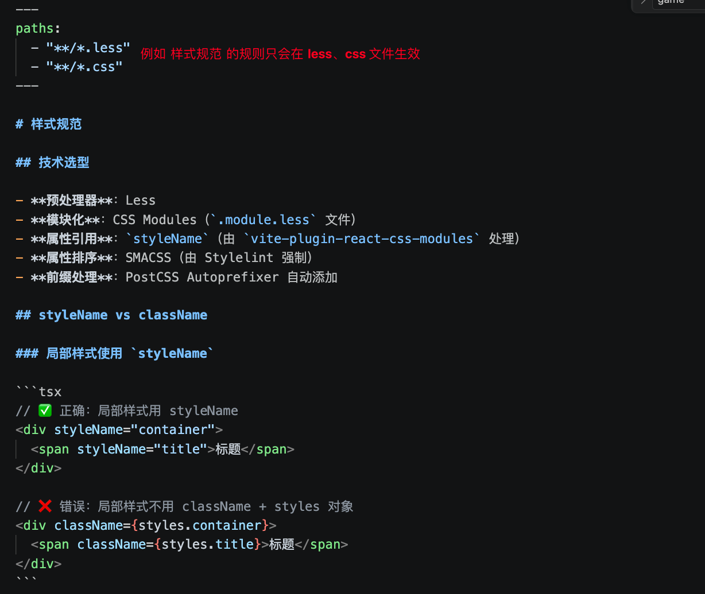
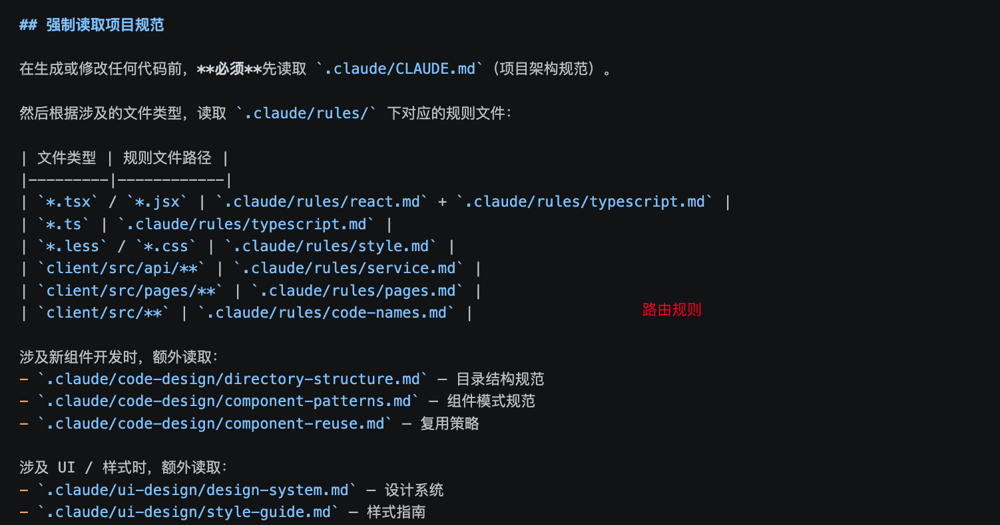
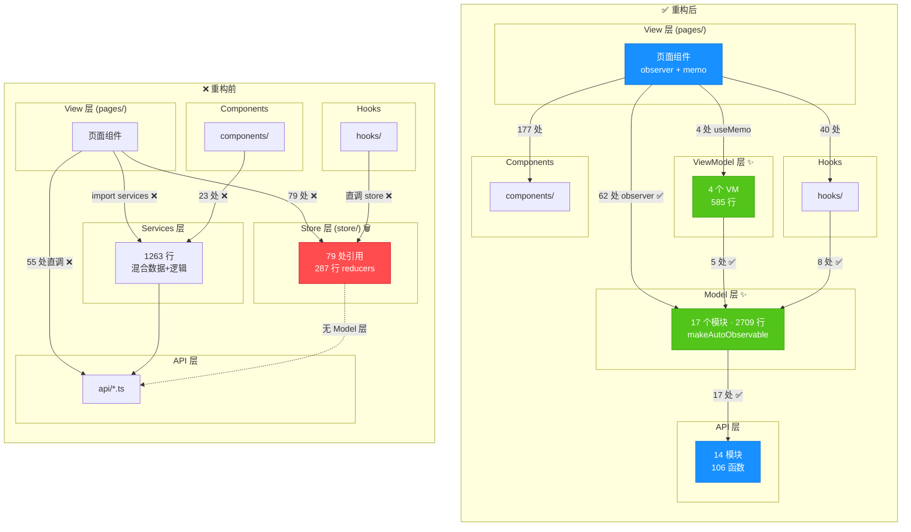

# 【AI 实践】 AI 时代下重构旧时代系统


## 前言

软件工程本质是一个对抗熵增的过程，我们需要将 无序的需求 转化成 有序的代码。



随着 AI 编程的普及，AI 是一个高增益放大器，必须匹配更强的阻尼机制（例如严格的测试、Review、Linting、架构设计）。

如何让 AI 在面对无序的需求时，生成有序代码是一个值得思考的问题。

接下来，在下将以 重构旧时代系统 为例，去思考在 AI 时代下，我们应该如何去构建一个系统，来对抗熵增，让系统保持有序。

## 核心理念1: 规则约束

### 为什么需要规则约束

AI 模型具备"通识能力"，给它一个需求描述，它确实能生成可运行的代码。

但问题在于，这些代码往往是"外星代码"：
- 风格不一致（命名规范、目录结构、分层方式与项目现有代码不同）
- 复用率低（没有利用项目已有的公共组件、工具函数、请求封装、生成的代码像一坨 "💩山"）
- 采纳率低（Code Review 时研发同学看到"外来风格"的代码，会产生大量修改意见）

结果就是：AI 生成了代码，但 Review 成本和返工成本反而更高了。

这时候可能有同学会说: "是用的 AI 模型太垃圾啦，换一个牛一点的模型就好了！"，诚然，模型的能力是一个重要因素，但除了模型能力之外，**规则约束**也是一个重要因素。

规则约束可以给 AI 一个已有的实现作为参照，限定 AI 的能力边界，让它照着复刻一份，而不是凭空创造，这就像给一个新入职的工程师说"你照着这个模块的风格，写一个类似的"，而不是"你自由发挥"——前者往往能更快产出符合团队规范的代码。

### 【实践】规则约束

在这次 AI 重构系统的实践中，在下给系统划分了 4 层规则约束 （架构层、示范层、视觉层、约束层）

- 架构层：定义系统的分层架构，明确每一层的职责和边界，让 AI 「对系统有一个整体的认知」
- 示范层：提供已有的实现作为示范，Good Case 与 Bad Case，告诉 AI「标准产出长什么样」
- 视觉层：提供系统的目录结构、文件结构等视觉信息，告诉 AI「页面应该长什么样」
- 约束层：提供一些具体的规则约束，例如命名规范、函数长度、注释规范等，告诉 AI「禁止什么、必须怎样」






#### 约束层

在约束层面，在下提供了一些具体的规则约束，例如命名规范、函数长度、注释规范等，告诉 AI「禁止什么、必须怎样」，让 AI 在生成代码时有明确的规则可遵循，从而提高代码的质量和一致性。




#### 视觉层

在视觉层面，在下提供设计系统（主题色、UI库、图标、字体等）、布局系统（Grid 布局、Flex 布局等）、样式开发规范、响应策略等视觉信息，告诉 AI「页面应该长什么样」



#### 示范层

在这次实践中，在下从 组件编写规范、组件复用规范、API 接口设计规范、项目整体结构 维度提供了一个已有的实现作为示范，告诉 AI「标准产出长什么样」，同时也提供了一些 Bad Case，告诉 AI「不符合规范的产出长什么样」，让 AI 知道什么是好的代码，什么是不好的代码，从而提高生成代码的质量和采纳率。

#### 架构层

在架构层面，我们定义了系统的分层架构，明确了每一层的职责和边界，让 AI 对系统有一个整体的认知。例如在这次重构事件中，划分了 3 层：

- Model 层：负责数据模型的定义和数据访问
- ViewModel 层：负责业务逻辑的处理和数据的转换
- View 层：负责 UI 的展示和用户交互

通过明确的分层架构，AI 在生成代码时就有了清晰的职责划分，知道每一层应该做什么，从而生成符合架构规范的代码，同时也方便了后续的复用。

```
API 层 (client/src/api/)               → 定义 MethodsAPI 常量 + callAPI 调用函数
Model 层 (client/src/models/)           → MobX 业务状态模型（makeAutoObservable 单例）
ViewModel 层 (client/src/view-models/)  → 页面级 UI 交互逻辑 (可选)
View 层 (client/src/pages/)             → React 组件（observer + memo）
```

> 实践中，Model 层尽量保持单一职责，如有数据聚合、数据转化等诉求，优先放在 ViewModel 层去实现，避免 Model 层过于臃肿，AI 也可以尽可能的复用 Model 层的代码，减少重复代码的生成。


#### 生成效果




> 通过以上的规则约束，AI 生成的代码质量和采纳率得到了显著提升，研发同学在 Code Review 时的修改意见也大大减少了，整体的开发效率得到了提升。

#### 注意事项

###### 1. 过大、过多的规则文件会占用更多上下文窗口、降低 Agent 对规则的遵循度，增加冲突概率。

在这次实践中，在下对规则进行了分层，拆分为多个 Markdown 文件，使用或导入机制（例如 @path/to/file）或路径匹配规则来进行引用，既保证了规则的完整性，又避免了单个规则文件过大导致的问题。






###### 2. 如何查看规则是否被命中

常见可以通过询问大模型、观察日志输出的记录，也可以通过运行 /memory（或类似命令）查看当前自动记忆的规则。


## 收益



| 对比项 | 重构前 | 重构后 |
| --- | --- | --- |
| 页面直调 API | 55 处 ❌ | 0 处 ✅ |
| 依赖方向 | 四向交叉（pages↔store↔services↔api） | 单向下行（View → VM → Model → API） |
| store/ 目录 | 存在 | 已删除 |
| Services 耦合 | pages + components 直接引用 | 仅 components/global 遗留 25 处（待迁移） |