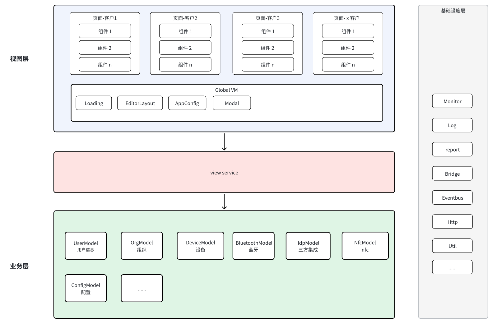
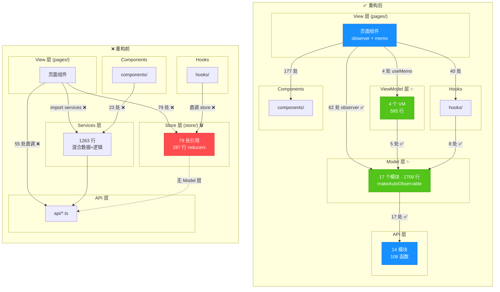

# 【AI 实践】 AI 时代下重构旧时代系统


## 前言

软件工程本质是一个对抗熵增的过程，我们需要将 无序的需求 转化成 有序的代码。


随着 AI 编程的普及，AI 是一个高增益放大器，必须匹配更强的阻尼机制（例如严格的测试、Review、Linting、架构设计）。

如何让 AI 在面对无序的需求时，生成有序代码是一个值得思考的问题。


## 背景

该系统是一个企业级的管理系统，有多个客户对其进行了定制化开发，导致系统功能复杂、代码质量参差不齐，维护成本高。

业务诉求：最近遇到了一个需求，因新的客户需求与旧系统功能有部分重合，但又有一些新的功能诉求（同时这些功能未来需要同步到其他客户），视图交互完全不同，导致无法直接在旧系统上进行功能开发，只能选择重构旧系统。

接下来，在下将以 重构旧时代系统 为例，去思考在 AI 时代下，我们应该如何去构建一个系统，来对抗熵增，让系统保持有序。


## 核心理念1: SDD （Specification Driven Development，规范驱动开发）驱动重构系统

SDD 典型工作流示例

```
1. explore（调研，脑暴）;
   ⬇️
2. propose "..."（生成设计文档）;
   ⬇️
3. apply-change（写代码）;
   ⬇️
4. verify-change（自测，校验代码与 SDD 文档是否对应）;
   ⬇️
5. archive-change（收尾，归档）
```

重构系统不同于功能开发，重构是「在活体系统上动手术」：这种高风险对 AI 执行提出了截然不同的要求——不仅要知道改什么，更要知道不能改什么，以及按什么顺序改。

SDD 的价值正在于此：在动代码之前，把这三件事全部写清楚。

1. 明确要改什么
2. 不能改什么
3. 按什么顺序改


### 明确要改什么

从业务痛点出发，对业务痛点分析，进而明确要改什么，例如在这次重构事件中，主要是为了满足新的客户需求，同时也要同步到其他客户，方便复用和维护。

因此我们先对现有的系统进行分析，判断当前的系统是否满足新的客户需求，如果不满足，明确需要如何修改系统的哪些部分，才能满足新的客户需求。

以下是系统模块依赖的分析图：

```mermaid
graph TB
  subgraph View["🔴 View 层 (pages/ 118 文件)"]
    Login["LoginForm<br/>405 行 | 26 imports"]
    Devices["DevicesContent<br/>360 行 | 直接调 API"]
    User["User<br/>多文件直接调 API"]
    CP["CPContent<br/>AuthorizationModal 442 行"]
    Nfc["NfcContent<br/>264 行 | 直接调 API"]
    Bluetooth["BluetoothContent<br/>211 行 | BindModal 228 行"]
    Register["Register<br/>VerityCode 283 行"]
    Admins["Administrators<br/>ReplaceManager 249+238 行"]
    Account["AccountSetting<br/>直接调 user API"]
    Forget["ForgotPassword<br/>直接调 user API"]
    Org["Organization<br/>直接调 org API"]
  end

  subgraph Components["🟠 components/ (67 文件)"]
    IdpConfig["IdpConfiguration<br/>1304 行 | 6 sections"]
    LdapModal["LdapModal<br/>857 行 | 2 大 hooks"]
    BatchUpload["BatchUpload<br/>652 行"]
    BatchBind["BatchBindModal<br/>428 行"]
    IdentitySync["IdentitySync<br/>272 行"]
    AppTable["AppTable<br/>223 行"]
  end

  subgraph Hooks["🟡 hooks/ (18 文件)"]
    useCreateLdap["useCreateLdap<br/>458 行 巨型 hook"]
    useDetailLdap["useDetailLdap<br/>285 行"]
    useNavList["useNavList<br/>131 行"]
    useConfig["useConfig / useAppConfig"]
  end

  subgraph Services["🟤 services/ (1280 行)"]
    ErrorHandler["errorHandler<br/>352 行"]
    IdpService["idpConfiguration<br/>service 206 行 + data 249 行"]
    SyncService["identitySync<br/>service 286 行 + data 187 行"]
  end

  subgraph Store["🔵 store/reducers (287 行)"]
    GlobalStore["global 43行"]
    UserStore["user 39行"]
    CPStore["cP 31行"]
    LdapStore["ldap 25行"]
    OrgStore["org 24行"]
    TeachersStore["teachers 21行"]
    NfcStore["nfc 19行"]
  end

  subgraph API["🟢 api/ (1367 行)"]
    ApiUser["user.ts<br/>349 行 | 23 exports"]
    ApiIdp["idp.ts<br/>298 行"]
    ApiDevices["devices.ts<br/>158 行"]
    ApiTeachers["teachers.ts<br/>127 行"]
    ApiOrg["org.ts + org*.ts"]
    ApiOther["nfc / cP / admin / ..."]
  end

  %% pages → store (51处)
  Login -->|dispatch| Store
  Devices -->|useSelector| Store
  User -->|useSelector| Store
  CP -->|dispatch| Store
  Admins -->|dispatch| Store

  %% pages → api 直接调用 (55处 ❌ 跳过 store)
  Login -.->|直接调用| ApiUser
  Devices -.->|直接调用| ApiDevices
  User -.->|直接调用| ApiUser
  Account -.->|直接调用| ApiUser
  Forget -.->|直接调用| ApiUser
  Org -.->|直接调用| ApiOrg
  Nfc -.->|直接调用| ApiOther
  Bluetooth -.->|直接调用| ApiDevices

  %% pages → components (163处)
  Login --> AppTable
  Devices --> AppTable
  User --> AppTable

  %% pages → hooks (37处)
  Login --> useConfig

  %% components → services (24处 紧耦合)
  IdpConfig ==>|紧耦合| IdpService
  LdapModal ==>|紧耦合| IdpService
  IdentitySync ==>|紧耦合| SyncService

  %% components → api (15处)
  IdpConfig -.->|直接调用| ApiIdp
  LdapModal -.->|直接调用| ApiIdp
  BatchUpload -.->|直接调用| ApiTeachers

  %% components → store (10处)
  LdapModal --> LdapStore
  IdpConfig --> Store

  %% hooks → store (11处)
  useCreateLdap --> LdapStore
  useDetailLdap --> LdapStore
  useNavList --> Store
  useConfig --> Store

  %% services → store (2处)
  IdpService --> Store
  SyncService --> Store

  %% services → api (3处)
  IdpService --> ApiIdp
  SyncService --> ApiIdp

  %% hooks → api (3处)
  useCreateLdap -.-> ApiIdp

  classDef red fill:#ff6b6b,stroke:#c0392b,color:white
  classDef orange fill:#f39c12,stroke:#e67e22,color:white
  classDef danger fill:#e74c3c,stroke:#c0392b,color:white

  class Login,Devices,CP red
  class useCreateLdap,useDetailLdap orange
  class IdpConfig,LdapModal danger
```


从上面的分析图中，不难发现:

- 依赖方向混乱：例如 pages 同时依赖 store(51处) + api(55处) + hooks(37处) + components(163处) — 四向依赖，不利于不同客户之前的功能复用和维护
- store 层存在，且被大量依赖（51处），但其职责不清晰，且存在大量冗余代码（287 行 reducers），不利于维护和复用
- API 层被大量直接调用（例如 pages 直接调用 API 55处，components 直接调用 API 15处，hooks 直接调用 API 3处，services 直接调用 API 3处），导致系统的依赖关系混乱，难以维护和复用
- hooks 同时依赖 store(11处) + api(3处) — 混合了状态管理和网络请求

基于此，业务痛点在于系统的依赖关系混乱，职责划分不清晰，导致系统的维护成本高，复用率低，无法比较好的满足新客户的诉求。因此在重构系统时，我们需要对系统的架构进行重新设计，明确每一层的职责和边界，规范系统的依赖关系，从而提高系统的可维护性和复用率。

在这次重构事件中，在下参考了类似于 Vue 的类 MVVM 设计实践，在 Vue 中 temple 模版是 View 视图，Data 相当于是模型，在 Vue 初始化过程中，通过 Object.defineProperty or Proxy 进行数据劫持，当模板渲染时，会触发 getter，Vue 会收集「依赖」，当数据修改时会触发 setter ，Vue 会通知依赖的视图节点重新渲染，实现 Model → View 的自动同步，这个阶段就是 视图模型层，是连接 Model 和 View 的桥梁，负责 数据绑定 和 事件监听，实现数据和视图的双向同步。

回到业务场景，在下针对现有的业务系统，也划分了 3 层：

- Model 层：负责数据模型的定义和数据访问
- ViewModel 层：负责业务逻辑的处理和数据的转换
- View 层：负责 UI 的展示和用户交互

通过明确的分层架构，AI 在生成代码时就有了清晰的职责划分，知道每一层应该做什么，从而生成符合架构规范的代码，同时也方便了后续的复用。

```
API 层 (client/src/api/)               → 定义 MethodsAPI 常量 + callAPI 调用函数
Model 层 (client/src/models/)           → MobX 业务状态模型（makeAutoObservable 单例）
ViewModel 层 (client/src/view-models/)  → 页面级 UI 交互逻辑 (可选)
View 层 (client/src/pages/)             → React 组件（observer + memo）
```



### 不能改什么

在重构系统时，除了明确要改什么之外，还需要明确不能改什么，例如在这次重构事件中，原有客户的样式、交互、接口需保持不变，避免破坏现有功能。


### 按什么顺序改

在重构系统时，还需要明确按什么顺序改，在方案设计过程中，在下自上而下确认了业务痛点，围绕业务痛点进行架构设计，但在实践过程中，应自下而上修改，优先改 Model 层，确保数据模型的定义和数据访问的正确性，然后改 ViewModel 层，确保业务逻辑的处理和数据的转换的正确性，最后改 View 层，确保 UI 的展示和用户交互的正确性。

## 核心理念2: 规则约束

### 为什么需要规则约束

AI 模型具备"通识能力"，给它一个需求描述，它确实能生成可运行的代码。

但问题在于，这些代码往往是"不符合项目规范的代码"：
- 风格不一致（命名规范、目录结构、分层方式与项目现有代码不同）
- 复用率低（没有利用项目已有的公共组件、工具函数、请求封装、生成的代码杂糅在一团像一坨 "💩山"）
- 采纳率低（Code Review 时研发同学看到"外来风格"的代码，会产生大量修改意见）

结果就是：AI 生成了代码，但 Review 成本和返工成本反而更高了。

这时候可能有同学会说: "是用的 AI 模型太垃圾啦，换一个牛一点的模型就好了！"，诚然，模型的能力是一个重要因素，但除了模型能力之外，**规则约束**也是另一个重要因素。

规则约束可以给 AI 一个已有的实现作为参照，限定 AI 的能力边界，让它照着复刻一份，而不是凭空创造，这就像给一个新入职的工程师说"你照着这个模块的风格，写一个类似的"，而不是"你自由发挥"——前者往往能更快产出符合团队规范的代码。

### 【实践】规则约束

在这次 AI 重构系统的实践中，在下给系统划分了 4 层规则约束 （架构层、示范层、视觉层、约束层）

- 架构层：定义系统的分层架构，明确每一层的职责和边界，让 AI 「对系统有一个整体的认知」
- 示范层：提供已有的实现作为示范，Good Case 与 Bad Case，告诉 AI「标准产出长什么样」
- 视觉层：提供系统的目录结构、文件结构等视觉信息，告诉 AI「页面应该长什么样」
- 约束层：提供一些具体的规则约束，例如命名规范、函数长度、注释规范等，告诉 AI「禁止什么、必须怎样」


#### 约束层

在约束层面，在下提供了一些具体的规则约束，例如命名规范、函数长度、注释规范等，告诉 AI「禁止什么、必须怎样」，让 AI 在生成代码时有明确的规则可遵循，从而提高代码的质量和一致性。


#### 视觉层

在视觉层面，在下提供设计系统（主题色、UI库、图标、字体等）、布局系统（Grid 布局、Flex 布局等）、样式开发规范、响应策略等视觉信息，告诉 AI「页面应该长什么样」


#### 示范层

在这次实践中，在下从 组件编写规范、组件复用规范、API 接口设计规范、项目整体结构 维度提供了一个已有的实现作为示范，告诉 AI「标准产出长什么样」，同时也提供了一些 Bad Case，告诉 AI「不符合规范的产出长什么样」，让 AI 知道什么是好的代码，什么是不好的代码，从而提高生成代码的质量和采纳率。

#### 架构层

在架构层面，我们定义了系统的分层架构，明确了每一层的职责和边界，让 AI 对系统有一个整体的认知。例如在这次重构事件中，划分了 3 层：

- Model 层：负责数据模型的定义和数据访问
- ViewModel 层：负责业务逻辑的处理和数据的转换
- View 层：负责 UI 的展示和用户交互

通过明确的分层架构，AI 在生成代码时就有了清晰的职责划分，知道每一层应该做什么，从而生成符合架构规范的代码，同时也方便了后续的复用。

```
API 层 (client/src/api/)               → 定义 MethodsAPI 常量 + callAPI 调用函数
Model 层 (client/src/models/)           → MobX 业务状态模型（makeAutoObservable 单例）
ViewModel 层 (client/src/view-models/)  → 页面级 UI 交互逻辑 (可选)
View 层 (client/src/pages/)             → React 组件（observer + memo）
```

> 实践中，Model 层尽量保持单一职责，如有数据聚合、数据转化等诉求，优先放在 ViewModel 层去实现，避免 Model 层过于臃肿，AI 也可以尽可能的复用 Model 层的代码，减少重复代码的生成。


#### 生成效果


> 通过以上的规则约束，AI 生成的代码质量和采纳率得到了显著提升，研发同学在 Code Review 时的修改意见也大大减少了，整体的开发效率得到了提升。

#### 注意事项


###### 1. 过大、过多的规则文件会占用更多上下文窗口、降低 Agent 对规则的遵循度，增加冲突概率。

在这次实践中，在下对规则进行了分层，拆分为多个 Markdown 文件，使用或导入机制（例如 @path/to/file）或路径匹配规则来进行引用，既保证了规则的完整性，又避免了单个规则文件过大导致的问题。


###### 2. 如何查看规则是否被命中

常见可以通过询问大模型、观察日志输出的记录，也可以通过运行 /memory（或类似命令）查看当前自动记忆的规则。


## 核心理念3: 可观测


## 收益



| 对比项 | 重构前 | 重构后 |
| --- | --- | --- |
| 页面直调 API | 55 处 ❌ | 0 处 ✅ |
| 依赖方向 | 四向交叉（pages↔store↔services↔api） | 单向下行（View → VM → Model → API） |
| store/ 目录 | 存在 | 已删除 |
| Services 耦合 | pages + components 直接引用 | 仅 components/global 遗留 25 处（待迁移） |


## 展望