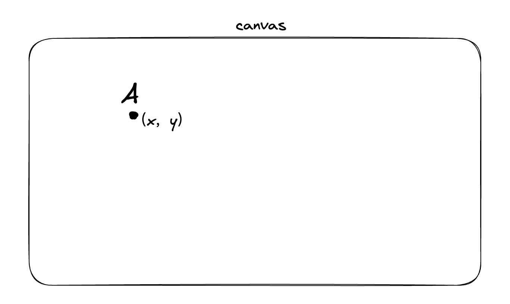
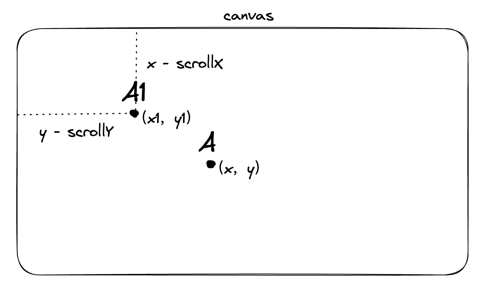
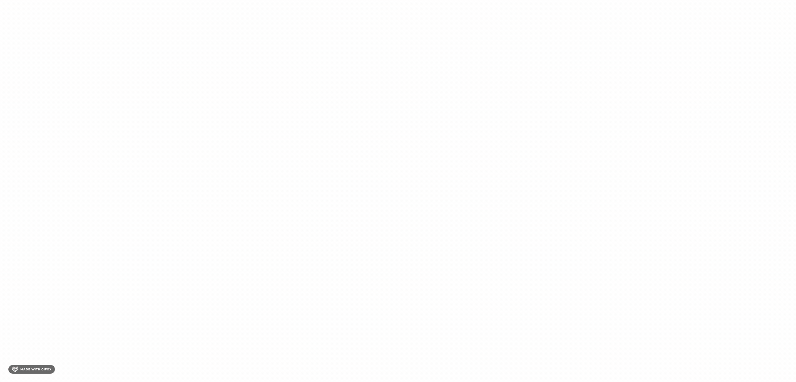
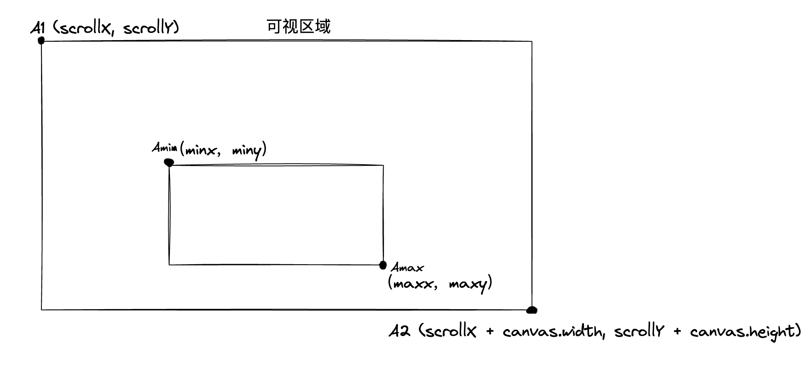
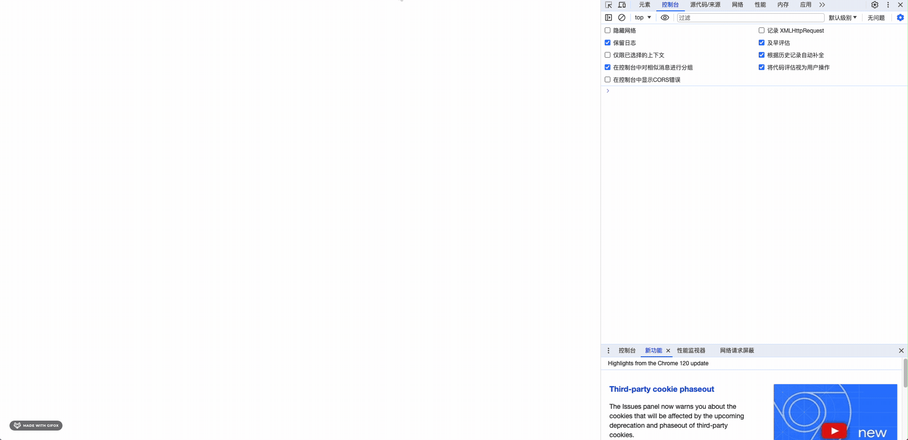

# 可视区域内渲染提高 Canvas 的书写性能

## 前言
上一节我们通过离屏渲染提高了 Canvas 的渲染性能，但是离屏渲染也有一些缺点，比如会增加内存的使用，而且在某些场景下，离屏渲染的性能并不会比直接在 Canvas 上绘制要高。本节我们将介绍如何通过可视区域内渲染提高 Canvas 的书写性能。

## 前提
一般我们说的可视区域内渲染，是指在 Canvas 上只绘制可视区域内的内容，而不是绘制整个 Canvas 的内容。这样做的好处是可以减少 Canvas 的绘制区域，从而提高 Canvas 的渲染性能。

对于 Canvas 而言，无法无限制地扩大 Canvas 的面积，因此浏览器对 Canvas 的大小也有一定的限制。从 [MDN 文档](https://developer.mozilla.org/zh-CN/docs/Web/HTML/Element/canvas#%E6%9C%80%E5%A4%A7%E7%9A%84%E7%94%BB%E5%B8%83%E5%B0%BA%E5%AF%B8) 可知, 在 Chrome 浏览器中，Canvas 的大小限制为 32767px * 32767px。由于 Canvas 的大小限制，因此我们在实现 `无限画布` 的功能时，不能无限拓展 Canvas 的大小，可以通过坐标的切换，来实现无限画布的功能。

## 实现无限画布

### 实现思路

记初始坐标A (x, y), 横向滚动距离为 scrollX, 纵向滚动距离为 scrollY

在初始状态下, scrollX、scrollY 均为 0




假设现在，我们在水平方向向右滚动了scrollX，垂直方向向下滚动scrollY。那么滚动后的坐标就是

x1 = x - scrollX

y1 = y - scrollY

这里大家可能会有疑惑，为什么是减法呢？因为向下滚动后，绘制的图形应该是往上移动的，因此我们需要减去滚动的距离。



在代码中，我们可以通过监听 Canvas 的 WheelEvent 事件，来获取滚动的距离，然后根据上面的公式计算出滚动后的坐标，最后重新绘制 Canvas。

具体实现如下

```jsx
ctx.clearRect(0, 0, window.innerWidth, window.innerHeight);
ctx.save();
ctx.translate(scrollX, scrollY);
// 绘制相关的逻辑
ctx.restore();
```

可以看到，我们在绘制图形之前，我们通过 `translate` API 先将 Canvas 的坐标原点移动到 (scrollX, scrollY) 的位置，然后再绘制图形。这样做的好处是，我们在绘制图形时，不需要再去计算图形的坐标，而是直接使用图形的坐标即可, 以达到图形滚动的目的

### 具体实现
WheelEvent 事件能够监听鼠标滚动。其中的 WheelEvent.deltaX 记录了横向滚动量（也就是我们上面说到的 scrollX），WheelEvent.deltaY 记录了纵向滚动量 （上面说的 scrollY）

我们可以在 Canvas 上监听 WheelEvent 事件，然后根据 WheelEvent.deltaX 和 WheelEvent.deltaY 获取滚动后的距离，然后根据上面的公式计算出滚动后的坐标，最后重新绘制 Canvas。

```jsx
   const handleCanvasWheel = (e: React.WheelEvent<HTMLCanvasElement>) => {
    if (!ctxRef.current) return;
    const { deltaX, deltaY } = e;
    appState.current.scrollX = appState.current.scrollX - deltaX;
    appState.current.scrollY = appState.current.scrollY - deltaY;
    render(ctxRef.current);
  };

  return (
    <>
      <canvas
        ref={canvasRef}
        id="draw"
        className={styles["draw"]}
        onWheel={handleCanvasWheel}
      ></canvas>
    </>
  );
```
### 实现效果


[具体代码](https://github.com/enson0131/learn/blob/main/Canvas/%E7%99%BD%E6%9D%BF%E7%9B%B8%E5%85%B3/canvas-react-demo/my-react-app/src/components/RenderInfiniteCanvas/index.tsx)

## 可视区域内渲染
基于上部分，我们已经实现了无限画布的功能，但我们在绘制图形时，是将整个 Canvas 的内容都绘制了一遍，而不是只绘制可视区域内的内容。因此，我们需要在绘制图形时，只绘制可视区域内的内容，从而提高 Canvas 的书写性能

### 实现思路

我们可以在绘制图形时，判断图形是否在可视区域内，如果在可视区域内，则绘制图形，否则不绘制图形。

判断的逻辑也比较简单，获取图形的坐标的最大值和最小值，然后判断最大值和最小值是否在可视区域内即可。

获取当前书写的图形的最大值和最小值的逻辑如下

```tsx
export interface Pointer {
  x: number;
  y: number;
}
export const getBoundsFromPoints = (points: Pointer[]) => {
  let minX = Infinity;
  let minY = Infinity;
  let maxX = -Infinity;
  let maxY = -Infinity;
  for (const { x, y } of points) {
    minX = Math.min(minX, x);
    minY = Math.min(minY, y);
    maxX = Math.max(maxX, x);
    maxY = Math.max(maxY, y);
  }

  return [minX, minY, maxX, maxY];
};

```

判断最大值和最小值是否在可视区域内，可以通过最小点是否在大于可视区域的最小值，最大点是否小于可视区域的最大值来判断




如上图所示，判断图形是否在可视区域内，需要判断图形的最大点 `大于` A1 && 图形的最小点 `小于` A2 即可。
即判断 maxX >= scrollX && maxY >= scrollY  && minX <= scrollX + window.innerWidth && minY <= scrollY + window.innerHeight

```tsx
/**
 * 判断点是否在画布内
 * @param element
 * @param canvasWidth
 * @param canvasHeight
 * @returns
 */
export const isVisibleElement = (
  element: Pointer[],
  screenCoords = {
    minX: 0,
    minY: 0,
    maxX: window.innerWidth,
    maxY: window.innerHeight,
  }
) => {
  const [x1, y1, x2, y2] = getBoundsFromPoints(element);

  return (
    x1 <= screenCoords.maxX &&
    y1 <= screenCoords.maxY &&
    x2 >= screenCoords.minX &&
    y2 >= screenCoords.minY
  );
};
```

### 具体实现

在 绘制前，先判断图形是否在可视区域内，如果在可视区域内，则绘制图形，否则不绘制图形。

```tsx
 const render = useCallback(
    (ctx: CanvasRenderingContext2D, points?: Pointer[] | undefined) => {
      ctx.clearRect(0, 0, window.innerWidth, window.innerHeight);

      const pointList = [...elementsRes.current, points || []];
      ctx.save();
      ctx.translate(appState.current.scrollX, appState.current.scrollY);
      pointList.forEach((points) => {
        if (!points.length) return;
        // 判断是否在可视区域内
        console.log(
          `是否在可视区域内: `,
          isVisibleElement(points, {
            minX: -appState.current.scrollX,
            minY: -appState.current.scrollY,
            maxX: window.innerWidth - appState.current.scrollX,
            maxY: window.innerHeight - appState.current.scrollY,
          })
        );
        /**
         * 这里为什么是减去scrollX和scrollY呢？
         * （上文 handleCanvasWheel 函数有具体代码 👆）
         * 因为鼠标在向下滚动的时候, appState.current.scrollY 是减去了偏移量，也就是这里的 appState.current.scrollY = -偏移量 
         * 因此我们需要通过减法来获取滚动后的真实坐标
         */
        if (
          isVisibleElement(points, {
            minX: -appState.current.scrollX,
            minY: -appState.current.scrollY,
            maxX: window.innerWidth - appState.current.scrollX,
            maxY: window.innerHeight - appState.current.scrollY,
          })
        ) {
          quadraticCurveTo(ctx, points);
        }
      });
      ctx.restore();
    },
    []
);
```

### 实现效果



[具体代码](https://github.com/enson0131/learn/blob/main/Canvas/%E7%99%BD%E6%9D%BF%E7%9B%B8%E5%85%B3/canvas-react-demo/my-react-app/src/components/RenderCanvasInScreen/index.tsx)


## 参考文章
- https://developer.mozilla.org/zh-CN/docs/Web/HTML/Element/canvas#%E6%9C%80%E5%A4%A7%E7%9A%84%E7%94%BB%E5%B8%83%E5%B0%BA%E5%AF%B8
