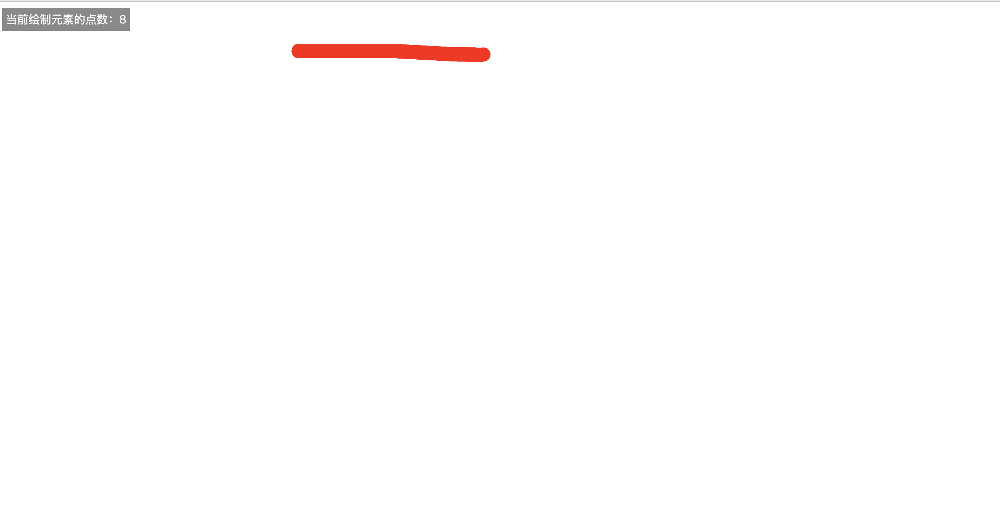

# 如何实现一个自由绘制的 Canvas 画板

## 前言
承接上文，当我们了解了如何去设置一个 Canvas 尺寸，并通过分辨率对 Canvas 进行矫正后，我们就可以开始实现一个自由绘制的 Canvas 画板了。

## 正文

### 实现思路
自由画笔的实现可以通过:

- 1. 监听鼠标事件
- 2. 将鼠标移动的点记录下来
- 3. 将这些点连成线，就可以实现自由画笔了。

### 实现代码
```html
<!DOCTYPE html>
<html lang="en">

<head>
    <meta charset="UTF-8">
    <meta name="viewport" content="width=device-width, initial-scale=1.0">
    <title>画板笔记绘制</title>
    <style>
        body,
        html {
            margin: 0;
            padding: 0;
            overflow: hidden;
        }

        #app-container {
            position: absolute;
            width: 100%;
            height: 100%;
        }

        #draw {
            border: 1px solid black;
            position: absolute;
            width: 100%;
            height: 100%;
        }

        #point-counter {
            position: absolute;
            top: 10px;
            left: 10px;
            color: white;
            background-color: rgba(0, 0, 0, 0.5);
            padding: 5px;
        }
    </style>
</head>

<body>
    <div id="app-container">
        <canvas id="draw"></canvas>
        <div id="point-counter">当前绘制元素的点数：0</div>
    </div>
    <script>
        let start = false; // 是否开始绘制
        let points = []; // 记录鼠标移动的点
        const dpr = window.devicePixelRatio || 1;
        const appContainer = document.getElementById("app-container");
        const pointCounter = document.getElementById("point-counter");
        const canvas = document.getElementById('draw');
        const width = appContainer.clientWidth;
        const height = appContainer.clientHeight;
        const ctx = canvas.getContext('2d');
        canvas.style.width = `${width}px`;
        canvas.style.height = `${height}px`;
        canvas.width = width * dpr;
        canvas.height = height * dpr;
        ctx.scale(dpr, dpr);

        /**
         * 自由画笔的实现思路
         * 1 监听鼠标事件 
         * 2 将鼠标移动的轨迹记录下来
         * 3 然后将这些点连接成线
         */
        canvas.addEventListener('pointerdown', (e) => {
            console.log('e--->', e);
            start = true; // 通过监听鼠标按下事件，来判断是否开始绘制
            addPoint(e); // 将鼠标按下的点添加到points数组中
        });

        canvas.addEventListener('pointermove', ((e) => {
            console.log('e--->', e);
            if (!start) return; // 如果没有按下，则不绘制
            addPoint(e); // 将鼠标移动的点添加到points数组中
            render(ctx, points); // 绘制
            updatePointCounter(points.length);
        }));

        canvas.addEventListener('pointerup', (e) => {
            start = false;
            points = []; // 绘制完毕后，清空points数组
        });

        /*
        * 将鼠标事件的点转化为相对于canvas的坐标上的点
        */
        function addPoint(e) {
            const rect = canvas.getBoundingClientRect(); // 获取canvas相对于视口的位置
            const x = e.clientX - rect.left; // 获取鼠标相对于canvas的位置
            const y = e.clientY - rect.top; // 获取鼠标相对于canvas的位置
            points.push({
                x,
                y
            });
        }

        /**
         * 绘制函数
         * @param {*} ctx - canvas 尺寸
         * @param {*} points - 鼠标移动的点集
         */
        function render(ctx, points) {
            ctx.strokeStyle = 'red'; // 设置线条颜色
            ctx.lineWidth = 20; // 设置线条宽度
            /*
            lineJoin 是 Canvas 2D API 中的一个属性，用于设置或返回两条线相交时的样式。它有三个可能的值：
            "bevel"：在相交处创建一个斜角。
            "round"：在相交处创建一个圆角。
            "miter"：默认值，在相交处创建一个尖角。
            */
            ctx.lineJoin = 'round'; // 设置线条连接处的样式

            /*
            lineCap 是 Canvas 2D API 中的一个属性，用于设置或返回线条的结束端点样式。它有三个可能的值：
            "butt"：这是默认值，线条的结束端点将是平直的边缘。
            "round"：线条的结束端点将是一个半圆。
            "square"：线条的结束端点将是一个矩形，其长度等于线条的宽度。
            */
            ctx.lineCap = 'round'; // 设置线条末端的样式

            /*
            beginPath() 是 Canvas 2D API 中的一个方法，用于开始一个新的路径。当你想创建一个新的路径时，你需要调用这个方法。
            例如，你可能会这样使用它：
                context.beginPath();
                context.moveTo(50, 50);
                context.lineTo(200, 50);
                context.stroke();
                在这个例子中，beginPath() 开始一个新的路径，moveTo(50, 50) 将路径的起点移动到 (50, 50)，lineTo(200, 50) 添加一条从当前位置到 (200, 50) 的线，
                最后 stroke() 方法绘制出路径。
                其中 context 是你的 canvas 上下文。
            */
            ctx.beginPath(); // 开始绘制

            ctx.moveTo(points[0].x, points[0].y); // 将画笔移动到起始点

            for (let i = 1; i < points.length; i++) {
                ctx.lineTo(points[i].x, points[i].y); // 将画笔移动到下一个点
            }

            ctx.stroke(); // 绘制路径
        }

        // 更新点数计数器
        function updatePointCounter(count) {
            pointCounter.textContent = `当前绘制元素的点数：${count}`;
        }

        function throttle(fn, delay = 60 / 1000) {
            let timer = null;
            return function () {
                if (timer) return;
                timer = setTimeout(() => {
                    fn.apply(this, arguments);
                    timer = null;
                }, delay);
            }
        }
    </script>
</body>
</html>
```

### 实现效果


### 性能优化
从实现的效果以及逻辑中，我们不难发现，我们采集的点是比较密集的，当我们书写的点数越多时，性能就越差，这是因为我们每次都是将所有的点都重新绘制了一遍，这样的性能是很差的，那么我们如何优化这个性能呢？

#### 点稀疏
我们可以通过点稀疏的方式来优化性能，我们可以通过设置一个点的最小距离，当我们的点与上一个点的距离小于这个最小距离时，我们就不绘制这个点，这样就可以减少我们绘制的点数，从而提高性能。

更加简单的实现方式就是通过节流

```js
  canvas.addEventListener('pointermove', throttle((e) => {
      console.log('e--->', e);
      if (!start) return; // 如果没有按下，则不绘制
      addPoint(e); // 将鼠标移动的点添加到points数组中
      render(ctx, points); // 绘制
      updatePointCounter(points.length);
  }));
```
之前绘制一条直线需要近 40 个点


通过点稀释，我们发现画一条直线只需要 8 个点就可以了，这样就大大提高了性能。



虽然点稀释可以减少绘制的点数，提高性能，但在绘制曲线的时候，我们会发现曲线的圆滑度不够，这是因为我们的点数太少了，我们可以通过贝塞尔曲线来优化我们的 Canvas 书写。


## 参考
- https://zhuanlan.zhihu.com/p/438142235