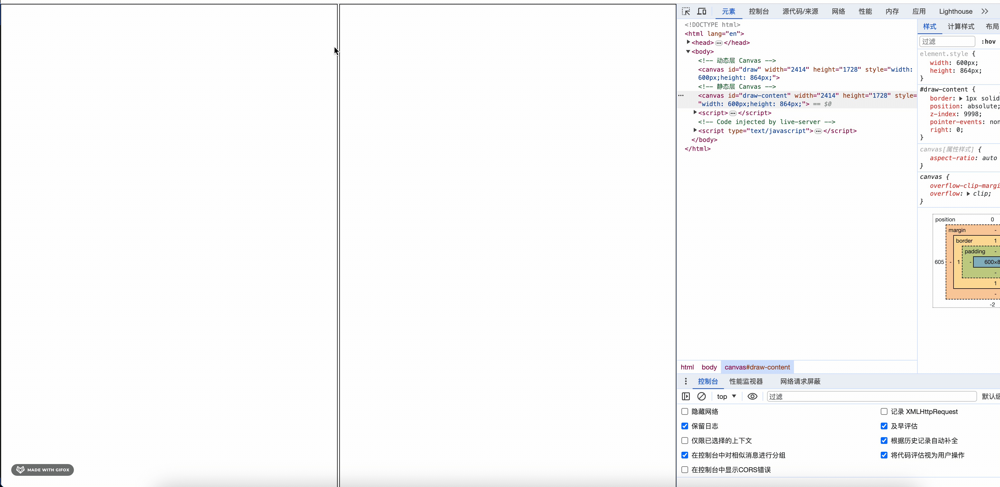
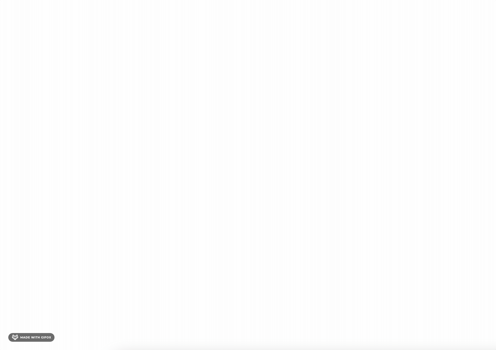

# 通过上下分层优化 Canvas 书写性能

## 前言
上一节，我们通过点稀疏的方式，优化了 Canvas 的绘制性能。但在书写的过程中，因为点的数量减少导致书写的效果不够理想，因此通过贝塞尔曲线的方式，将点连接起来，形成平滑的曲线，从而达到书写的效果。
这节，我们将通过上下分层的方式，优化 Canvas 的书写性能。

## 基本思路
这里我将 Canvas 分为上下两层，上层称之为动态层，下层称之为静态层，动态层用于书写，静态层用于显示书写的效果。当书写的时候，将书写的点绘制到上层，当书写完成后，将上层的内容绘制到下层，然后清空上层的内容，这样就可以达到书写的效果。

因为 Canvas 每次渲染都会将整个 Canvas 清空，所以我们需要将静态层的内容保存下来，然后在每次书写的时候，只需要渲染当前动态层的内容即可。

## 实现

### 创建 2 个 Canvas

首先创建 2 个 Canvas, 上层 Canvas 用于书写, 书写完成后将上层 Canvas 的内容绘制到下层 Canvas 中, 然后清空上层 Canvas 的内容, 这样就可以达到书写的效果。

这样的好处在于, 每次书写的时候, 只需要渲染上层 Canvas 的书写内容即可, 不需要每次都渲染整个 Canvas, 从而达到优化性能的目的。

```html
<style>
    #draw {
        border: 1px solid black;
        position: absolute;
        z-index: 9999;
    }

    #draw-content {
        border: 1px solid black;
        position: absolute;
        z-index: 9998;
        pointer-events: none;
    }
</style>

<!-- 动态层 Canvas -->
<canvas id="draw"></canvas>
<!-- 静态层 Canvas -->
<canvas id="draw-content"></canvas>

```


### 数据动静切换

笔者创建了 2 个 Canvas 后, 可以在书写的过程中（监听 pointerMove 事件），现在数据渲染到动态层 Canvas 上

当书写完成后（监听 pointerUp 事件），将动态层 Canvas 的内容渲染到静态层 Canvas 上

```html
<script>
    /**
     * 自由画笔的实现思路
     * 1 监听鼠标事件 
     * 2 将鼠标移动的轨迹记录下来
     * 3 然后将这些点连接成线
     */
    canvas.addEventListener('pointerdown', (e) => {
        start = true; // 通过监听鼠标按下事件，来判断是否开始绘制
        addPoint((e)); // 将鼠标按下的点添加到points数组中
    });

    canvas.addEventListener('pointermove', (e) => {
        if (!start) return; // 如果没有按下，则不绘制
        addPoint((e)); // 将鼠标移动的点添加到points数组中
        renderUpperCanvas(ctx); // 绘制上层
    });

    canvas.addEventListener('pointerup', (e) => {
        start = false;
        // 将上层 canvas 绘制的内容保存到下层 canvas 中
        history.push(points);
        points = []; // 绘制完毕后，清空points数组
        renderLowerCanvas(ctx, ctxContent);
    });
</script>
```

### 演示效果
这里我将动静 Canvas 分成了左右 2 个部分，左边是动态层 Canvas，右边是静态层 Canvas，可以看到，当书写的时候，只有左边的 Canvas 会有书写的效果，右边的 Canvas 不会有书写的效果，当书写完成后，左边的 Canvas 会将书写的内容绘制到右边的 Canvas 中，然后清空左边的 Canvas 的内容，这样就可以达到书写的效果。



当我们把 2 个 Canvas 整合在一起后，具体的效果如下




## 具体代码
https://github.com/enson0131/learn/blob/main/Canvas/%E7%99%BD%E6%9D%BF%E7%9B%B8%E5%85%B3/%E4%B8%8A%E4%B8%8B%E5%88%86%E5%B1%82%E7%BB%98%E5%88%B6.html

