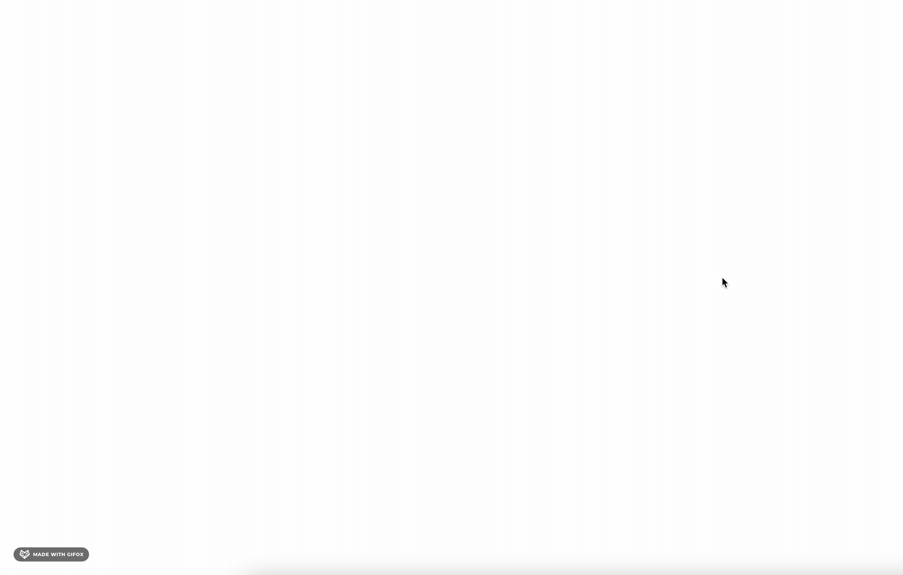

# 通过离屏渲染提高 Canvas 书写性能

## 前言
前面我们通过上下分层的方式，优化了 Canvas 的书写性能，接下来我们通过离屏渲染的方式，进一步优化 Canvas 的书写性能。

## 基本思路
在书写的过程中，每绘制一笔都需要不断地调用 Canvas 的 API，重新渲染整个 Canvas，这样就会导致性能的浪费。
而离屏渲染则是将 绘制内容存储到离屏的 Canvas 中，相当于一个缓冲区，然后将需要绘制的画面在离屏的 Canvas 缓冲好，最后将离屏的 Canvas 转化成图片，渲染到屏幕上，这样就可以达到优化性能的目的。

## 实现
### 创建离屏 Canvas

思路如下: 基于上一节的基础，我们改写 render 函数，如果是离屏渲染的话，将绘制的内容存储到离屏的 Canvas 中，然后将离屏的 Canvas 缓存起来，下次绘制的时候，如果命中缓存的话，就直接使用缓存的 Canvas，从而达到优化性能的目的。

操作如下:
- 1 在执行 render 函数之前，先判断是否存在缓存的 Canvas，如果存在的话，就直接使用缓存的 Canvas
- 2 如果命中缓存，使用离屏 Canvas 转化成图片进行绘制
- 3 如果不存在缓存的 Canvas，就创建一个离屏的 Canvas，然后将绘制的内容存储到离屏的 Canvas 中，最后将离屏的 Canvas 缓存起来

```html
   <script>
        const elementWithCanvasCache = new WeakMap(); // 用于存储离屏 Canvas 的缓存
        const generateOffScreenCanvas = (points) => {
            const padding = 20; // 避免笔记被 Canvas 
            const canvas = document.createElement('canvas'); // 创建一个离屏 Canvas
            const ctxContent = canvas.getContext('2d');
            
            // TODO 绘制的内容存储
            // ....

            // 将离屏 Canvas 缓存起来
            elementWithCanvasCache.set(points, {
                canvas,
            });
            return canvas;
        }

        /**
         * 绘制函数
         * @param {*} ctx - canvas 尺寸
         * @param {*} points - 鼠标移动的点集
         * @return 返回一个 canvas 元素
         */
        function render(ctx, points, isOffScreen = false) {
            /*
              判断是否存在缓存元素，存在的话使用缓存元素，绘制
            */
            if (isOffScreen && elementWithCanvasCache.has(points)) {
                const { canvas, x, y, width, height } = elementWithCanvasCache.get(points);
                ctx.save();
                ctx.scale(1 / dpr, 1 / dpr);
                ctx.drawImage(
                    canvas,
                    x,
                    y,
                    canvas.width,
                    canvas.height
                );
                ctx.restore();
                console.log(`命中了🎯`)
                return;
            }

            ctx.strokeStyle = 'red'; // 设置线条颜色
            ctx.lineWidth = 6; // 设置线条宽度
            ctx.lineJoin = 'round'; // 设置线条连接处的样式
            ctx.lineCap = 'round'; // 设置线条末端的样式

            /*
            beginPath() 是 Canvas 2D API 中的一个方法，用于开始一个新的路径。当你想创建一个新的路径时，你需要调用这个方法。
            例如，你可能会这样使用它：
                context.beginPath();
                context.moveTo(50, 50);
                context.lineTo(200, 50);
                context.stroke();
                在这个例子中，beginPath() 开始一个新的路径，moveTo(50, 50) 将路径的起点移动到 (50, 50)，lineTo(200, 50) 添加一条从当前位置到 (200, 50) 的线，
                最后 stroke() 方法绘制出路径。
                其中 context 是你的 canvas 上下文。
            */
            ctx.beginPath(); // 开始绘制

            ctx.moveTo(points[0].x, points[0].y); // 将画笔移动到起始点

            for (let i = 1; i < points.length; i++) {
                // 取终点，将上一个点作为控制点，平滑过渡
                const cx = (points[i].x + points[i - 1].x) / 2;
                const cy = (points[i].y + points[i - 1].y) / 2;
                ctx.quadraticCurveTo(points[i - 1].x, points[i - 1].y, cx, cy);
            }

            ctx.stroke(); // 绘制路径

            if (isOffScreen) {
                generateOffScreenCanvas(points);
            }
        }


   </script>
```

### 数据的切换
这里是离屏 Canvas 的难点，即如何将绘制的坐标转化到对应的离屏 Canvas 中，这里笔者通过计算坐标的偏移量，将坐标转化到离屏 Canvas 中。
即关键是 `generateOffScreenCanvas` 函数如何实现将绘制的内容存储到离屏的 Canvas 中。

实现思路:
1 获取到绘制图形的最小的点和最大的点，从而计算出宽高
2 获取最小的点坐标，从而计算出相对于离屏 Canvas 的坐标集合
3 将点绘制到离屏 Canvas 中
4 将离屏 Canvas 缓存起来
5 将离屏 Canvas 转化成图片进行绘制

```html

<script>
    const getBoundsFromPoints = (points) => {
        let minX = Infinity;
        let minY = Infinity;
        let maxX = -Infinity;
        let maxY = -Infinity;
        for (const { x, y } of points) {
            minX = Math.min(minX, x);
            minY = Math.min(minY, y);
            maxX = Math.max(maxX, x);
            maxY = Math.max(maxY, y);
        }
        return [minX, minY, maxX, maxY];
    };

      /*
      1 获取当前元素的坐标，相对于离屏 Canvas 的坐标
      2 获取 Canvas 的宽高
      */
      const getElementAbsoluteCoords = (points) => {
          const [minX, minY, maxX, maxY] = getBoundsFromPoints(points);
          const width = maxX - minX;
          const height = maxY - minY;
          return {
              minX,
              minY,
              width,
              height,
              points: points.map(({ x, y }) => ({ x: Math.round(x - minX), y: Math.round(y - minY) })) // 获取当前元素的坐标，相对于离屏 Canvas 的坐标
          };
      };

    const generateOffScreenCanvas = (points) => {
          const canvas = document.createElement('canvas'); // 创建一个离屏 Canvas
          const ctxContent = canvas.getContext('2d');
          ctxContent.save();
          // 获取最小的点和最大的点
          const { minX, minY, width: realWidth, height: realHeight, points: realPoints } = getElementAbsoluteCoords(points);

          console.log(`realWidth---->`, realWidth, Math.floor(minX));
          console.log(`realHeight---->`, realHeight, Math.floor(minY));
          canvas.width = realWidth * dpr + padding * 2;
          canvas.height = realHeight * dpr + padding * 2;
          canvas.style.width = realWidth + "px";
          canvas.style.height = realHeight + "px";
          ctxContent.translate(padding, padding); // 将坐标轴原点移动到（20, 20）
          ctxContent.scale(dpr, dpr);
          ctxContent.strokeStyle = 'red'; // 设置线条颜色
          ctxContent.lineWidth = 6; // 设置线条宽度
          ctxContent.lineJoin = 'round'; // 设置线条连接处的样式
          ctxContent.lineCap = 'round'; // 设置线条末端的样式
          ctxContent.moveTo(realPoints[0].x, realPoints[0].y); // 将画笔移动到起始点
          for (let i = 1; i < realPoints.length; i++) {
              // 取终点，将上一个点作为控制点，平滑过渡
              const cx = (realPoints[i].x + realPoints[i - 1].x) / 2;
              const cy = (realPoints[i].y + realPoints[i - 1].y) / 2;
              ctxContent.quadraticCurveTo(realPoints[i - 1].x, realPoints[i - 1].y, cx, cy);
          }

          ctxContent.stroke(); // 画线
          ctxContent.restore();
          console.log(`canvas--->`, canvas.toDataURL());
          elementWithCanvasCache.set(points, {
              canvas,
              realPoints,
              x: minX * dpr - padding,
              y: minY * dpr - padding
          });
      }
</script>

```

## 实现的效果
