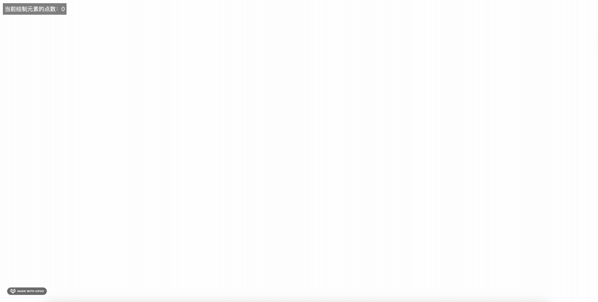
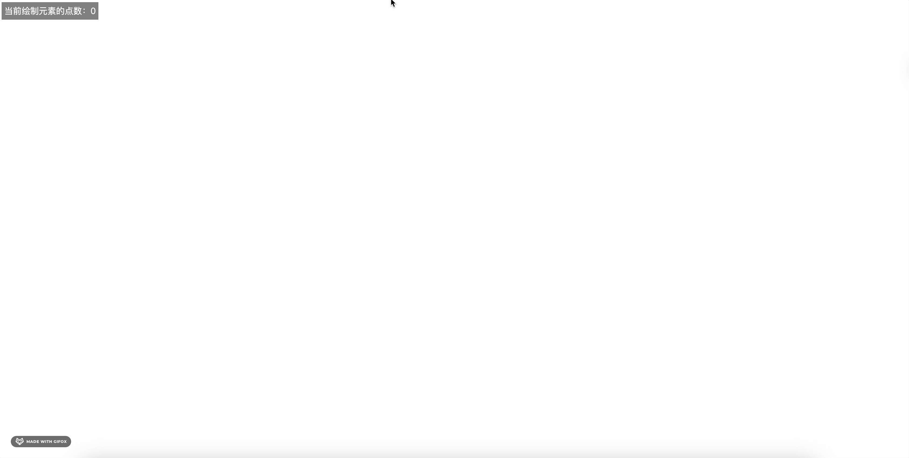

# 通过贝塞尔曲线解决 Canvas 书写的圆滑问题

## 前言
书接上回，当我们实现了一个自由书写的 Canvas 画板后，我们发现采集的点越少，画出来的圈圈越不圆润，这时候我们可以使用贝塞尔曲线来优化书写。



## 正文

### 贝塞尔曲线
贝塞尔曲线是一种数学曲线，常见的有: 线性贝塞尔曲线、二次·贝塞尔曲线、三次贝塞尔曲线等，
它可以用来实现平滑曲线，我们可以通过贝塞尔曲线以相对圆滑的方式来优化我们的 Canvas 书写。

### 优化思路
我们可以通过贝塞尔曲线来优化我们的 Canvas 书写性能，将笔直的线变的更加圆滑弯曲。

在 Canvas2D API 中有一个方法叫做 `quadraticCurveTo` 用于创建二次贝塞尔曲线。它需要两个点：一个控制点和一个终点。曲线从当前的绘图位置开始绘制，并以控制点为参考，向终点绘制曲线。

这个方法的语法是：context.quadraticCurveTo(cp1x, cp1y, x, y);

其中：

    cp1x 和 cp1y 是控制点坐标。
    x 和 y 是终点坐标。

这个方法不会直接绘制曲线，而是将曲线添加到当前的路径中。要在画布上实际绘制曲线，你需要使用 stroke 或 fill 方法

### 优化实现
1 采集到所有的点集
2 前一个点作为控制点，当前点作为终点，绘制二次贝塞尔曲线

```html
<!DOCTYPE html>
<html lang="en">

<head>
    <meta charset="UTF-8">
    <meta name="viewport" content="width=device-width, initial-scale=1.0">
    <title>画板笔记绘制</title>
    <style>
        body,
        html {
            margin: 0;
            padding: 0;
            overflow: hidden;
        }

        #app-container {
            position: absolute;
            width: 100%;
            height: 100%;
        }

        #draw {
            border: 1px solid black;
            position: absolute;
            width: 100%;
            height: 100%;
        }

        #point-counter {
            position: absolute;
            top: 10px;
            left: 10px;
            color: white;
            background-color: rgba(0, 0, 0, 0.5);
            padding: 5px;
        }
    </style>
</head>

<body>
    <div id="app-container">
        <canvas id="draw"></canvas>
        <div id="point-counter">当前绘制元素的点数：0</div>
    </div>
    <script>
        let start = false; // 是否开始绘制
        let points = []; // 记录鼠标移动的点
        const dpr = window.devicePixelRatio || 1;
        const appContainer = document.getElementById("app-container");
        const pointCounter = document.getElementById("point-counter");
        const canvas = document.getElementById('draw');
        const width = appContainer.clientWidth;
        const height = appContainer.clientHeight;
        const ctx = canvas.getContext('2d');
        canvas.style.width = `${width}px`;
        canvas.style.height = `${height}px`;
        canvas.width = width * dpr;
        canvas.height = height * dpr;
        ctx.scale(dpr, dpr);

        /**
         * 自由画笔的实现思路
         * 1 监听鼠标事件 
         * 2 将鼠标移动的轨迹记录下来
         * 3 然后将这些点连接成线
         */
        canvas.addEventListener('pointerdown', (e) => {
            console.log('e--->', e);
            start = true; // 通过监听鼠标按下事件，来判断是否开始绘制
            addPoint(e); // 将鼠标按下的点添加到points数组中
        });

        canvas.addEventListener('pointermove', throttle((e) => {
            console.log('e--->', e);
            if (!start) return; // 如果没有按下，则不绘制
            addPoint(e); // 将鼠标移动的点添加到points数组中
            render(ctx, points); // 绘制
            updatePointCounter(points.length);
        }));

        canvas.addEventListener('pointerup', (e) => {
            start = false;
            points = []; // 绘制完毕后，清空points数组
        });

        /*
        * 将鼠标事件的点转化为相对于canvas的坐标上的点
        */
        function addPoint(e) {
            const rect = canvas.getBoundingClientRect(); // 获取canvas相对于视口的位置
            const x = e.clientX - rect.left; // 获取鼠标相对于canvas的位置
            const y = e.clientY - rect.top; // 获取鼠标相对于canvas的位置
            points.push({
                x,
                y
            });
        }

        /**
         * 绘制函数
         * @param {*} ctx - canvas 尺寸
         * @param {*} points - 鼠标移动的点集
         */
        function render(ctx, points) {
            ctx.strokeStyle = 'red'; // 设置线条颜色
            ctx.lineWidth = 20; // 设置线条宽度
            /*
            lineJoin 是 Canvas 2D API 中的一个属性，用于设置或返回两条线相交时的样式。它有三个可能的值：
            "bevel"：在相交处创建一个斜角。
            "round"：在相交处创建一个圆角。
            "miter"：默认值，在相交处创建一个尖角。
            */
            ctx.lineJoin = 'round'; // 设置线条连接处的样式

            /*
            lineCap 是 Canvas 2D API 中的一个属性，用于设置或返回线条的结束端点样式。它有三个可能的值：
            "butt"：这是默认值，线条的结束端点将是平直的边缘。
            "round"：线条的结束端点将是一个半圆。
            "square"：线条的结束端点将是一个矩形，其长度等于线条的宽度。
            */
            ctx.lineCap = 'round'; // 设置线条末端的样式

            /*
            beginPath() 是 Canvas 2D API 中的一个方法，用于开始一个新的路径。当你想创建一个新的路径时，你需要调用这个方法。
            例如，你可能会这样使用它：
                context.beginPath();
                context.moveTo(50, 50);
                context.lineTo(200, 50);
                context.stroke();
                在这个例子中，beginPath() 开始一个新的路径，moveTo(50, 50) 将路径的起点移动到 (50, 50)，lineTo(200, 50) 添加一条从当前位置到 (200, 50) 的线，
                最后 stroke() 方法绘制出路径。
                其中 context 是你的 canvas 上下文。
            */
            ctx.beginPath(); // 开始绘制

            ctx.moveTo(points[0].x, points[0].y); // 将画笔移动到起始点

            // for (let i = 1; i < points.length; i++) {
            //     ctx.lineTo(points[i].x, points[i].y); // 将画笔移动到下一个点
            // }
            for (let i = 1; i < points.length - 1; i++) {
                // 取终点，将上一个点作为控制点，平滑过渡
                /*
                将两个点的中点作为控制点的选择通常用于创建平滑的曲线，该方法可以确保曲线通过两个点并且在两个点之间有一个平滑的拐角。
                方法的依据是曲线的切线在控制点处与曲线的切线在两个点的中点处平行，从而使曲线过渡更加平滑。
                */
                const cx = (points[i].x + points[i - 1].x) / 2;
                const cy = (points[i].y + points[i - 1].y) / 2;
                ctx.quadraticCurveTo(points[i - 1].x, points[i - 1].y, cx, cy);
            }

            ctx.stroke(); // 绘制路径
        }

        // 更新点数计数器
        function updatePointCounter(count) {
            pointCounter.textContent = `当前绘制元素的点数：${count}`;
        }

        function throttle(fn, delay = 100) {
            let timer = null;
            return function () {
                if (timer) return;
                timer = setTimeout(() => {
                    fn.apply(this, arguments);
                    timer = null;
                }, delay);
            }
        }
    </script>
</body>
</html>

```

将两个点的中点作为控制点的选择通常用于创建平滑的曲线，该方法可以确保曲线通过两个点并且在两个点之间有一个平滑的拐角。
方法的依据是曲线的切线在控制点处与曲线的切线在两个点的中点处平行，从而使曲线过渡更加平滑。



## 参考文章
- https://github.com/chenxiaoyao6228/fe-notes/blob/main/Canvas/canvas%E4%BD%BF%E7%94%A8%E8%B4%9D%E5%A1%9E%E5%B0%94%E6%9B%B2%E7%BA%BF%E4%BC%98%E5%8C%96%E8%87%AA%E7%94%B1%E7%94%BB%E7%AC%94%E5%B9%B6%E6%8E%A2%E7%A9%B6%E5%85%B6%E5%8E%9F%E7%90%86.md