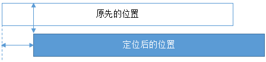
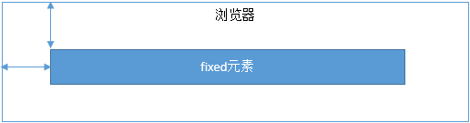

# Position

## static [ˈstætɪk]

默认值，没有定位，元素出现在正常的文档流中，会忽略 top，bottom，left，right 或者 z-index 声明

## relative

生成相对定位元素，相对于其原来位置进行定位，元素的位置通过 left、top、right、bottom 属性规定




元素定位永远相对于元素自身位置，和其他元素没有关系，也不会影响其他元素。

## absolute

生成绝对定位的元素，相对于 static 定位以外的一个父元素进行定位

元素位置通过 left、top、right、bottom 属性规定


浏览器会递归查找该元素的所有父元素，如果找到一个设置了非 static 的定位元素，就以该元素为基准定位，如果没有找到，就以浏览器边界定位

但是它具有破坏性，会导致其他元素位置的变化

## fixed

生成绝对定位的元素，指定元素相对于屏幕视口的位置来制定元素位置。



但是它具有破坏性，会导致其他元素位置的变化

## sticky [ˈstɪki]

相对它的最近滚动祖先（nearest scrolling ancestor）和 containing block (最近块级祖先 nearest block-level ancestor)，包括table-related元素，基于top, right, bottom, 和 left的值进行偏移。偏移值不会影响任何其他元素的位置。

##  inherit

规定从父元素继承 position 属性的值


```js
<!DOCTYPE html>
<html lang="en">

<head>
  <meta charset="UTF-8">
  <title>Document</title>
  <style type="text/css">
    .insert {
      position: relative;
      z-index: 100;
      background: green;
      width: 300px;
      height: 300px;
      top: 100px;
    }

    .parent {
      /*position:relative;
			z-index: 1000;*/
      width: 200px;
      height: 200px;
      /*left:0;
			top:-50px;*/
      border: 1px solid #eee;
    }

    .subbottom {
      position: relative;
      z-index: 50;
      width: 200px;
      height: 200px;
      background: red;
      top: -100px;
      left: 0;

    }

    .subtop {
      position: relative;
      z-index: 1100;
      width: 100px;
      height: 100px;
      left: 0;
      top: 0;
      background: blue;
    }
  </style>
</head>

<body>
  <div class="insert"></div>
  <div class="parent">
    <div class="subtop"></div>
    <div class="subbottom"></div>
  </div>
</body>
</html>

```