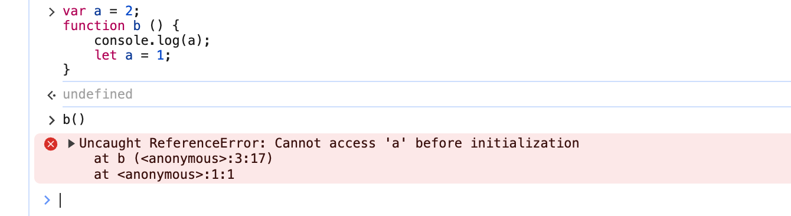

# ES6相关

## var、let、const 的区别
1 作用域
  let、const 存在块级作用域
  var 不存在块级作用域

2 const 常量
  定义时赋值

3 变量提升
  let/const 声明的变量需要声明后使用
  var 声明的变量可以声明前使用

4 重复声明
  let/const 不能重复声明
  var 可以重复声明

5 暂时性死区
  let/const 声明的变量不能在声明前使用


  

## 箭头函数和普通函数的区别
1 箭头函数比普通函数更加简洁

2 箭头函数没有自己的 this，继承父级作用域的 this 指向

3 箭头函数继承来的 this 不会改变 
  call、apply、bind 方法不能改变箭头函数的 this 指向

```js
var id = 'global';
var obj = {
    id: 'obj',
    a: function () {
        console.log(this.id);
    },
    b: () => {
        console.log(this.id);
    }
}

obj.a(); // obj
obj.b(); // global
const a = obj.a;
a(); // global
const b = obj.b;
b(); // global
new obj.a(); // undefined
new obj.b(); // Uncaught TypeError: obj.b is not a constructor
```


```js
var id = 'global';
const fun1 = () => {
    console.log(this.id);
}
fun1(); // global
fun1.call({ id: 'call' }); // global
fun1.apply({ id: 'call' }); // global
fun1.bind({ id: 'call' })(); // global
```

4 箭头函数不能作为构造函数
  因为没有 prototype 属性

5 箭头函数没有 arguments 对象
  可以使用 rest 参数代替

6 箭头函数不能作为 Generator 函数，不能使用 yield 关键字

## Proxy
用来代理对象

```js
// target 要代理的对象
// handler 代理对象的行为
let p = new Proxy(target, handler);


let onWatch = (obj) => {
    let handler = {
        // target 目标对象，property 目标对象的属性，receiver Proxy 实例本身
        get(target, property, receiver) {
            console.log(`getting ${property}!`);
            return Reflect.get(target, property, receiver);
        },
        set(target, property, value, receiver) {
            console.log(`setting ${property}!`);
            return Reflect.set(target, property, value, receiver);
        }
    }

    return new Proxy(obj, handler);
}

let obj = { a: 1 };
let test = onWatch(obj);

test.a // getting a!
test.a = 2 // setting a!
```

