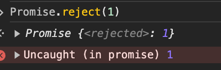
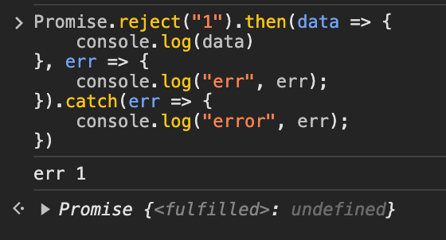
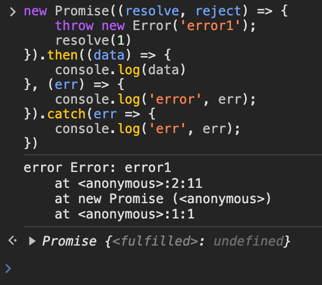
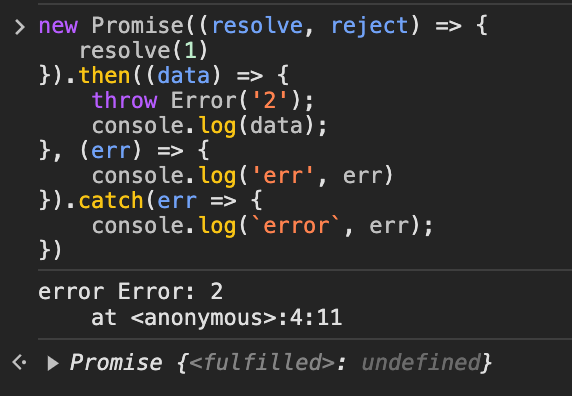

# Promise 相关

## 定义
Promise 有 3 种状态:
- 等待状态 pending
- 成功状态 resolved
- 失败状态 rejected

当 Promise 状态是 Pending 时，可以转换为 Resolved 或者 Rejected 状态，一旦状态转换，就不会再改变。

resolved、rejected 是异步函数

then 默认返回一个 Promise 对象，第一个参数是 resolved 的回调函数，第二个参数是 rejected 的回调函数
catch 会返回一个 Promise 对象，catch 正常返回 resolved 状态，里面报错返回 rejected 状态

## Promise.resolve

Promise.resolve(value) 返回一个成功状态的 promise 对象

```js
/*
  如果 .then 函数参数不是一个函数，那么会将其封装成 v => v 函数, 这里的 v 是上一个 resolve 的返回值
*/

Promise.resolve(1).then(2).then(3).then(data => console.log(data)); // 1
```

## Promise.reject

Promise.reject(reason) 返回一个失败状态的 promise 对象





如果同时有 then 的错误回调和 catch, 会优先走 then 的错误回调



但如果是在 then 的 resolve 回调中抛出错误，则会走 catch，因为此时 Promise 的状态已经不会变了




## Promise.all
参数是数组，所有的 Promise 全部 resolve 后 才会 resolve 状态

成功的时候返回的是一个结果数字，失败则返回第一个失败的原因

```js
// 手写 Promise.all
const all = (arr) => {
    return new Promise((resolve, reject) => {
        const res = [];
        for (let index = 0; index < arr.length; index++) {
            Promise.resolve(arr[index]).then(data => {
                res[index] = data;
                if (index === arr.length - 1) {
                    resolve(data);
                }
            }).catch(err => {
                reject(err);
            })
        }
    })
}
```

## Promise.allSettled
参数是一个数组，不管成功还是失败，都会返回一个结果数组

## Promise.race
参数是一个数组，返回第一个响应的值，可以是成功 or 失败

```js

const race = (arr) => {
    return new Promise((resolve, reject) => {
        for(let i = 0; i < arr.length; i++) {
            Promise.resolve(arr[i]).then(data => {
                resolve(data);
            }).catch(err => {
                reject(err);
            })
        }
    })
}

```

## Promise.any
参数是一个数组，返回第一个成功的值


## Promise.finally
不管 Promise 返回什么状态都会执行


## 常见的问题

### Promise 解决了什么问题
   - 解决了回调地狱的问题