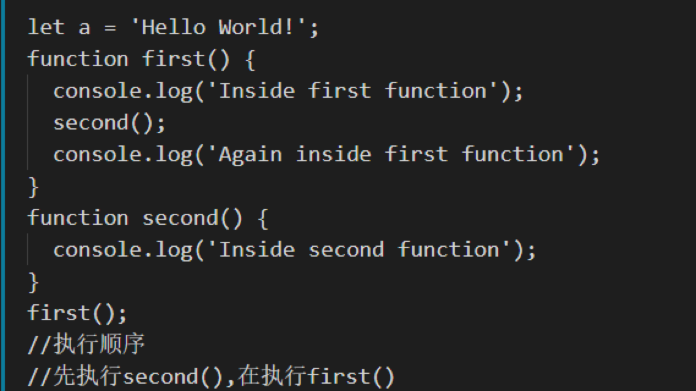
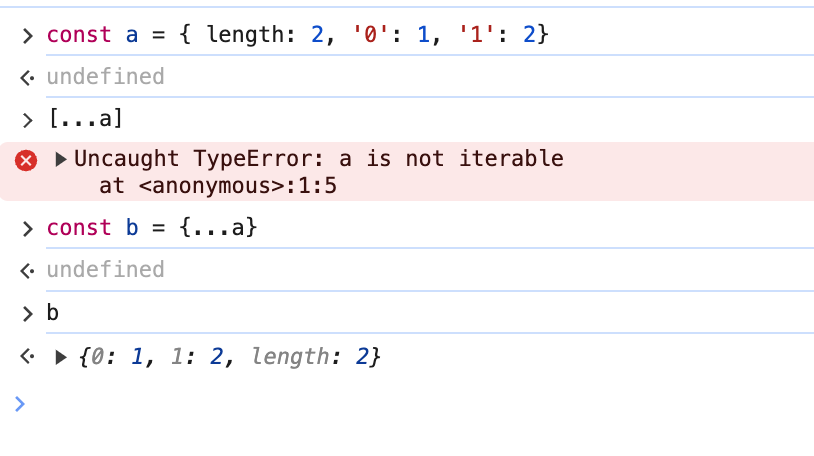

# 3 基础概念

## 3.1 闭包
执行外部函数返回内部函数后，虽然外部函数已经弹出调用栈了，但是内部函数对外部函数变量的引用依然保存在内存中，那么内部函数和这些变量的集合就叫做闭包。

闭包的好处:
    1. 私有变量在内存中持久化

闭包的坏处:
    1. 使用不当会造成内存泄漏
   
## 3.2 原型
在 js 中对象是由构造函数创建的，构造函数中会有一个 prototype 属性，指向一个对象，这个对象包含了由该构造函数创建的实例所共享的属性和方法，
由该构造函数创建的实例可以通过 __proto__ 属性指向这个对象，这个对象就是我们所说的原型。

当想要访问对象的某个属性时，如果在当前对象查找不到，就会往该对象的原型查找，对象的原型也会有属于他的原型对象，如此循环，直到 null 停止，这就是我们所说的原型链

隐式原型: __proto__
显示原型: prototype

相关方法:
    1. hasOwnProperty() 判断属性是否是实例自身的属性
    2. Object.getPrototypeOf() 获取实例的原型

## 3.3 作用域
作用域分成`全局作用域`、`函数作用域`、`块级作用域`，它标识着一个变量是否合法 （编译过程中就已经确认了）
   
当查询一个变量时，如果当前作用域查询不到，会往上一级作用域查找，如此循环，直到全局作用域，这就是我们所说的作用域链

## 3.4 执行上下文

从类型上看
    1. 全局执行上下文
    2. 函数执行上下文
    3. eval 执行上下文

从生命周期上看
    1. 创建阶段
       - this 绑定
       - 创建词法环境 （let、const会被提升到词法环境）
       - 创建变量环境 （var 声明的变量会被提升到变量环境）
    2. 执行阶段
       - 对变量进行赋值，执行代码
    3. 回收阶段
       - 当执行上下文弹出调用站后，会对上下文进行回收
  
执行上下文栈: 当 JS 执行代码时，首先遇到全局代码，会创建一个全局执行上下文并压入执行栈中，当遇到函数调用时，就会为该函数创建一个新的函数执行上下文压入栈中，
引擎会执行位于执行上下文栈顶的函数，当函数执行完后，执行上下文会从栈中弹出，继续执行下一个上下文，当所有代码都执行完毕后，从栈中弹出全局执行上下文

## 3.5 类数组对象
一个拥有 length 属性和若干索引属性的对象就是类数组对象。

将类数组对象转化成数组的方法：
    1 Array.from(arrayLike)
    2 Array.prototype.slice.call(arrayLike)
    3 Array.prototype.concat.apply([], arrayLike)
    4 Array.prototype.splice.call(arrayLike, 0)
    
注意： **类数组对象不一定有  iterator 接口，所以不能用拓展运算符**

1 arguments 可以使用拓展运算符
2 可迭代对象（Iteratable Object，例如 [] ）与可枚举对象 (可以通过 for..in 遍历，例如 {} ) 不可用拓展运算符转化

## 3.6 严格模式
使用 use strict 即可声明严格模式

目的：
   - 消除 JavaScript 一些语法不合理、不严谨之处，减少怪异行为
   - 消除代码运行的一些不安全之处，保证代码运行的安全

区别：
   - 禁止使用 with 语句
   - 禁止 this 关键字指向全局对象
   - 对象的属性名不能重复
   - arguments.callee 被禁止

## 3.7 尾调用
在函数的最后一步调用另一个函数，称为尾调用（父函数执行上下文弹出调用栈）

只在严格模式开启

## 3.8 常见的问题

