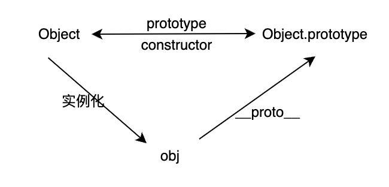

# 2 数据类型
## 2.1 数据类型

一共有 7 种基本数据类型
- 1 Number - 基于 IEEE 754 标准实现，采用双精度 64 位二进制格式, -(2 ^ 63 - 1) ~ 2 ^ 63 - 1
- 2 Boolean - 只有 true 和 false
- 3 Undefined - 没有定义的值
- 4 Null - 空值
- 5 String - 字符串
- 6 Symbol - 唯一不可修改的值
- 7 BigInt - 大整数类型


一种引用类型
- Object - 引用类型，存储在堆中


## 2.2 类型检测
### 2.2.1 typeof
判断基础数据类型，除了 null
也可以判断 function

```js
typeof (function() {}) // function
typeof (() => {}) // function
```

但数组、对象、null 都会返回 object

```js
typeof [] // object
typeof {} // object
typeof null // object
```


### 2.2.2 instanceof 
判断引用类型

原理是判断其原型链上是否有该构造函数的原型



```js
const _instanceof = (obj, Func) => {
  // 获取实例的原型对象
  let objPrototype = Object.getPrototypeOf(obj);
  // 获取构造函数的原型对象
  const funcPrototype = Func.prototype;
  while (objPrototype) {
    if (objPrototype === funcPrototype) {
      return true;
    }

    objPrototype = Object.getPrototypeOf(objPrototype);
  }
  return false;
};

console.log(new Object() instanceof Object); // true
console.log(_instanceof(new Object(), Object)); // true
```


### 2.2.3 constructor
实例对象可以通过 constructor 属性找到它的构造函数

```js
({}).constructor === Object // true
[].constructor === Array // true
```

这种方法不太准确，因为可以修改原型对象

### 2.2.4 Object.prototype.toString.call()
可以判断所有类型

```js
Object.prototype.toString.call(null); // '[object Null]'
Object.prototype.toString.call({}); // '[object Object]'
Object.prototype.toString.call([]); // '[object Array]'
Object.prototype.toString.call(1);  // '[object Number]'
Object.prototype.toString.call('1'); // '[object String]'
Object.prototype.toString.call(true); // '[object Boolean]'
Object.prototype.toString.call(undefined); // '[object Undefined]'
Object.prototype.toString.call(Symbol(1)); // '[object Symbol]'
Object.prototype.toString.call(BigInt(1)); // '[object BigInt]'
```


### 2.2.5 如何判断是否是数组
常见的有:
- Array.isArray()
- instanceof
- Object.prototype.toString.call()

## 2.3 类型转化
### 2.3.1 布尔类型
在条件判断中，除了 `undefined`、`null`、`false`、`NaN`、`''`、`0`、`-0`、`+0` 会被转化为 `false`，其他都会被转化为 `true`

这里有个特殊的点
```js
+0 === -0; // true, 因为都会被转化为 false
```

### 2.3.2 隐式类型转化

JavaScript 的每个值都隐含的自带了 ToPrimitive 方法，用来将值进行隐式转化成基本类型值

```js
let value = 0;
let a = {
    valueOf() {
        return 1;
    },
    toString() {
        return '2';
    },
    [Symbol.toPrimitive]() {
        value = value + 1;
        return value;
    }
}

a == 1; // true
a == 2; // true
a == 3; // true
```

ToPrimitive 方法会优先调用 Symbol.toPrimitive 方法，如果没有，再调用 valueOf 方法，如果还没有，再调用 toString 方法
在没有 ToPrimitive 情况下, 转数字先调用 valueOf 方法，转字符串先调用 toString 方法


### 2.3.3 基本类型在不同操作符下的转化规则
- 1 +操作符: +操作符的俩边有一个是 string 类型时，俩边隐式转化成 string 类型，其他情况都转化成 number 类型
- 2 其他情况转化为数字在操作

|  原始值   | 转化目标  | 结果  |
|  :----:| :----:  | :----:  |
|  number            | 布尔值 | 除了 0、-0、NaN 都为 true |
|  string           | 布尔值 | 除了空串都为 true |
|  undefined、null  | 布尔值 | false |
|  引用类型          | 布尔值 | true |
|  number           | 字符串 | 6 -> '6' |
|  数组             |  字符串 | [1, 2] -> '1, 2' 每个元素都进行转字符串操作 |
|  对象             |  字符串 | '[object, Object]' |
|  string          |  数字   | '1' -> 1 'a' -> Nam |
|  数组             |  数字 | 空数组为0，存在一个元素且为数字转数字，其他情况为 NaN |
|  null             | 数字 | 0 |
|  除数组以外的引用类型| 数字 | NaN |
|  Symbol           | 数字 | 报错 |

转数字的特殊场景
- **undefined转数字: NaN**
- **null转数字: 0**
- **false转数字: 0**
- **[]转数字: 0**

## 2.4 常见的问题
### 1 栈和堆有什么区别？

1 从数据结构的角度上看
栈是一个先进后出的数据结构
堆是一个特别的完全二叉树

2 从存储的角度上看
栈存储基本类型
堆存储引用类型

3 从垃圾回收的角度上看
- 栈 采用 ESP 指针，例如当一个函数调用时，该函数的上下文被压入调用栈中，此时 ESP 指针指向该上下文，当函数执行完后，ESP指针下移，函数上下文弹出调用栈
- 堆分成新生代和旧生代
- 新生代采用 GC 算法，将新生代分成俩个区域，活动对象区域和空闲区域，对于一些占用内存较小的对象，会被分配到活动对象区域，当活动对象区域充满时，会进行一次 GC 算法，将存活的对象移入空闲区域并进行一次碎片内存整理后，将空闲区域和活动对象区域进行互换，等待下一次的垃圾回收的执行（俩次回收都还存活的对象，进入到老生区）
- 旧生代采用标记清除 + 标记整理算法，会循环查找堆内存空间的对象是否被引用，如果没有，则标记清除，清除后会标记整理算法将碎片空间进行整理

### 2 什么是 JavaScript 中的包装类型
在 JavaScript 中，基本类型是没有属性和方法的，但是为了方便操作基本类型的值，当调用基本类型的属性和方法时，JavaScript 会隐式地将基本类型的值转化为对象。

```js
const a = "abc";
a.length; // 3
a.toUpperCase(); // "ABC"
```

### 3 undefined 和 null 的区别
undefined 表示未定义，一般变量声明了但还没有定义的时候返回 undefined
null 表示空值，常用在对象初始化的场景

区别如下:
- typeof null 返回的是 ‘object’, 因为在早期 javaScript 设计时，类型通过 1～3位标识进行存储，对象和null一样都是 000
- typeof undefined 返回的是 ‘undefined’
- undefined 不是保留字，可以被赋值，通常我们会用 void 0 表示 undefined，null 是保留字，不能被赋值

### 4 isNaN 和 Number.isNaN 的区别
- isNaN 不会判断是否为数字，会先将参数转化为数字，再判断是否为 NaN
- Number.isNaN 会判断是否是数字，是数字后才会判断是否是 NaN

```js
isNaN('a'); // true
Number.isNaN('a'); // false
```
