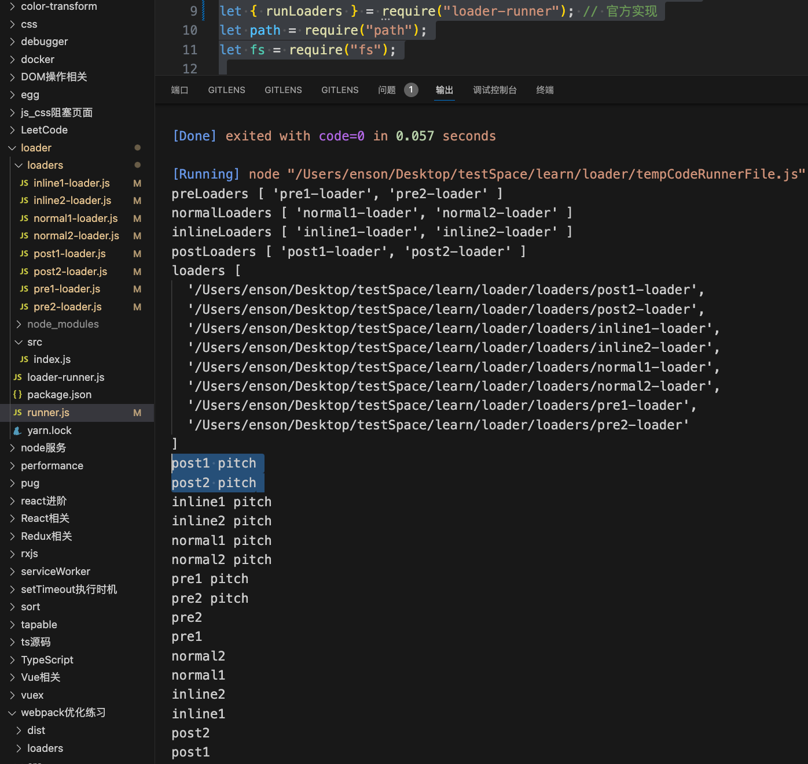
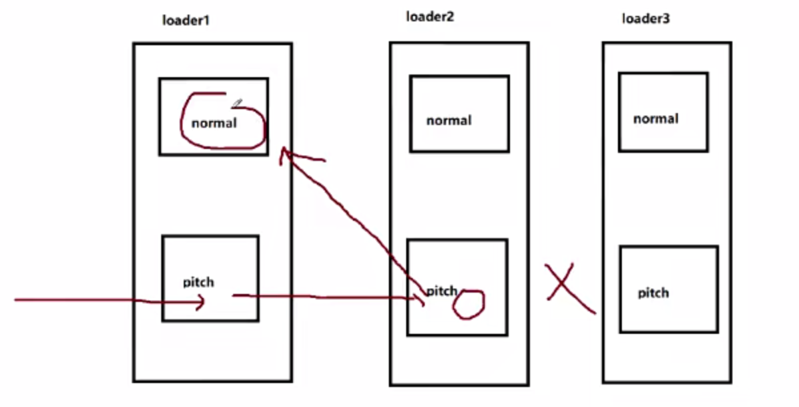

# Loader

loader 是一个加载器，让 webpack 拥有加载和解析非 JavaScript 文件的能力

## 类型
1. pre - 前置
2. normal - 普通
3. inline - 行内
4. post - 后置

```js
// 定义在 require 请求内部的叫做行内 loader
const a = require('inline1-loader!inline2-loader!a.js');
```

- 如果是 `!` 作为前缀，将禁用 normal loader，例如 `!inline1-loader!inline2-loader!a.js`
- 如果是 `!!` 作为前缀，将禁用所有 loader，例如 `!!inline1-loader!inline2-loader!a.js`
- 如果是 `-!` 作为前缀，将禁用所有 loader 但不包含 post loader，例如 `-!inline1-loader!inline2-loader!a.js`


## pitch
一个 loader 中存在 normal （必须） 和 pitch （可选）

先从左往右执行 loader 的 `pitch 方法`，在从右往左执行 loader 的`默认方法`。


```js
function preLoader(source) {
  console.log("pre1");
  return source + "//pre1";
}

preLoader.pitch = function () {
  console.log(`pre1 pitch`);
};

function normalLoader(source) {
  console.log("normal1");
  return source + "//normal1";
}

normalLoader.pitch = function () {
  console.log(`normal1 pitch`);
};

function inlineLoader(source) {
  console.log("inline1");
  return source + "//inline1";
}

inlineLoader.pitch = function () {
  console.log(`inline1 pitch`);
};

function postLoader(source) {
  console.log("post1");
  return source + "//post1";
}

postLoader.pitch = function () {
  console.log(`post1 pitch`);
};

// post1 pitch -> inline1 pitch -> normal1 pitch -> pre1 pitch -> pre1 -> normal1 -> inline1 -> post1
```




⚠️注意: 某一个 loader 的 `pitch` 方法返回了值，那么直接跳到默认方法阶段

例如 loader2 的 pitch 返回了值，则直接跳过当前 loader 后续的阶段
