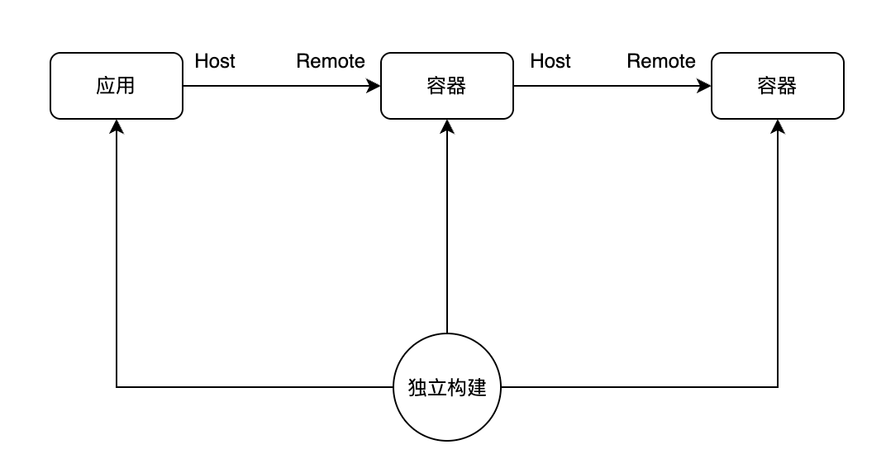
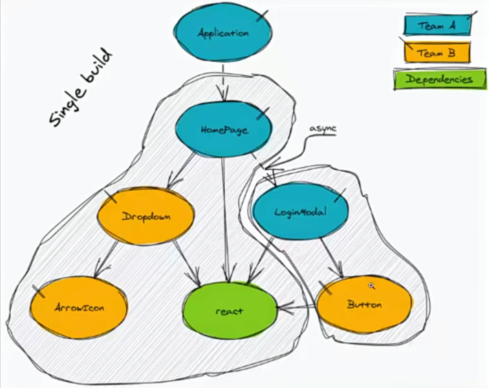
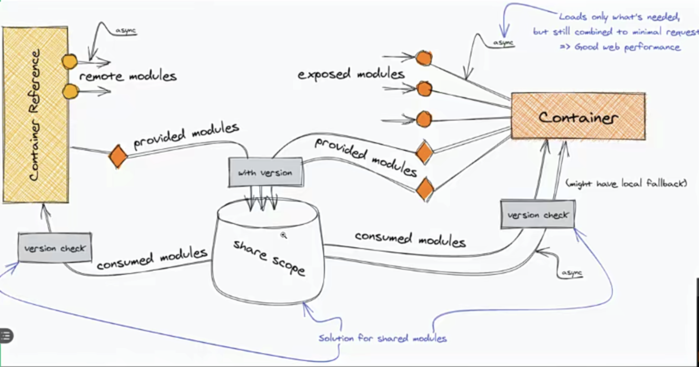

# 模块联邦


## 目的

更好的复用应用块或者库

每个应用块都是独立构建，被称之为容器



一个被引用的容器被称之为 remote

引用者被称之为 host


## 配置参数
|  字段   | 类型   | 含义   |
|  ----  | ----  | ----  |
| name   | string | 必传值，即输出的模块名，被远程引用时的路径为 ${name}/${expose} |
| library  | object | 声明全局变量的方式，name为 umd 的name |
| filename  | string | 构建输出的文件名称 |
| remotes  | object | （host 使用）远程引用的应用名及其别名的映射，使用时以 key 值作为 name |
| exposes  | object | （remote 使用）被引用时可暴露的资源路径以其别名 |
| shared  | object | 与其他应用之间可以共享的第三方依赖，使你的代码中不用重复加载同一份依赖 |


## remote 配置

```js
// webpack.config.js
const path = require("path");
const webpack = require("webpack");
const HtmlWebpackPlugin = require("html-webpack-plugin");
const ModuleFederationPlugin = require("webpack/lib/container/ModuleFederationPlugin");

module.exports = {
  mode: "development",
  entry: "./src/index.js",
  output: {
    publicPath: "http://localhost:3000/",
  },
  devServer: {
    port: 3000,
  },
  module: {
    rules: [
      {
        test: /\.jsx?$/,
        use: {
          loader: "babel-loader",
          options: {
            presets: ["@babel/preset-react"],
          },
        },
        exclude: /node_modules/,
      },
    ],
  },
  plugins: [
    new HtmlWebpackPlugin({
      template: "./public/index.html",
    }),
    new ModuleFederationPlugin({
      filename: "remoteEntry.js", // 输出的文件
      name: "remote", // 被远程引用的路径为 `${name}/${expose}`, 例如 remote/NewsList
      exposes: {
        "./NewsList": "./src/NewsList",
      },
      shared: ["react", "react-dom"], // 共享代码块
    }),
  ],
};
```


## host 配置
```js
const path = require("path");
const webpack = require("webpack");
const HtmlWebpackPlugin = require("html-webpack-plugin");
const ModuleFederationPlugin = require("webpack/lib/container/ModuleFederationPlugin");

module.exports = {
  mode: "development",
  entry: "./src/index.js",
  output: {
    publicPath: "http://localhost:3001/",
  },
  devServer: {
    port: 3001,
  },
  module: {
    rules: [
      {
        test: /\.jsx?$/,
        use: {
          loader: "babel-loader",
          options: {
            presets: ["@babel/preset-react"],
          },
        },
        exclude: /node_modules/,
      },
    ],
  },
  plugins: [
    new HtmlWebpackPlugin({
      template: "./public/index.html",
    }),
    new ModuleFederationPlugin({
      name: "host",
      filename: "remoteEntry.js",
      remotes: {
        remote: "remote@http://localhost:3000/remoteEntry.js", // 引用的模块
      },
      shared: ["react", "react-dom"], // 共享代码块
      // or
      /**
      shared: { // 如果是存在 shared 共享代码块得通过 bootstrap 动态引入 - https://webpack.js.org/concepts/module-federation/
        react: { singleton: true }, // 单例
        'react-dom': { singleton: true }, // 单例
      }, // 共享代码块
       */
    }),
  ],
};

```

host 和 remote 的区别在于：
host 通过 remotes 引入模块
remote 通过 exposes 导出模块

如果是存在 shared 共享代码块得通过 bootstrap 动态引入 - https://webpack.js.org/concepts/module-federation/


## 项目应用图


## 案例代码
[案例代码](https://github.com/enson0131/learn/tree/main/%E6%A8%A1%E5%9D%97%E8%81%94%E9%82%A6)

## 原理




remote 通过 exposes 导出模块
host 通过 remotes 引入远程模块

若存在共享依赖会存储到同一个变量中（require.S）, 这个变量（require.S） 存放各个作用域下的共享模块，
可以通过 作用域名（scopeName）、包名（key）、版本 (version) 再去获取对应的共享模块合如 modules 中

[案例代码](https://github.com/enson0131/learn/blob/main/%E6%A8%A1%E5%9D%97%E8%81%94%E9%82%A6/remote/serve/remoteEntry.js)