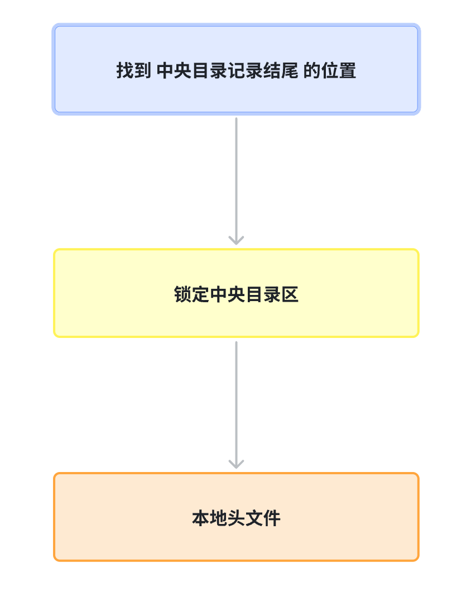

# 如何解析 zip 文件

## 什么是 zip 文件

zip 文件是一种压缩文件格式，它可以将多个文件压缩成一个文件，从而节省空间。

## 如何解析

在解析 zip 文件之前，我们在项目中创建了一个 zip 文件，并添加了 1 个 txt 文件。


[本文的 zip 案例文件](https://github.com/enson0131/learn/raw/refs/heads/main/%E6%96%87%E4%BB%B6%E7%9B%B8%E5%85%B3/jszip/hello.txt.zip)


## 读取 zip 文件内容

```html
<body>
    <div>
        <div>上传一个zip文件，并在控制台查看内存存储方式</div>
        <input id="uploadInput" type="file" multiple="">
        <br>
    </div>
    <script>
        const uploadInput = document.getElementById("uploadInput");
        uploadInput.addEventListener(
            "change",
            () => {
                const file = uploadInput.files[0];
                console.log('File 对象，只读不能写：', file)
                const reader = new FileReader();
                reader.onload = function (e) {
                    console.log('Array Buffer对象，不能读写：', e.target.result)
                    const uint8arr = new Uint8Array(e.target.result);
                    console.log('Uint8Array对象，可读写：', uint8arr);
                };
                reader.onerror = function (e) {
                    console.log("error", e.target.error);
                };
                reader.readAsArrayBuffer(file);
            },
            false
        );

    </script>
</body>
```


## zip 文件协议格式

zip文件官方规范可以看这里。从 [官方文档](https://pkware.cachefly.net/webdocs/casestudies/APPNOTE.TXT) 可以看出，

组成标准zip文件：本地文件头 + 中央目录头 + 中央目录记录结尾。

```js
[local file header 1] // 本地文件头
[file data 1] 

[local file header 2] // 本地文件头
[file data 2] 

[local file header 3] // 本地文件头
[file data 3] 

[central directory header 1] // 中央目录头
[central directory header 2] // 中央目录头
[central directory header 3] // 中央目录头

[end of central directory record] // 中央目录记录结尾
```

### 本地文件头

本地文件头是 zip 文件的第一个部分，它包含了文件的名称、大小、压缩方式等信息。其格式如下：


```js
local file header signature     4 bytes  (0x04034b50) // 本地文件头签名
version needed to extract       2 bytes // 版本需要提取
general purpose bit flag        2 bytes // 通用目的位标志
compression method              2 bytes // 压缩方法
last mod file time              2 bytes // 最后修改文件时间
last mod file date              2 bytes // 最后修改文件日期
crc-32                          4 bytes // CRC-32
compressed size                 4 bytes // 压缩大小
uncompressed size               4 bytes // 未压缩大小
file name length                2 bytes // 文件名称长度
extra field length              2 bytes // 额外字段长度
file name (variable size) // 文件名称 (可变大小)
extra field (variable size) // 额外字段 (可变大小)
```

以当前的 zip 文件为例，我们可以看到本地文件头的内容如下：

```js
local file header signature: 50 4B 03 04 // 本地文件头签名，因为是小端模式，也就是 16 进制的 0x04034b50
Version needed to extract: 0A 00 // 10
general purpose bit flag:  00 00 // 通用目的位标志
compression method: 00 00 // 压缩方法
last mod file time: 1B 7C // 最后修改文件时间
last mod file date: 4F 5B // 最后修改文件日期
crc-32: 52 9E D6 8B // CRC-32
compressed size: 0B 00 00 00 // 压缩大小
uncompressed size: 0B 00 00 00 // 未压缩大小
file name length: 09 00 // 文件名称长度
extra field length: 1C 00 // 额外字段长度
file name: 68 65 6C 6C 6F 2E 74 78 74 // 文件名称
extra field: 00 00 00 00 // 额外字段 这里可以根据 extra field length 的长度获取

// file Data.. 
```


### 中央目录头

```
central file header signature   4 bytes  (0x02014b50)
version made by                 2 bytes
version needed to extract       2 bytes
general purpose bit flag        2 bytes
compression method              2 bytes
last mod file time              2 bytes
last mod file date              2 bytes
crc-32                          4 bytes
compressed size                 4 bytes
uncompressed size               4 bytes
file name length                2 bytes
extra field length              2 bytes
file comment length             2 bytes
disk number start               2 bytes
internal file attributes        2 bytes
external file attributes        4 bytes
relative offset of local header 4 bytes

file name (variable size)
extra field (variable size)
file comment (variable size)
```

大部分字段本地文件头协议差不多，需要留意的是 relative offset of local header 字段，他标识了本地文件头的所在位置。

以当前的 zip 文件为例，我们可以看到 中央目录头 的内容如下：

```js
central file header signature: 50 4B 01 02 // 中央目录头标识
version made by: 1E 03
version needed to extract: 0A 00
general purpose bit flag:  00 00 
compression method: 00
last mod file time: 1B 7C
last mod file date: 4F 5B
crc-32            : 52 9E D6 8B 
compressed size   : 0B 00 00 00 
uncompressed size : 0B 00 00 00
file name length  : 09 00 
extra field length: 18 00
file comment length : 00 00
disk number start   : 00 00
internal file attributes        01 00
external file attributes        00 00 A4 81
relative offset of local header 00 00 00 00
file name (variable size): 68 65 6C 6C 6F 2E 74 78 74
extra field: 55 54 05 00 03 26 4E EF 68 75 78 0B 00 01 04 F5 01 00 00 04 14 00 00 // 这里是根据 extra field length 的长度来获取的。
```


### 中央目录记录结尾

```
end of central dir signature    4 bytes  (0x06054b50)
number of this disk             2 bytes
number of the disk with the start of the central directory  2 bytes
total number of entries in the central directory on this disk  2 bytes
total number of entries in the central directory           2 bytes
size of the central directory   4 bytes
offset of start of central directory with respect to the starting disk number        4 bytes
.ZIP file comment length        2 bytes
.ZIP file comment       (variable size)
```

以当前的 zip 文件为例，我们可以看到 中央目录记录结尾 的内容如下：

``` js
end of central dir signature: 50 4B 05 06 
number of this disk: 00 00
number of the disk with the start of the central directory: 00 00
total number of entries in the central directory on this disk: 01 00 // 存储的是文件总数
total number of entries in the central directory: 01 00 // 存储的是文件总数
size of the central directory : 4F 00 00 00 // 中央目录区占据的字节大小。
offset of start of central directory with respect to the starting disk number: 4E 00 00 00 // 中央目录区开始的位置。
.ZIP file comment length: 00 00

```


综上，我们大概了解了 zip 包协议的内容，并根据协议的内容读取了 案例文件 对应数据。

接下来，我们看看 [JSzip](https://stuk.github.io/jszip/documentation/api_jszip.html) 是怎么 “读懂” 这段数据的。


## JSZip 是如何解析的？

依旧以 当前的案例文件 为准。

JSZip 内部流程大致是这样👇

### 1. 定位 “50 4B 05 06”，找到 中央目录记录结尾 的位置

JSZip 先从文件尾部向前扫描，寻找 0x06054B50（50 4B 05 06），这是 End of Central Directory Record（中央目录的结束标志）。


找到之后，JSZip 会根据 offset of start of central directory with respect to the starting disk number 字段，找到中央目录区的开始位置。

```js
const offset = centralDirectoryHeader.offsetOfStartOfCentralDirectoryWithRespectToTheStartingDiskNumber;
```

### 2. 找到 中央目录区的开始位置 + 找到 中央目录区的结束位置, 锁定中央目录区

找到中央目录区的开始位置后，JSZip 会根据 total number of entries in the central directory 字段，找到中央目录区的结束位置。

```js
const end = centralDirectoryHeader.offsetOfStartOfCentralDirectoryWithRespectToTheStartingDiskNumber + centralDirectoryHeader.sizeOfTheCentralDirectory;
```

找到中央目录区的结束位置后，JSZip 会根据 central directory header 字段，找到中央目录区的内容。

### 3. 遍历中央目录区，找到每个文件的本地文件头

找到每个文件的本地文件头后，JSZip 会根据 local file header 字段，找到每个文件的本地文件头的内容。




这就是 JSZip 自底向上的解析流程。