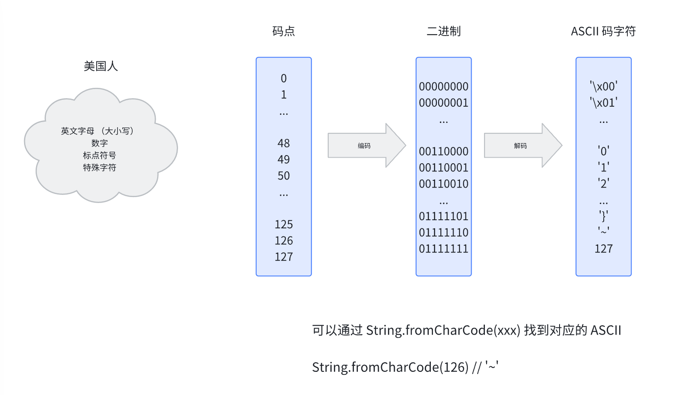

# 背景

最近开发过程中遇到了需要文件相关的转化，基于此，通过一篇文章梳理各个文件对象之间的关系。

# 文件对象


## ArrayBuffer

ArrayBuffer 是通用的、固定长度的原始二进制数据缓冲区，它是一个字节数组，在其他语言中也被称为 byte array


例如 创建长度为 8 个字节的 ArrayBuffer

```js
const buffer = new ArrayBuffer(8);

console.log(buffer.byteLength); // 8
```


> 不可读写，需要通过 类型数组对象（TypedArray） 或者 DataView 进行写操作


## TypedArray 

因为 ArrayBuffer 不可操作，一般会将 ArrayBuffer 转化为 TypedArray 对象 **（可读写）**

TypedArray 是一个底层二进制缓冲区的一个类数组视图

TypedArray 本身是一个接口，有很多实现如 Int8Array、Uint8Array、Int16Array、Uint16Array


| 类型       | 单个元素值范围 |  单元素大小（bytes）| 描述 |
| --------- | ------------ | ---            |  --- |
| Int8Array |  -128 ～ 127 |  1             |  8 位二进制有符号整数  |
| Uint8Array |  0 ～ 255   |  1             |  8 位无符号整数  |
| Int16Array |  -32768 ～ 32767   |  2      |  16 位二进制有符号整数  |
| Uint16Array |  0 ～ 65535   |  2          |  16 位无符号整数  |


上面，我们可以知道 Int8Array 单个元素占据 1 个字节，8 个二进制位。

而 Int16Array 单个元素占据 2 个字节，16 个二进制位。

那么，假设创建了一个 8 个字节长度的 ArrayBuffer 转化成 Int16Array，那么，Int16Array 是多少呢？有兴趣可以试试。


```js
const buffer = new ArrayBuffer(8);
console.log(buffer.byteLength); // 8
const int8Array = new Int8Array(buffer);
console.log(int8Array.length); // 8

const int16Array = new Int16Array(buffer);
console.log(int16Array.length); // ?
```

另外，所有 TypedArray 都有一个 `buffer` 属性，用于返回其底层的 ArrayBuffer。


```js
const buffer = new ArrayBuffer(8);
const uint8Array = new Uint8Array(buffer);
console.log(uint8Array.buffer === buffer); // true
```


## DataView 

**`DataView`** 视图是一个可以从二进制 [`ArrayBuffer`](https://developer.mozilla.org/zh-CN/docs/Web/JavaScript/Reference/Global_Objects/ArrayBuffer) 对象中读写多种数值类型的底层接口，相对于 TypedArray 的固定格式要更加灵活些。

setInt8(offset, value) 方法，可以从偏移量位置开始存储一个 8 个 bit 的数（存一个字节）

getInt8(offset) 则是从 偏移量位置读取一个 8 个 bit 的数。


```js
const buffer = new ArrayBuffer(2); // 2 个字节的 ArrayBuffer
console.log(buffer.byteLength); // 2
const dataView = new DataView(buffer);
dataView.setInt(0, 1);
dataView.setInt(1, 2);

console.log(dataView.getInt8(0)); // 1
console.log(dataView.getInt8(1)); // 2
console.log(dataView.getInt16(0)); // 258, 取 2 个字节的整数
console.log(dataView.buffer === buffer); // true

```


## Blob

Blob 是不可变的、原始数据的类文件对象 

常见的，可以使用 new Blob(array, type) 创建 Blob 对象，这里的 array 可以是 string[]、ArrayBuffer、ArrayBufferView、Blob


```js
const jsonData = {
   name: "Hello world!",
}
const blob = new Blob([JSON.stringify(jsonData)], { type: "application/json" });
console.log(blob);

function readBlob(blob, type) {
   const { promise, resolve }= Promise.withResolvers();
   let reader = new FileReader();
   
   reader.onload = function(event) {
      resolve(event.target.result);
   }

   switch(type) {
      case "ArrayBuffer":
           reader.readAsArrayBuffer(blob);
           break;
      case "DataURL":
           reader.readAsDataURL(blob); // Base64 字符串
           break;
      case "Text":
           reader.readAsText(blob, 'utf-8');
           break;
   }
   
   return promise;
}

function toAscii(uint8Array) {
  let ascii = '';
  for (let i = 0; i < uint8Array.length; i++) {
    // 转换为ASCII字符并拼接
    ascii += String.fromCharCode(uint8Array[i]);
  }
  
  return ascii;
}

readBlob(blob, "ArrayBuffer").then(result => {
    console.log(`ArrayBuffer`, result);
    const uint8Array = new Uint8Array(result); // uint8Array 的元素是 8 位 bit 的无符号整数（最大 255），
    console.log(`hexToAscii--->`, toAscii(uint8Array)); // 整数转 ASCII 字符
})

readBlob(blob, "DataURL").then(result => {
    console.log(`DataURL`, result);
})

readBlob(blob, "Text").then(result => {
    console.log(`Text`, result);
})
```

输出打印时，当我们可以打开内存器查看 ArrayBuffer 的内存存储信息。


此时，我们发现内存地址存储的是 16 进制的数，将 16 进制转 ASCII 码的操作，便可以得到文件内容了。


```js
function hexToAscii(hex) {
  // 移除可能存在的空格或0x前缀
  hex = hex.replace(/\s|0x/g, '');
  let ascii = '';
  
  // 每两位16进制数转换为一个ASCII字符
  for (let i = 0; i < hex.length; i += 2) {
    // 截取两位16进制数并转换为十进制
    const decimal = parseInt(hex.substr(i, 2), 16);
    // 转换为ASCII字符并拼接
    ascii += String.fromCharCode(decimal);
  }
  
  return ascii;
}

console.log(hexToAscii('7B226E616D65223A2268656C6C6F20776F726C6421227D')); // { "name": "hello world!" }
```

通过前面的学习，我们知道 ArrayBuffer 是不可操作的，我们需要将 ArrayBuffer 转化为 TypedArray 对象或者 DataView 对象，然后进行读写操作。

因此，我们将 ArrayBuffer 转化成 Uint8Array 即8位无符号整数数组(数组中最大整数只能是255)。

因为 Uint8Array 的元素是十进制数，因此，我们需要不需要将 16 进制转十进制，直接将十进制数转 ASCII 码即可。


```js
    function toAscii(uint8Array) {
        let ascii = '';
        for (let i = 0; i < uint8Array.length; i++) {
            // 转换为ASCII字符并拼接
            ascii += String.fromCharCode(uint8Array[i]);
        }
        
        return ascii;
    }
    const uint8Array = new Uint8Array(result); // uint8Array 的元素是 8 位 bit 的无符号整数（最大 255），
    console.log(`toAscii--->`, toAscii(uint8Array)); // 整数转 ASCII 字符 { "name": "hello world!" }
```

似乎一切都在按我们的预期进行，但是，当我们尝试读取一个包含中文的文件时，我们会发现，读取到的内容是乱码。

```js
    const jsonData = {
    name: "Hello world!我是中文",
    }
    const blob = new Blob([JSON.stringify(jsonData)], { type: "application/json" });

    readBlob(blob, "ArrayBuffer").then(result => {
        console.log('-------- uint8Array start --------');
        const uint8Array = new Uint8Array(result); // uint8Array 的元素是 8 位 bit 的无符号整数（最大 255）
        console.log('-------- uint8Array end --------');
        console.log('-------- toAscii start --------');
        console.log(`toAscii--->`, toAscii(uint8Array)); // 整数转 ASCII 字符 { "name": "hello world!" }
        console.log('-------- toAscii end --------');
    })
```


我们发现，读取到的内容是乱码，这是因为什么呢？

在解决乱码问题之前，我们需要先了解一些字符编码的知识。

字符是不能直接存入计算机的。

起初，美国人将需要的字符（英文字母、数字、标点符号、特殊字符）挨个从 0 开始到 127 进行编号，总共 128 个字符。

然后再将 0 到 127 转换成对应的二进制数字。0 到 127 就称为码点，对应的二进制就是编码，再通过 字符集 映射成对应的字符。

这里的 **字符集** 就是 ASCII 字符集。





### ASCII 字符集

ASCII(American Standard Code for Information Interchange)：美国信息交换标准代码，包括了英文、符号等。

标准ASCII字符集使用1个字节存储一个字符，首位是 0，总共可表示 128 个字符，对美国人来说完全够用。

但对于中文的话，ASCII 字符集无法表示，因此，我们需要使用其他字符集来表示中文。

### GBK

GBK 是一种国标的汉字编码字符集，包含了2万多个汉字等字符，其中一个中文字符编码成两个字节的形式存储。

注意：GBK兼容了ASCII字符集。也就是GBK中0到127这128个码点需要和ASCII字符集的码点对应。因此，在GBK中，英文和数字占1个字节，中文占2个字节。

对于字符串“我a你”，用GBK的方式存入计算机，编码后的形式如下：


GBK规定，汉字的第一个字节的第一位必须是1，如上图所示。

在解码时，计算机还是会一个一个字节读取，读取第一个字节时，发现第一个字节的第一位是1，那么计算机会连着读取后面一个字节，作为一个整体读取。读取到中间的字节时，发现是0开头，就认为是ASCII字符集，只需要读一个字节。读取到第四个字节时，发现第一位是1，那么就将第4和第5个字节作为整体读取。

> 因此，GBK最大能表示的范围就只有 15 位二进制位。


### Unicode字符集(统一码，也叫万国码)

GBK 只满足汉字编码，不能满足世界上其他国家的字符需求。因此，我们需要更大的字符集，Unicode 字符集来表示。


Unicode是国际组织制定的，可以容纳世界上所有文字、符合的字符集。

Unicode字符集也提供了很多编码方案，比如：

 - UTF-32。最早提供的方案之一。使用4个字节表示一个字符。字节数固定，编解码方便简单。但是浪费存储空间，通信效率低。比如，ASCII字符集只需要1个字节，但如果采用UTF-32编码方案，就需要往前面手动补3个字节。
 - UTF-8


UTF-8的编码规则是：

 - 对于单字节的字符，直接使用一个字节表示，规定ASCII字符直接以一个字节的形式编码，不做任何处理
 - 对于双字节的字符，使用两个字节表示, 第一个字节必须以110开头，第二个字节必须以10开头。
 - 对于三字节的字符，使用三个字节表示, 第一个字节必须以1110开头，第二个和第三个字节必须以10开头
 - 对于四字节的字符，使用四个字节表示, 第一个字节必须以11110开头，后面三个字节都是以10开头。
  
英文字符、数字等只占1个字节(兼容标准ASCII编码)，汉字字符占用3个字节。

因此“我”的UTF-8编码就是：`11100110 10001000 10010001`

综上，字符串"a我m"对应的UTF-8编码为：

`01100001 11100110 10001000 10010001 01101101`


```js
function strToUtf8Binary(s) {
    // 1. 编码为UTF-8字节序列（Uint8Array）
    const encoder = new TextEncoder();
    const utf8Bytes = encoder.encode(s);
    // 2. 每个字节转为8位二进制，拼接
    let binaryStr = '';
    for (const b of utf8Bytes) {
        binaryStr += b.toString(2).padStart(8, '0'); // 补前导0至8位
    }
    return binaryStr;
}

// 示例
console.log(strToUtf8Binary("a"));    // 01100001
console.log(strToUtf8Binary("中"));  // 111001001011100010101101


function utf8BinaryToStr(binaryStr) {
    // 1. 验证二进制字符串合法性（仅包含0/1，且长度为8的倍数）
    if (!/^[01]+$/.test(binaryStr) || binaryStr.length % 8 !== 0) {
        throw new Error("无效的UTF-8二进制编码（必须仅包含0和1，且长度为8的倍数）");
    }

    // 2. 按8位拆分二进制字符串，得到每个字节的二进制
    const byteBinaries = [];
    for (let i = 0; i < binaryStr.length; i += 8) {
        byteBinaries.push(binaryStr.slice(i, i + 8));
    }

    // 3. 将每个字节的二进制转为十进制数值（0-255）
    const bytes = new Uint8Array(byteBinaries.map(bin => parseInt(bin, 2)));

    // 4. 用TextDecoder解码UTF-8字节序列
    const decoder = new TextDecoder('utf-8');
    return decoder.decode(bytes);
}

console.log(utf8BinaryToStr("01100001")); // a
console.log(utf8BinaryToStr("111001001011100010101101")); // 中
```


### 乱码问题
假设我们使用GBK对字符串"a我m"进行编码存储，然后使用UTF-8进行读取，就会出现乱码：


显然，当我们使用GBK对"a我m"进行编码时，"a"占用1个字节，"我"占用2个字节，"m"占用一个字节。GBK编码后大概是这样子：

`0xxxxxxx 1xxxxxxx xxxxxxxx 0xxxxxxx`

如果我们使用UTF-8进行解码时，第一个字节可以正常解码为"a"。读取第二个字节时，发现不符合UTF-8的编码规则，因此打印一个？号。读取第三个字节时，发现也不符合UTF-8编码规则，因此打印一个？号。读取第四个字节时，发现符合UTF-8编码规则，因此打印"m"

注意：

- 字符编码时使用的字符集，和解码时使用的字符集必须一致，否则会出现乱码
- 英文、数字一般不会乱码，因为很多字符集都兼容了ASCII编码。

## Object URL


## Base64


