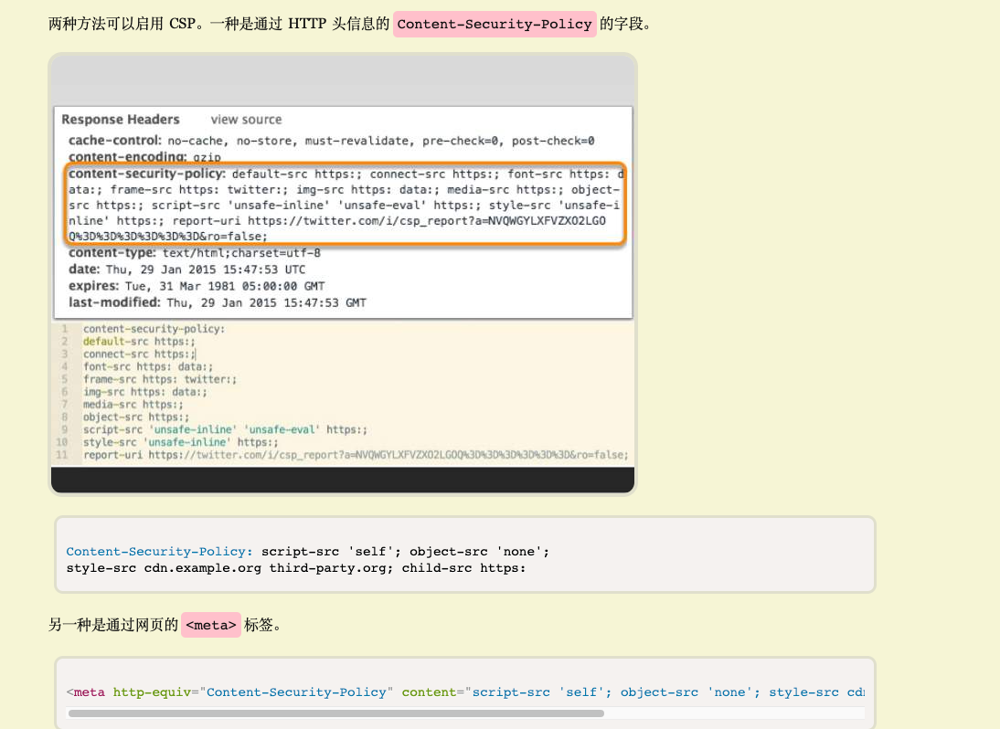
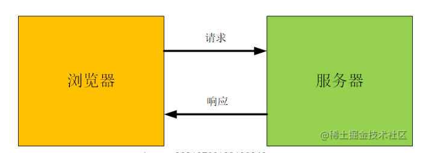
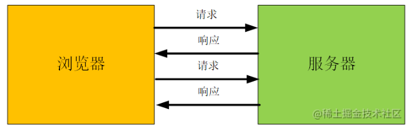
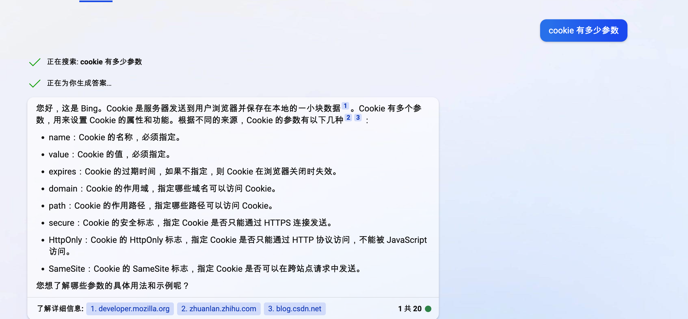

# 浏览器安全

## 页面安全

### 同源策略
协议、域名、端口号都相同，才是同源。

#### 限制
1. 无法进行 DOM 操作
2. 无法获取 Cookie、LocalStorage 等数据
3. 无法向不同源发请求
 
#### 开放
1. 默认页面中可以引用任意第三方资源
   
   引入 CSP (内容安全策略)
   
   

2. 只能请求同源的接口
   
   引入 CORS (跨域资源共享)

   - 简单请求 （HEAD/POST/GET请求）
     1. 浏览器在请求头上添加 Oirgin 字段，该字段用来说明请求来自那个源，服务器可以根据这个值决定是否同意这次请求
     2. 当服务器收到请求后，根据 Origin 判断是否在许可范围内
     3. 如果不在范围内，服务器会返回一个正常的 HTTP 响应，浏览器发现该响应头没有包含 Access-Control-Allow-Origin 字段，就会抛出一个错误，被 XMLHttpRequest 的 onerror 回调函数捕获 （由于正常响应，其状态码是 200，所以该错误不能通过状态码识别）
     4. 如果 Origin 在指定范围内，服务器返回的响应会多几个头信息字段       
        - Access-Control-Allow-Origin（必须）
          判断源是否可以跨域，该值要么是请求的 Origin，要么是 *
        - Access-Control-Allow-Credentials
          是否允许发送 Cookie，默认为 false
          如果 Access-Control-Allow-Origin 的值为 *，则无法发送 Cookie
        - Access-Control-Expose-Headers
          制定其他的头信息字段可以暴露给客户端
          因为默认情况下，只有 6 个字段可以被暴露，其他的都会被过滤掉

          
    
   - 非简单请求 （PUT/DELETE 或者 Content-type字段类型是 application/json）
      1. 浏览器发起 Option 预检请求
      2. 服务器收到预检请求后，检查
         - Origin 发起请求的源信息
         - Access-Control-Request-Method 浏览器会发起请求的方法
         - Access-Control-Request-Headers 请求额外发送的头信息字段
      3. 如果服务器否定预检请求，会返回一个正常的 HTTP 响应，但是没有任何的 CORS 相关的头信息字段，这是浏览器会认定服务器不同意预检，触发错误
      4. 如果服务器同意预检请求，会返回一个正常的 HTTP 响应，但是会多几个 CORS 相关的头信息字段
         - Access-Control-Allow-Origin （必须）
         - Access-Control-Allow-Credentials
         - Access-Control-Expose-Headers
         - Access-Control-Max-Age - 预检请求的有效期, 单位秒
         - Access-Control-Allow-Methods （必须）
         - Access-Control-Allow-Headers
        
        

   
3. 只能操作同源的DOM
   引入了跨文档消息机制 postMessage

### XSS 攻击
跨域脚本攻击。

#### 类型

1. 存储型
   脚本存储在服务器，用户访问时，脚本从服务器返回，浏览器执行脚本

2. 反射型
   
   在文章链接参数上存放了一段恶意脚本，用户访问时，脚本从参数中取出，浏览器执行脚本

3. DOM 型
   比如在搜索的时候，添加了一段脚本， 如果网站的搜索功能没有对用户输入进行适当的过滤和转义，搜索结果页面可能会将恶意的脚本代码直接插入到 HTML 中，并在用户浏览器中执行
   
   web 资源在传输或者用户在使用的过程中修改了 Web 页面的数据

#### 预防
1. 对输入的内容进行截取或者转义（encode）
2. 限制输入的长度和类型
3. 引入内容安全策略 （CSP）
4. 对 Cookie 设置 HttpOnly 属性
   

### CSRF 攻击
跨站请求伪造。

比如诱导用户点击链接，访问网址后，网址通过用户的登录信息伪造请求

#### 必要条件
1. 站点有 CSRF 漏洞
2. 用户登录了
3. 用户点击了诱导链接

#### 预防
1. 给 Cookie 新增 SameSite 属性
   - Strict: 第三方站点无法发送 Cookie
   - Lax (默认): 第三方站点如果是 GET 请求可以发送 Cookie
   - None 不做限制
    
2. 通过请求的 Origin or Referer 字段判断请求合法性
3. 在请求地址中添加 token 并验证

## 浏览器安全

将渲染进程放在沙箱中
- 无法持久存储
- 无法访问网络
- 无法监听用户交互
- 需要通过 IPC 与浏览器主进程通信，由浏览器进程处理后，再将结果传递给渲染进程

## 网络安全
HTTPS、重放攻击、验签