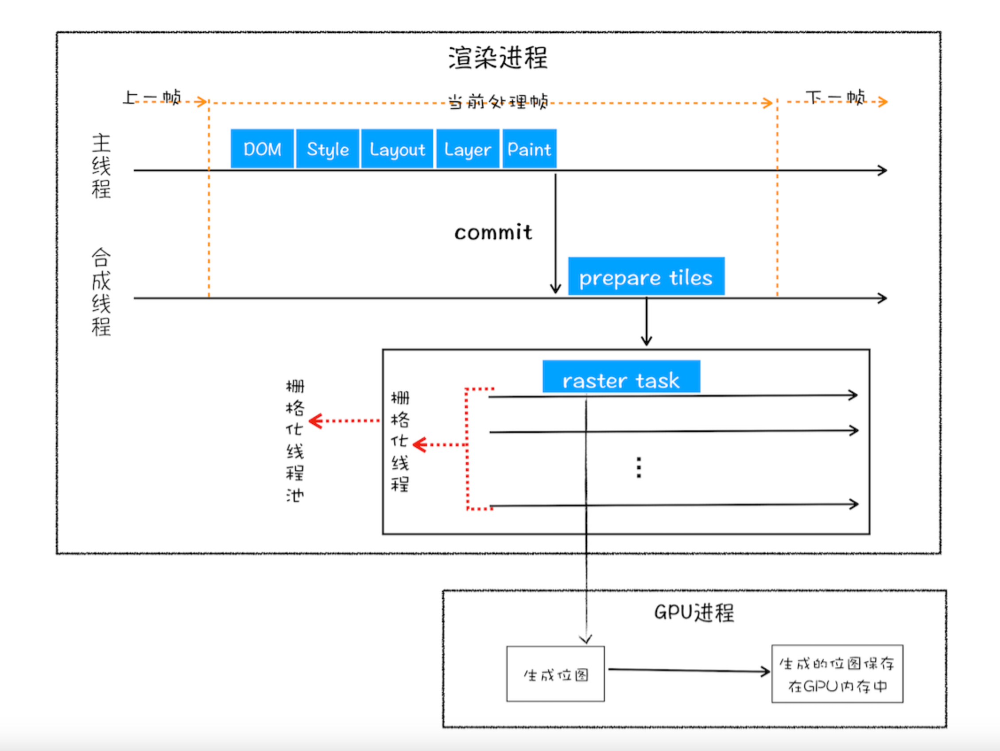
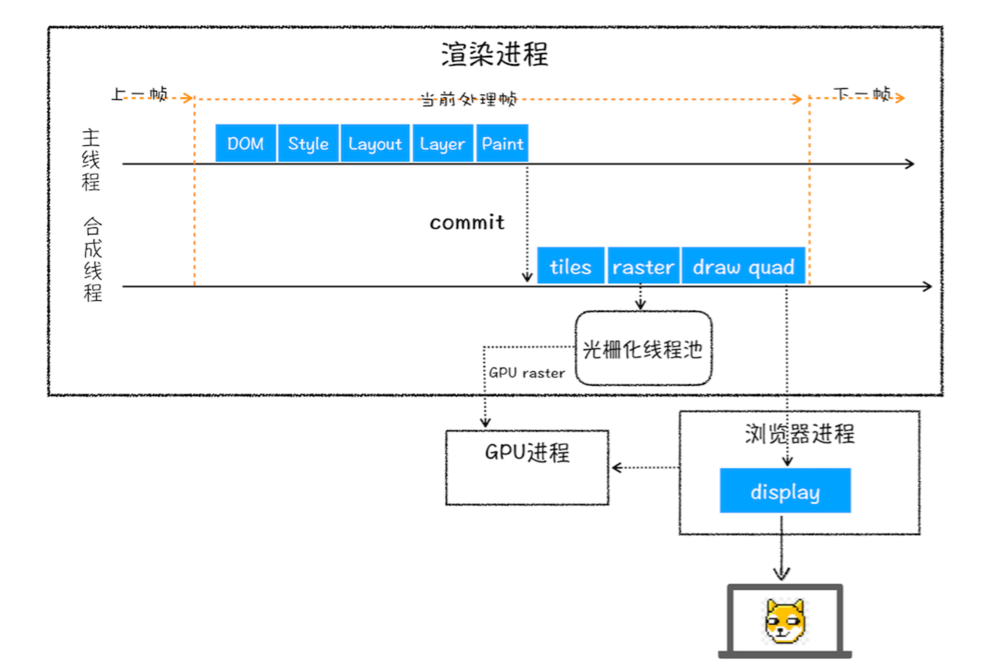

# 浏览器渲染流程

## 浏览器渲染流程

1. 发出请求到页面首次绘制
   - 第一阶段: 页面提交请求到服务器响应，这时候页面还是之前的页面
   - 第二阶段: 获取到响应数据提交到渲染进程，进行 HTML 解析、CSS 加载、JS 加载、JS 执行、CSSOM 解析、布局树生成、页面绘制
   - 第三阶段: 等首次加载完成后，页面一点点被渲染
2. HTML 解析
3. 生成 CSSOM 树
   CSS 不会阻塞 HTML 解析，但是会阻塞页面渲染，因为要生成渲染树
4. 生成布局树
   去除不显示的节点，计算样式
5. 分层和合成机制
   - 分层: 分层树在布局树之后，分层树的每一个节点都是图层，如没有，则和父节点同一个图层
   - 绘制阶段: 根据图层在绘制阶段生成绘制指令
   - 光栅化: 根据绘制指令，将每个图层都绘制成一张图片
   - 合成: 合成线程将多张图片合成一张图片，然后显示在屏幕上 (由合成线程完成，不影响主线程)
          - 优化操作1: 合成线程内会维护一个光栅化线程池，将绘制指令列表提交到 GPU 进行光栅化，生成位图，放在内存中
          - 优化操作2: 分块，合成线程将图层分块，优先渲染离屏幕最近的图块
          - 
6. 页面显示

## 常见的问题

### 1 从输入 URL 到页面渲染完成，发生了什么？
1. 浏览器会根据用户输入的内容判断是关键字还是URL
2. 如果是关键字，会将其组成成带有搜索关键字的URL，通过IPC进程通信发送给网络进程
3. 网络进程发起请求前，会判断是否命中强缓存，如命中直接返回存储资源
4. 否则发起请求，根据 DNS 解析获取域名对应的 IP 地址，进行 TCP、HTTP 连接
5. 服务端收到请求后，会判断是否命中协商缓存，如命中则返回304状态码
6. 如返回的是301、302状态码，浏览器会根据响应头返回的location字段，进行重定向
7. 如是正常返回资源类型，浏览器会根据 content-type 对资源做相对应的操作，如果是下载类型则进行下载，如果是html类型则会提交到渲染进程进行解析
8. 解析HTML，转换成浏览器能识别的DOM树
9. 解析CSS，转化成浏览器能识别的CSS样式树
10. 根据DOM和CSS样式树，通过布局计算生成布局树
11. 根据布局树上的分层属性（z-index），生成分层树
12. 根据分层树，生成绘制指令列表
13. 渲染主线程会将绘制指令列表提交给合成线程
14. 合成线程会发送指令给光栅化线程池，将绘制指令列表提交到 GPU 进行光栅化，生成位图，放在内存中
15. 合成线程通信浏览器进程，浏览器进程将内存中的数据输出到显卡的后缓存区，在下一帧绘制之前，显卡的后缓冲区与前缓冲区对换，显示屏读取前缓冲区数据，显示到屏幕上

### 2 回流和重绘有什么区别
回流：元素尺寸、定位改变，可能会影响到其他元素的位置

重绘：元素外观改变，如背景色、颜色，元素尺寸位置不改变且不影响其他元素

减少回流的方法：
1. 集中修改
   - 修改样式，使用 class 
   - 修改前将 DOM 改成 display: none，修改后再显示
   - 使用 DocumentFragment
   - resize、scroll 事件，使用防抖
2. 使用 BFC
   - 隔离内部元素对外部元素的影响
3. 脱离文档流
   - position: absolute、fixed
   - float
4. 提升合成图层
   - CSS3 属性: will-change、transform: translate3d(0);
5. 不是用 offsetHeight、getBoundingClientRect
   - 使用 intersectionObserver API - 判断元素是否在可视区域内

BFC: 块级格式化上下文
特点: BFC 内部元素不会影响到外部元素
形成条件:
1. HTML 元素
2. overflow: hidden、auto、scroll
3. position: absolute、fixed
4. float 元素
5. display: inline-block、flex、inline-flex等

### 3 渲染流程图

JS 会阻塞 HTML 的解析和渲染

CSS 不会阻塞 HTML 解析，但会阻塞 DOM 渲染，还会阻塞 JS 的执行

为什么 CSS 会阻塞 JS 的执行？

因为 JS 可能会操作 DOM 节点和 CSS 样式，因此浏览器为了获取到最新的 CSS 样式，样式表会在后面的 JS 执行前先加载执行完毕，所以 CSS 会阻塞 JS 的执行