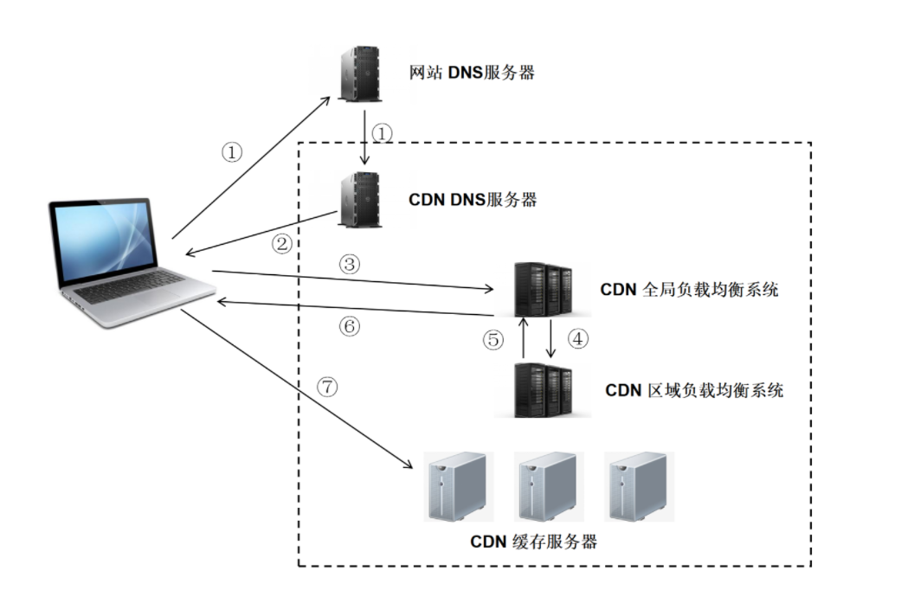

# CDN

## 定义

内容分发网络，利用最靠近用户的服务器，将资源更快更可靠的给到用户

## 组成
1. 分发服务系统
   
   最小单位是 Cache 设备
      - 响应用户请求
      - 与源站点进行资源同步
   
2. 负载均衡系统
   
   负责对用户的请求进行调度
   
3. 运营管理系统
   
   负责业务层面与外界系统的交互所需要的收集、整理、交付等工作 （为了做闭环）

   运营管理子系统
   网络管理子系统

## 作用

托管 web 资源，加速 web 资源的获取速度

### 性能方面
1. 用户从最近的 CDN 站点获取资源，访问速度更快
2. 突破 TCP 只有同域名下只有 6 个的限制
3. 减少源服务器的负担

### 安全方面
1. 针对 DDos: 通过监控分析异常流量，限制请求频率
2. 针对 MITM: 从源服务器到 CDN 节点到 ISP (Internet Service Provider, 网络运营提供商)，全链路 HTTPS 通信

## 工作原理

### 没有使用 CDN 过程
1. 浏览器通过 DNS 对域名进行解析，得到此域名对应的 IP 地址
2. 浏览器根据得到的 IP 地址，向域名的服务主机发送数据请求
3. 服务器向浏览器返回响应数据

### 使用了 CDN 过程 
1. 获取负载均衡服务器 IP 地址 （自底向上）
   - 1. 数据的 URL 先进行 DNS 系统解析，发现该 URL 对应的是一个 CDN 专用的 DNS 服务器，DNS 系统就会将域名解析权交给 CNAME 指向的 CDN 专用的 DNS 服务器
   - 2. CDN 专用的 DNS 服务器将 CDN 全局负载均衡设备 IP 地址返回给用户
   - 3. 用户向 CDN 的全局负载均衡设备发起数据请求
  
2. 获取目标缓存服务器 IP 地址 （自顶向下）
   
   - 4. CDN 全局负载均衡设备根据用户 IP 地址以及用户请求的 URL，选择一台用户所属区域的负载均衡设备
   - 5. 区域负责均衡设备选择一台适合的缓存服务器来提供服务，将该缓存服务器的 IP 地址返回给全局负载均衡设备
   - 6. 全局负载均衡设备把服务器 IP 地址返回给用户
  
3. 用户发起请求获取
   - 用户向该缓存服务器发起请求，缓存服务器响应用户的请求，将用户所需内容发送支用户终端 （如果缓存服务器没有用户想要的内容，那么缓存服务器会穿透 CDN 集群往源服务器获取设备）

## 使用场景
1. 使用第三方 CDN 服务 （例如开源框架可以使用第三方 CDN 服务，如 React、Vue、JQuery）
2. 使用 CDN 进行静态资源的缓存 （将网站的资源放在 CDN 上）
3. 直播传送 （直播本质也是使用流媒体进行传送，CDN 也支持流媒体传送，所以直播完全可以使用 CDN 来提高访问速度）