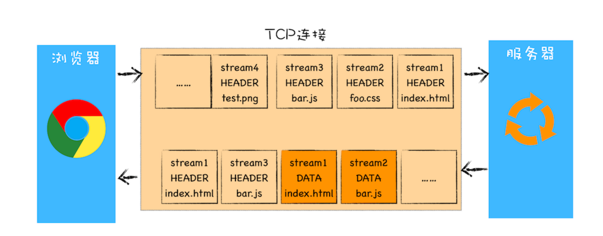
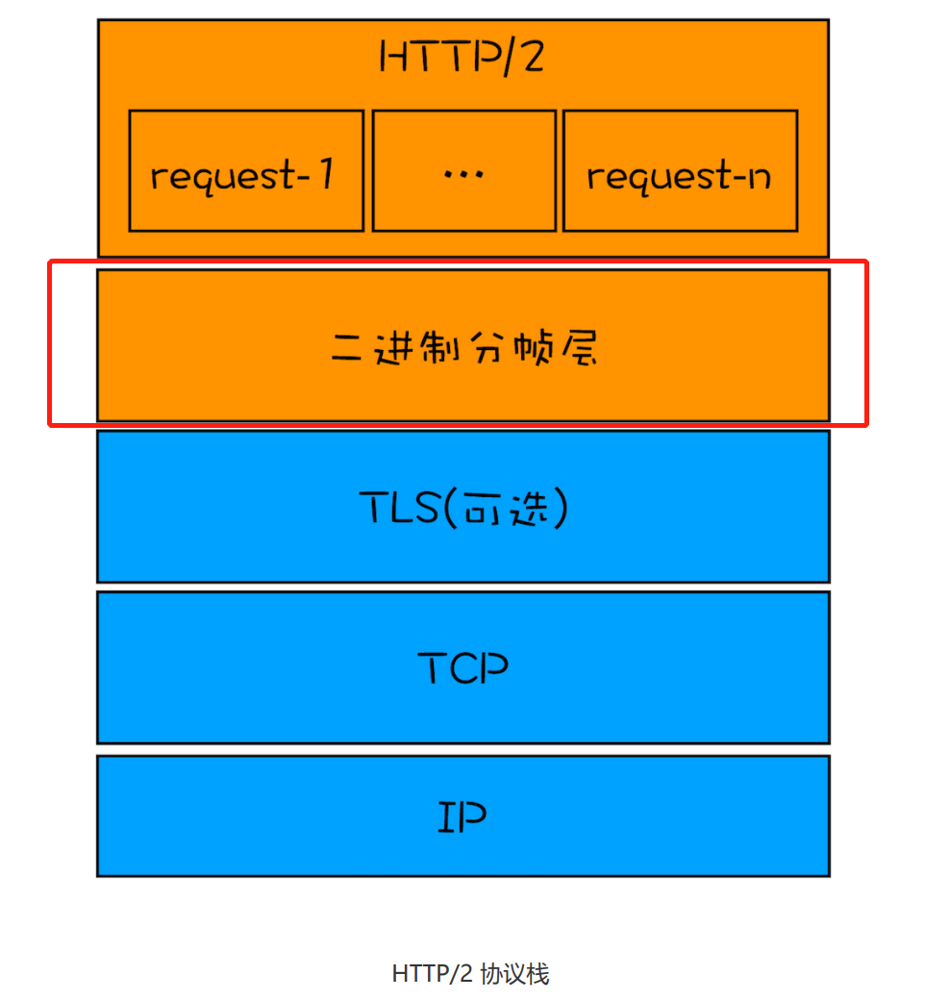
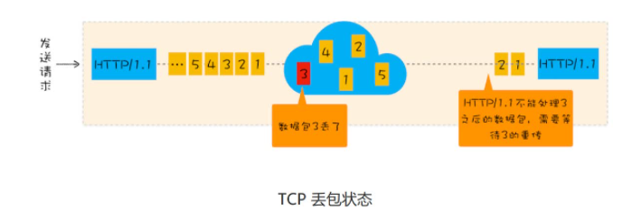

# HTTP

## HTTP 0.9

早期做学术研究使用，只是单纯的文本传输（只有请求行、没有请求头和请求体）

## HTTP1.0

支持图片、视频传输，但传输效率太低

核心需求：支持多种类型的文件下载（引入了请求头和响应头）

## HTTP1.1

### 持久连接 keep-alive

在此之前一个 HTTP 请求需要建立一个 TCP 连接

目前浏览器中对于 **同一个域名**，默认允许同时建立 6 个 TCP 连接

### 管道化连接

将串行请求改成并行请求

### 支持虚拟主机

HTTP 根据 Host 去区分同一 IP 物理机子上的不同虚拟主机

### 对动态生成的内容提供完美支持

Chunk transfer 机制

### Cookie、完全机制

### 主要问题
- 1. HTTP/1.1 对头阻塞问题
  在 HTTP 中，因为前一条请求因某些原因没有及时返回，会导致后面的请求无法发起，容易导致对头阻塞（串行）。虽然 HTTP1.1 引入了管道化技术尝试解决队头阻塞问题，但服务端还是需要按顺序处理请求并返回，因此阻塞问题依然存在
- 2. 带宽利用率不理想
  - 原因:
    - TCP 的慢启动: 传输数据的速度从慢到快
    - 同时开启多个 TCP 连接，那么这些连接会竞争固定的带宽（带宽不足时，TCP 传输速度会变慢）

## HTTP/1.0 与 HTTP/1.1 的 区别？

### 1 连接方面

持久化连接: HTTP1.1 支持持久化连接，减少每次 HTTP 请求都需要建立 TCP 连接的耗时

管道化连接：提高请求效率

### 2 缓存方面

HTTP1.1 新增了协商缓存的字段 ETag 比 if-None-Match 更加紧准

### 3 新增 Host 字段

根据 Host 区分同一 IP 服务器上的不同网站

之前只能通过 IP 区分网站

### 4 请求资源方面
添加范围请求 （206 状态码）

### 5 新增了请求方法

PUT、HEAD、OPTIONS 等

## HTTP/2.0

一个域名只有一个 TCP 长连接传输数据 （避规 HTTP 1.1 的 TCP 慢启动和多个 TCP 连接时竞争带宽资源）

### 多路复用机制

通过引入二进制分帧层，实现多路复用机制

1. 浏览器发起请求，经过二进制分帧层将请求拆分成一个个带请求id的帧，发送给服务端
2. 服务端收到这些帧后，根据请求id组装成完整请求信息，服务端处理完请求后，将响应请求发送到二进制分帧层，经过二进制分帧层转化为一个个带有响应id的帧发送给浏览器
3. 浏览器收到这些帧后，会组合成一个完整的响应请求

实现基础：
***HTTP2 是一个二进制协议***，在 HTTP/1.1 版中，报文的头信息必须是文本（ASCII 编码），数据体可以是文本，也可以是二进制。HTTP/2 则是一个彻底的二进制协议，头信息和数据体都是二进制，并且统称为"帧"，可以分为头信息帧和数据帧。 帧的概念是它实现多路复用的基础

### 头部压缩
HTTP/2 实现了头信息压缩，由于 HTTP 1.1 协议不带状态，每次请求都必须附上所有信息。所以，请求的很多字段都是重复的，比如 Cookie 和 User Agent ，一模一样的内容，每次请求都必须附带，这会浪费很多带宽，也影响速度。HTTP/2 对这一点做了优化，引入了头信息压缩机制。一方面，头信息使用 gzip 或 compress 压缩后再发送；另一方面，客户端和服务器同时维护一张头信息表，所有字段都会存入这个表，生成一个索引号，以后就不发送同样字段了，只发送索引号，这样就能提高速度了。

### 设置请求优先级

### 服务器推送

### 存在的问题

TCP 协议本身存在的问题：
- 1. TCP 的队头阻塞
  TCP 传输过程中把一份数据分成多个数据包进行传输，当某个数据包没有按顺序返回，接收端会一直保持连接等待数据包返回，这就阻塞了后续数据包的传输
  
- 2. TCP 建立连接需要耗时

### 优点
多路复用技术能有效利用带宽（只有一个TCP连接），缓解 TCP 慢启动带来的问题，解决了 HTTP 队头阻塞问题，同时还支持设置优先级、服务器推送、头部压缩极大的提高了 HTTP 的传输效率
  

## http2 与 http1 的区别？

1. 为了解决 HTTP1.1 的队头阻塞问题引入了二进制分帧层
2. 只建立一个 TCP 连接，解决 HTTP1.1中 TCP 慢启动以及多个 TCP 之间相互竞争带宽问题
3. 头部压缩，HTTP2 请求头部采用头部压缩，减少数据内容的大小，提高效率
4. 服务端推送: 服务端可以向客户端推送资源

## HTTP3.0
采用UDP + QUIC协议

1. UDP 可以减少连接耗费的 RTT，加快数据传输
2. 使用 QUIC 协议，可以使用多路复用、TLS、可靠性传输等 TCP 协议的特点

存在的问题:
1. 规范的制定和落地有着较大的差异（比如官方的QUIC和谷歌的QUIC协议有较大差异）
2. 是对底层协议的改造，落地成本高。

## HTTP1.0/1.1/2.0有什么区别？
这道题应该从HTTP的发展历史的角度出发

1. http1.0 在 http0.9 时代新增了图片、视频的传输，同时新增了请求、响应头，支持文件下载，但请求的效率低，因为每个http请求需要一次TCP连接
2. HTTP1.1 引入了缓存策略、支持长连接keep-alive等，支持PUT/DELETE/OPTION方法，提高了HTTP的传输效率，但并发请求时会有一个HTTP的头部阻塞问题
3. HTTP2 通过引入二进制分帧层、采用多路复用避规了HTTP的头部阻塞问题，还支持头部压缩，提高HTTP的传输效率，服务端推送

## RTT
浏览器发送数据包到服务器 + 浏览器接收到服务器确认接收的数据包的往返时间，成为RTT