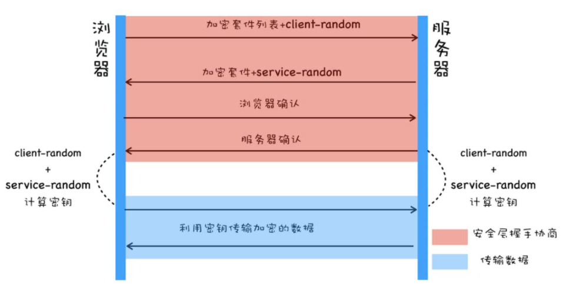
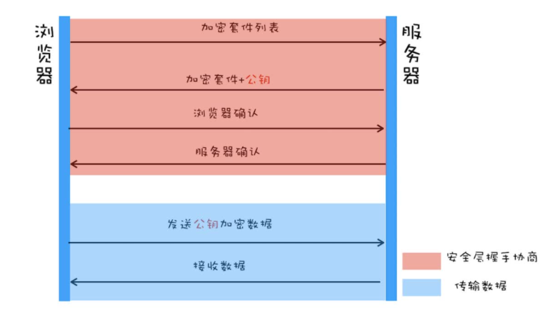
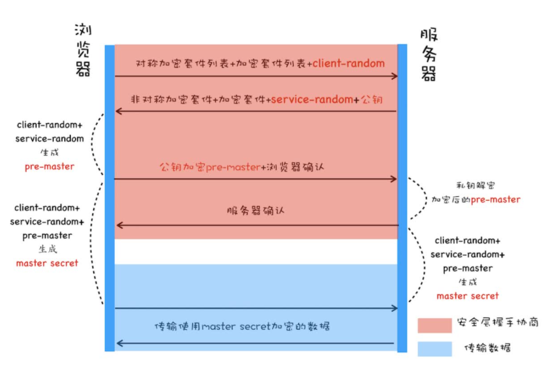
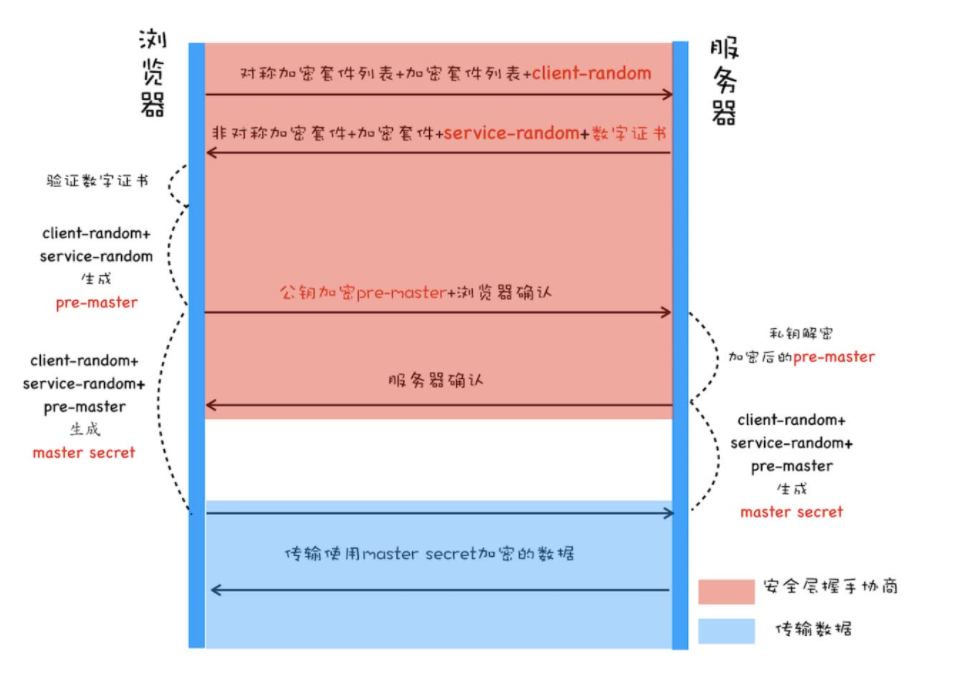
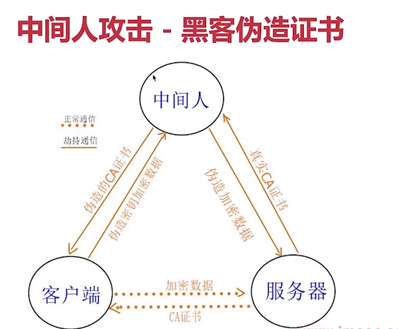

# HTTPS

## HTTP 和 HTTPS 的区别
1. HTTP 是超文本传输协议，明文传输、简单、无状态，而 HTTPS 是在 HTTP 基础上增加了 SSL 协议，更加安全
2. HTTP 协议默认端口是 80，HTTPS 协议默认端口是 443
3. HTTPS 需要 CA 证书、相对于 HTTP 费用更高

## HTTPS 演进过程

### 第一版对称加密 - 不安全

### 非对称加密 - 传输效率低

### 对称加密与非对称加密结合 - 存在中间人攻击

### 通过数字证书校验网站的真实性和获取网站的公钥

之前传输的是密钥，这种方式传输的是装有密钥的保险箱，就算获取到了保险箱，也没有保险箱的钥匙🔑

1. 浏览器将对称加密方法列表、非对称加密方法列表、随机数 A 传输给服务端
2. 服务器接受后，将对称加密、非对称加密方法、服务器生成的随机数 B 、数字证书发送给浏览器
3. 浏览器接受后，验证证书的可靠性，并获取证书内的非对称加密的公钥
4. 浏览器通过 2 个随机数生成新的随机数 C，并通过非对成加密的公钥对随机数 C 进行加密发送给服务器
5. 服务器确认后，服务器与浏览器通过 3 个随机数生成对称加密密钥，进行数据传输

## 如何验证证书的可靠性
1. 浏览器获取到证书后，通过 CA 相同的 Hash 算法对证书信息进行加密得到摘要 A
2. 通过 CA 的公钥对证书内的数字签名进行解密，获取到摘要 B
3. 如果 AB 相同，则证书可靠

## 什么是 HTTPS 中间人攻击？如何预防？
1. 先说下 HTTPS 传输过程
2. 客户端和服务端通信之间，新增一个中间人，伪造 CA 证书和加密数据，获取服务器和客户端的通信信息

如何预防？

使用正规厂商的第三方证书

