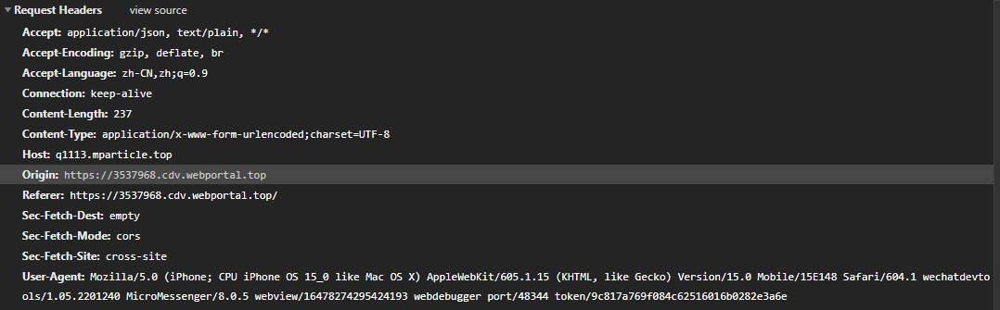

# 请求报文
由请求行、请求头、请求体组成

## 请求行
由请求方法、URI、协议版本组成

## 请求方法
1. GET 请求获取资源
2. POST 提交数据
3. PUT 更新资源
4. DELETE 删除资源
5. OPTIONS 查询针对请求 URL 指定的资源支持的方法（常用在非简单请求的预检上）
6. HEAD 获取响应头
7. CONNECT 要求用隧道协议链接代理
8. TRACE 追踪请求经过的路径

## URI 字段

## 协议版本
HTTP0.9、 HTTP1.0、HTTP1.1、HTTP2.0、HTTP3.0

## 请求头

## 接受内容相关
1. Accept 浏览器接受的格式 Accept: application/json, text/plain, */*
2. Accept-Encoding 浏览器接受的压缩格式 Accept-Encoding: gzip, deflate, br
3. Accept-Language 浏览器接受的语言 Accept-Language: zh-CN
4. Accept-Charset 浏览器接受的字符集

## 强缓存相关
1. Cache-Control
   
## 协商缓存相关
1. If-Modified-Since 上一次访问时文件的更改时间 （存在校验问题，比如文件内容只是添加了空格，但是 Last-Modified 改变了）
2. If-None-Match 上次访问的 ETag 信息 （如果 If-None-Match 和 ETag 一致，则命中 304 协商缓存）

## 请求域名相关
1. HOST HTTP 请求的域名
2. Origin 页面域名 （常用于防止 CSRF 攻击和跨域请求）
3. Referer 发出请求的页面 URL

## 客户端相关
- UA 
- COOKIE

## 连接相关
- Connection  Connection: keep-alive

## 请求体

