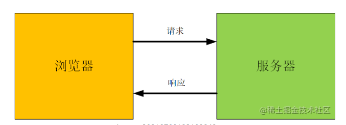
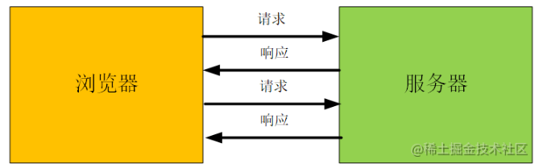

# 跨域请求

## 简单请求

若请求满足**所有**下述条件，则该请求可视为简单请求：
1. HEAD/GET/POST 请求
2. Content-Type: text/plain、multipart/form-data、application/x-www-form-urlencoded
3. 除了被用户代理自动设置的标头字段，剩下的请求头是: Accept、Accept-Language、Content-Language、Content-Type、Range

### 请求过程
1. 发起请求，请求头会带上 Origin 字段，该字段用来说明请求来自哪个源（协议 + 域名 + 端口），服务器根据这个值决定是否同意这次请求
2. 当服务器接收到请求后，根据 Origin 判断是否在允许的范围内
3. 如果不在范围内，服务器会返回一个正常的 HTTP 响应，浏览器发现响应头信息没有 Access-Control-Allow-Origin 字段，就知道出错了，从而抛出错误，被 XML 的 onerror 回调函数捕获。（注意：由于正常响应，其状态码为200，因此该错误不能通过状态码识别）
4. 如果 Origin 指定的域名在范围内，服务器返回的响应会多出几个头信息字段（Access-Control-Allow-Origin、Access-Control-Allow-Credentials、Access-Control-Expose-Header 等）
   

## 非简单请求

请求方法是 PUT、DELETE 或者 Content-Type 是 application/json 类型

### 请求过程 （源、请求头、方法、缓存、Cookie）
1. 浏览器发起 Option 预检请求
2. 服务器收到预检请求以后，检查了 Origin、Access-Control-Request-Method 和 Access-Control-Request-Headers 字段后，确认允许跨域请求，就可以做出回应
   - Origin (必须): 发起请求的源信息
   - Access-Control-Request-Method（必须）: 用来列出浏览器的 CORS 请求会用到哪些 HTTP 方法
   - Access-Control-Request-Headers 跨域请求而外的请求头字段
3. 如果服务器预检请求，会返回一个正常的 HTTP 回应，但没有任何的 CORS 相关的头信息字段，这时浏览器就会认定服务器不同意预检请求，触发错误。
4. 如果服务器通过了预检请求，以后每次浏览器正常的 CORS 请求就跟简单请求一样
   - Access-Control-Allow-Origin（必须）: 运行哪些源跨域，如果是 * 无法携带 Cookie
   - Access-Control-Allow-Method（必须）: 服务器支持哪些请求
   - Access-Control-Allow-Header: 服务器支持的头信息字段
   - Access-Control-Max-Age: 预检请求的有效期，单位秒

## 跨域请求如何传输 cookie
1. 响应头设置 Access-Control-Allow-Credentials 等于 true
2. Access-Control-Allow-Origin 不能设置成 * （Cookie 的 SameSite 属性如果是 Lax 可能也会导致带不上去）
3. 前端设置 withCredentials: true

## 常见的问题

### session 和 cookie 有什么区别？

cookie 一般用于登录验证，存储用户信息，大小为 4KB，会随着网络请求携带给服务端

session 一般存储在服务端，常用于与 Cookie 配合做登录检验

### token 和 cookie 有什么区别？
- cookie 是 HTTP 的内容，token 是自定义的数据
- cookie 可以默认存储在浏览器中，token 需要自行存储
- token 没有跨域限制，cookie 存在跨域限制
- token 常用于 CSRF 或者 JWT（JSON WEB TOKEN）
- Cookie 常于 Session 配合，做用户登录鉴权

### Cookie 的字段有哪些？
- 基本属性:
  - name
  - value
- 访问性：
  - expire
  - path
  - domain
  
- 安全性：
  - secure
  - httpOnly
  - sameSite

### Session 和 JWT 哪个更合适？
- Session 
    - 优点: 
        1. 易于学习
        2. 用户信息存储在服务器，可以快速封禁某个用户
    - 缺点:
        1. 占用服务器资源，硬件成本高
        2. 多进程、多服务器时，不好同步 （需要第三方缓存， Redis）
        3. Session 需要配合 Cookie 使用，cookie 有域名限制
   
- Json Web Token
    - 优点:
        1. 存储在客户端，不占用服务端资源
        2. 易于同步
        3. 没有跨域限制
    - 缺点:
        1. 无法快速封禁用户
        2. Token 不安全，一但秘钥被泄漏，容易窃取用户信息
        3. Token很大，影响请求体积
    
- 使用场景:
    - 用户信息安全 -> 使用 Session
    - 没有特殊要求 -> 使用 JWT 

### 如何实现 SSO 单点登录