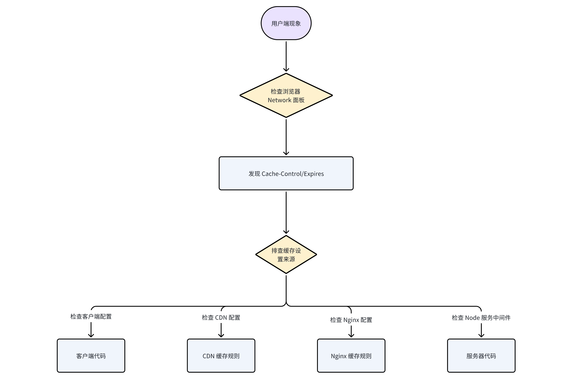
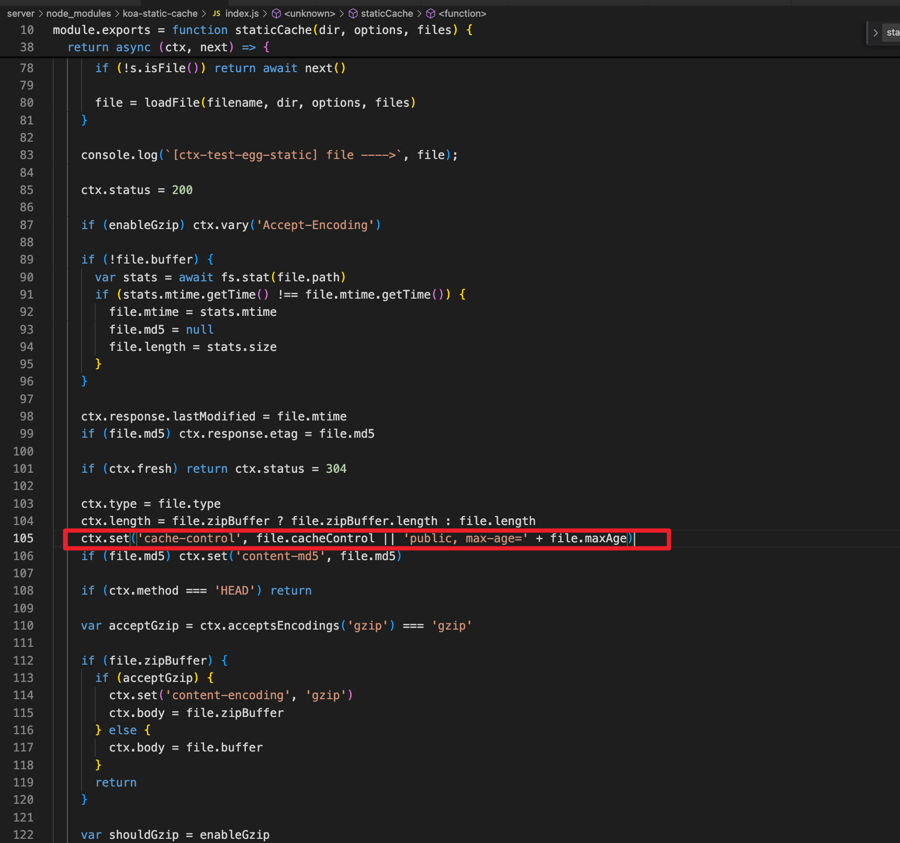
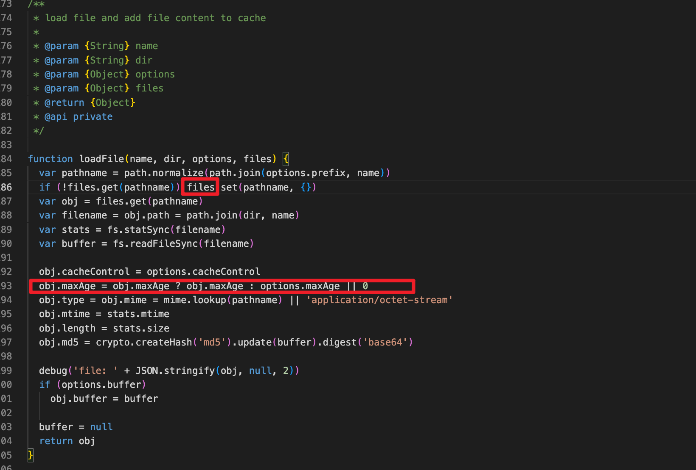
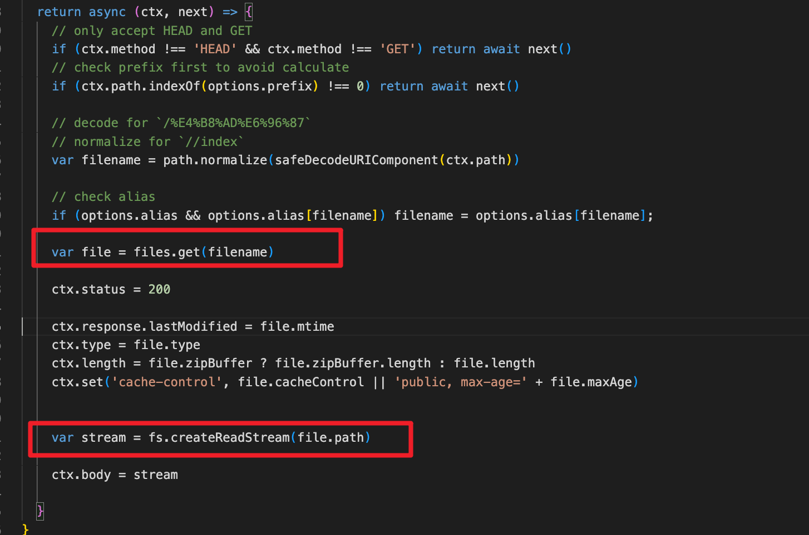
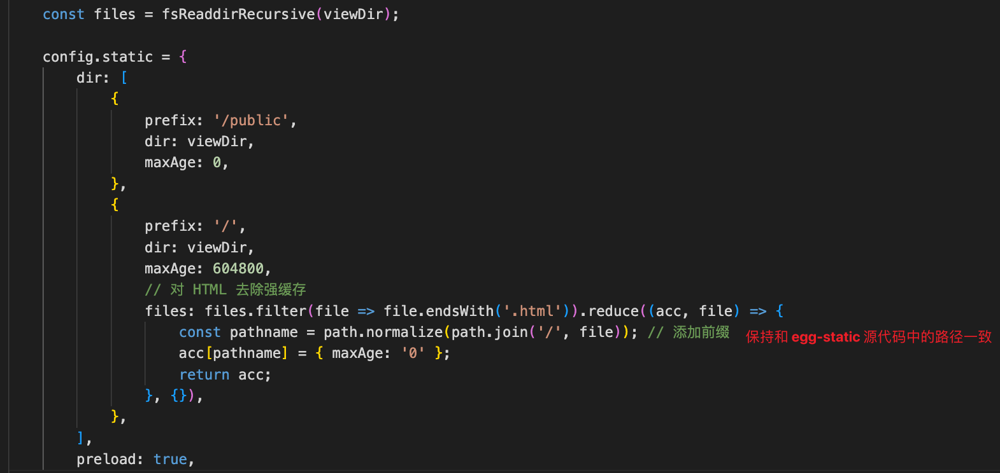
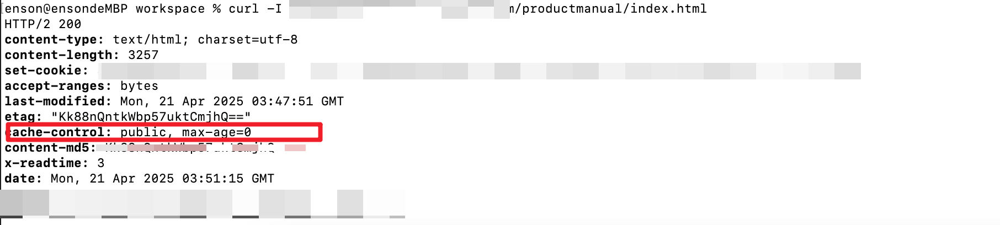

# Egg.js 服务端 HTML 强缓存问题排查与解决


## 1.问题现象与影响

某次线上更新后发现：HTML 页面内容未更新，用户浏览器反复刷新仍显示旧版本。经排查发现服务端对 HTML 文件设置了强缓存，导致浏览器直接从本地缓存加载 HTML，而未向服务器请求最新内容。

## 2.排查路径

基于请求链路，从浏览器缓存、CDN缓存、nginx 缓存、服务端缓存等多个维度进行排查。

 

### 2.1 客户端（浏览器）层面

例如通过 Service Worker 控制缓存策略

```js
// sw.js
self.addEventListener('fetch', event => {
  event.respondWith(
    caches.match(event.request).then(res => {
      return res || fetch(event.request);
    })
  );
});
```


基于此，**可以通过 curl 请求页面，发现请求头仍然存在强缓存，说明浏览器未对 HTML 设置缓存**。


### 2.2 CDN 层面

因请求 HTML 的域名并非 CDN 的域名，因此 CDN 不会对该 HTML 文件进行缓存。

### 2.3 NGINX 层面

检查了 NGINX 配置，并确认了 NGINX 配置没有对 HTML 文件进行缓存。


### 2.4 服务端层面

在服务端中，可能在业务代码的中间件、响应头以及第三方代码模块中设置了强缓存。

最终根据响应头的标识，全局搜索，最终定位到是服务器 egg-static 插件配置问题，通过 egg-static 的源码我们发现，在返回数据时，会对 HTML 文件设置强缓存的请求头。




```js

顺便一提: 在 Node 服务中，HTML 模版不应该转变成静态资源，而是应该使用 `render` 方法进行模版渲染。

```

## 3.解决方案

回归业务场景，egg-static 基于 koa-static-cache 实现，默认配置为：

```js
{
  maxAge: 31536000, // 1年缓存
  buffer: true,
  dynamic: true,
  preload: false
}
```

在 koa-static-cache 中，存在 `files` 配置，它是一个文件管理器对象，key 为文件名称，value 是文件制定配置 FileMeta，用于管理文件返回值的相关配置，其中 `maxAge` 配置用于指定缓存时间，当 `maxAge` 为 0 时，表示不缓存。

源码连接: https://github.com/eggjs/koa-static-cache/blob/master/src/index.ts

```ts

export interface FileMeta {
  maxAge?: number;
  cacheControl?: string;
  buffer?: Buffer;
  zipBuffer?: Buffer;
  type?: string;
  mime?: string;
  mtime?: Date;
  path?: string;
  md5?: string;
  length?: number;
}

```

在源码中，会先执行 loadFile 方法，获取文件的配置，然后根据配置返回文件内容。（LoadFile --> 获取文件配置项 --> 根据配置返回文件内容）






基于此，可以配置 `files` 配置，将 HTML 文件的 `maxAge` 设置为 0，去除强缓存。




最终修改后，我们通过 curl 请求页面，发现请求头已经没有强缓存了。




## 4.总结

通过以上排查，最终定位到是服务器 egg-static 插件配置问题，导致 HTML 文件被缓存。

基于此，可以通过 egg-static 中的 files 配置，对 HTML 文件进行缓存控制。


