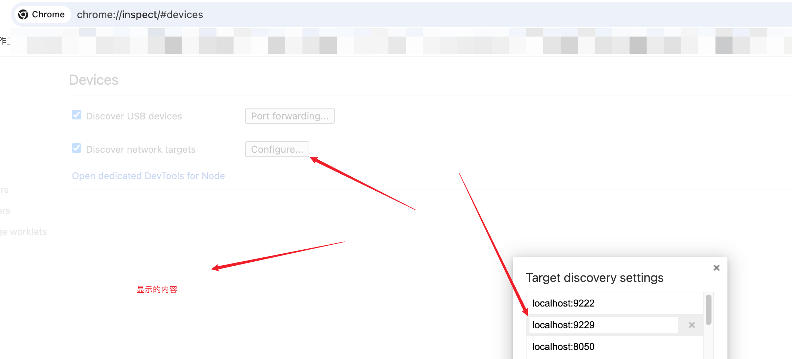
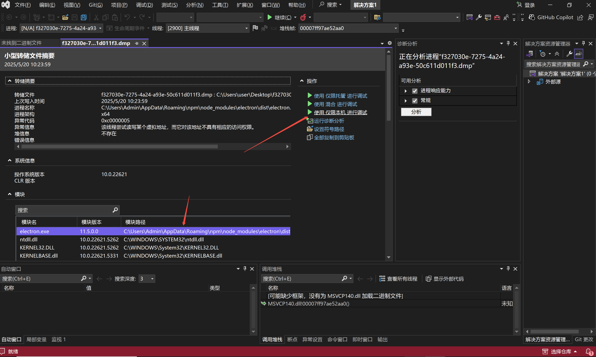
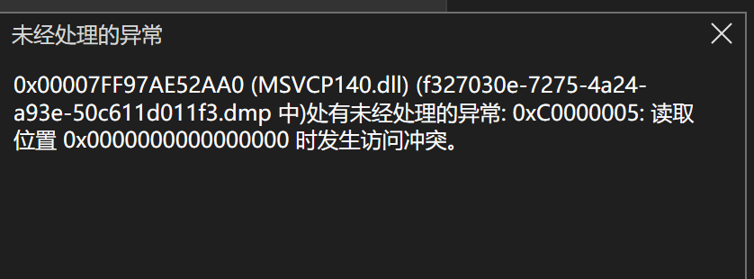
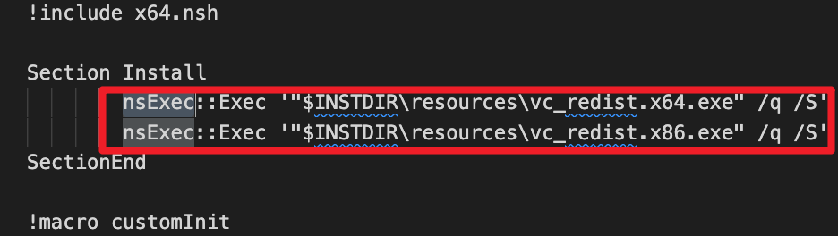

# Electron 黑屏问题排查与解决


## 背景

在风和日丽的下午，小C 正在愉快的敲着代码，突然接到一个用户反馈，说在他的 Windows 机器上打开 Electron 应用就直接白屏了。

小 C 一脸蒙蔽，这怎么可能呢？因为小 C 的 Windows 机器上安装了 Electron 应用，并且可以正常运行。

在疑惑之际，小 C 决定还是排查一下这个问题，毕竟用户反馈了，总不能不解决吧。


## 如何调试 Electron 应用

在定位问题之前，我们需要知道如何调试 Electron 应用。

### 调试主进程

为了提供一个可以调试主进程的方法，Electron 提供了 --inspect 和 --inspect-brk 开关。

--inspect=[port]

Electron 将监听指定 port 上的 V8 调试协议消息， `外部调试器` 需要连接到此端口上。 port 默认为 9229。

```shell
electron --inspect=9229 [app.exe]
```

--inspect-brk=[port]

与 --inspect 类似，但会在第一行暂停执行，直到调试器连接。


#### 这里提到了一个概念，`外部调试器`，什么是外部调试器？

外部调试器是指一个独立的工具，用于连接到 Electron 应用的调试协议。例如我们的 Chrome DevTools 就是外部调试器。

通过访问 `chrome://inspect` 来连接并在那里选择需要检查的 Electron 应用程序。

 


### 调试渲染进程

可以通过编程的方式在 BrowserWindow 的 webContents中调用openDevTool()API来打开它们：👇

```Js
const { BrowserWindow } = require('electron');

const win = new BrowserWindow({...params});
win.webContents.openDevTools();
```


### V8 崩溃

如果V8环境崩溃的话, DevTools 将显示以下信息👇

`
DevTools was disconnected from the page.（DevTools 与页面断开连接） Once page is reloaded, DevTools will automatically reconnect.（页面重新载入后，DevTools 将自动重新连接）
`

传入 --enable-logging 将导致日志打印到 stderr。 传递 --enable-logging=file 将导致日志被保存到指定的文件内, 通过 --log-file=指定目录, 或者如果用户数据目录 --log-file 没有指定则直接存放到 electron_debug.log.


### crashReporter 收集主进程、渲染进程崩溃

通过 `crashReporter` 可以收集崩溃信息，并发送给开发者。

```Js
const { crashReporter } = require('electron');

crashReporter.start({
  productName: 'Your Product Name',
  companyName: 'Your Company Name',
  submitURL: '',
  uploadToServer: false,
});
```

通过这段代码，我们可以收集到崩溃信息，生成 .dmp 文件

通过 Visual Studio (C++ 编辑器) 打开 .dmp 文件，可以获取到崩溃信息。

## Electron 白屏问题的可能原因

有了前面的知识储备后，小C 迫不及待的开始分析起了 Electron 白屏可能的原因。

Electron 应用白屏问题通常与渲染进程崩溃相关，以下是常见原因分类：

1. 原生模块依赖缺失

- 动态链接库（DLL）缺失：引用了未正确打包或系统环境未安装的 C++ 模块依赖。

- Node 原生模块未正确编译：未针对当前平台（Windows/macOS/Linux）重新编译 .node 文件。

2. 代码逻辑异常
   
- 渲染进程 JavaScript 代码存在未捕获的异常（如空指针、未定义变量）。

- 主进程与渲染进程通信中断（如 IPC 消息未正确处理）。

- 异步操作未正确处理（如未捕获的 Promise 异常）。

3. 环境兼容性问题
   
- Node.js 或 Electron 版本不兼容。

- 系统权限不足（如文件读写权限）。

- 安全软件拦截（如误判为恶意进程）。


## 问题排查

根据问题的描述，小 C 猜测是原生模块依赖缺失导致的，但不确定是在渲染进程崩溃还是主进程崩溃。

小 C 首选怀疑可能是主进程卡死 or 崩溃导致，但通过主进程的日志，小 C 并没有发现异常。

基于此，小 C 将全部页面打开 `openDevTools` 调试工具, 想通过控制台日志的信息来判断是哪个进程崩溃了。

但遗憾的事，控制台打不开。显示 `DevTools was disconnected from the page.（DevTools 与页面断开连接） Once page is reloaded, DevTools will automatically reconnect.（页面重新载入后，DevTools 将自动重新连接）`。

这里我们可以很快知道是 V8 崩溃了，但问题不得而知。

因此，小 C 决定先通过 `crashReporter` 收集崩溃信息，然后通过 Visual Studio (C++ 编辑器) 打开 .dmp 文件，获取崩溃信息。

果然，在收集的 .dmp 文件中，通过 Visual Studio (C++ 编辑器) 打开后，点击执行 `仅限本机运行调试`，小 C 发现了崩溃信息。

 


 

基于此，小 C 发现了是系统中缺少了 `MSVCP140.dll` 文件，导致 Electron 渲染进程崩溃。


## 解决方案

由于 `MSVCP140.dll` 文件是 Visual C++ Redistributable Packages的一部分，需要下载并重装来修复该问题。从 [Microsoft官方网站]( https://learn.microsoft.com/zh-cn/cpp/windows/latest-supported-vc-redist?view=msvc-170) 下载最新版本的 Visual C++ Redistributable，并在 nsis 安装程序上，安装 `vc_redist.x64.exe`、 `vc_redist.x86.exe` 文件。


 

PS: `$INSTDIR`是一个 nsis 内置变量，表示安装目录。


## 总结

至此，小 C 通过 `crashReporter` 收集崩溃信息，并生成 .dmp 文件。通过 Visual Studio (C++ 编辑器) 打开 .dmp 文件，获取崩溃信息。由于 `MSVCP140.dll` 文件是 Visual C++ Redistributable Packages的一部分，则在 安装应用的过程中，集成所需要的环境，即可解决该问题。


## 参考文章
- https://www.electronjs.org/zh/docs/latest/api/command-line-switches#--enable-loggingfile
- https://www.electronjs.org/zh/docs/latest/api/crash-reporter#%E6%96%B9%E6%B3%95
- https://answers.microsoft.com/zh-hans/windows/forum/all/%E7%94%B1%E4%BA%8E%E6%89%BE%E4%B8%8D%E5%88%B0msvcp/182ed95f-1178-4223-ad38-c18992caea57
- https://learn.microsoft.com/zh-cn/cpp/windows/latest-supported-vc-redist?view=msvc-170

