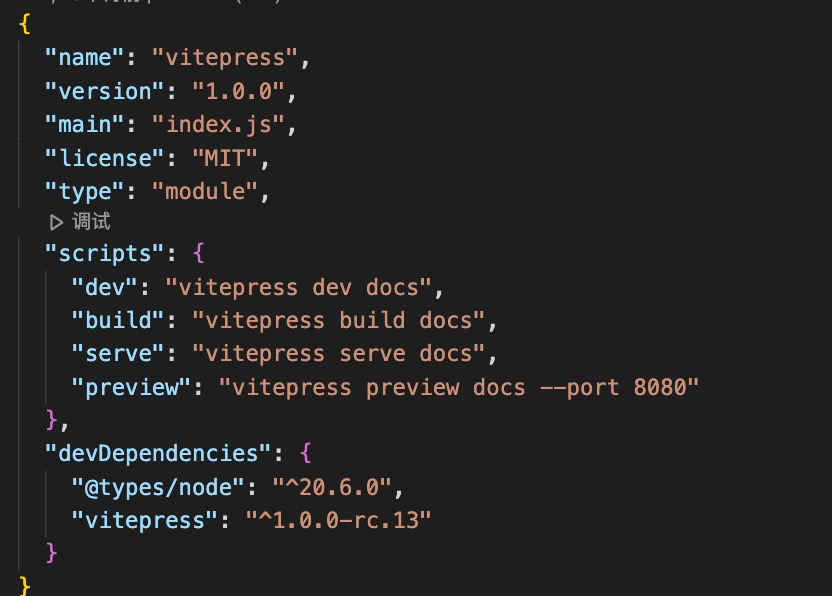
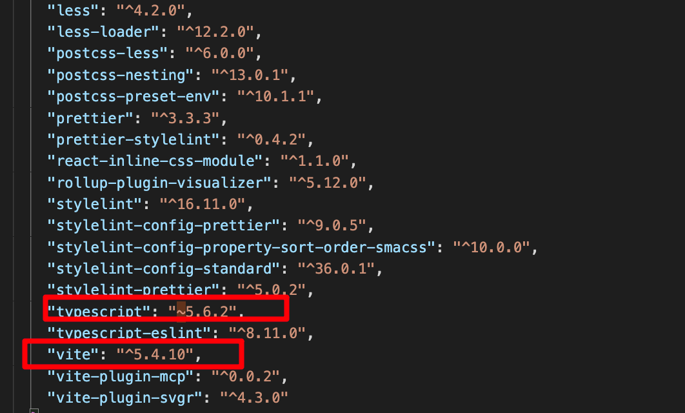
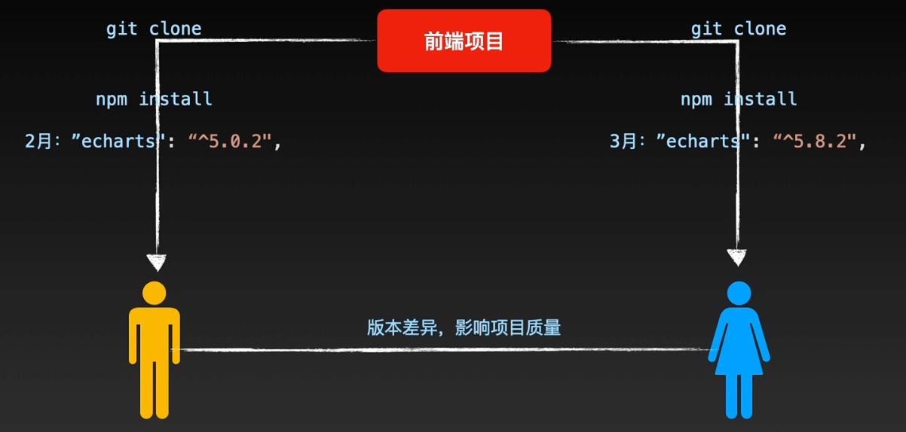
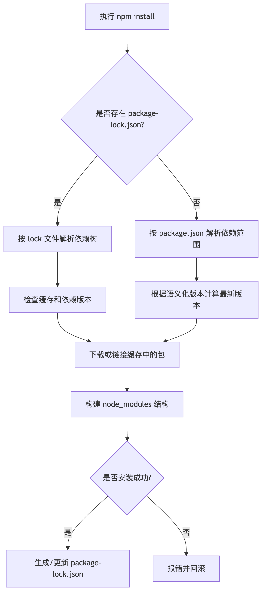

# 从 node_modules 逆向生成 package-lock.json 的救火实战


## 背景

在风和日丽的下午，小C 正在愉快的敲着代码，突然接到一个任务，说需要紧急开发一个介绍文件的下载页面，并部署到线上。

小C 询问了项目仓库地址，娴熟地拉下了代码，准备重新安装依赖时，发现项目中没有 package-lock.json 文件（心态崩了，因为这个项目 4 年前维护的，package-lock.json 文件早就被删除了，无法追溯😭）。

因开发时间有限，小C 需要尽快解决这个安装依赖问题，否则会影响到项目进度。

## 问题分析🤔

### 为什么需要 package-lock.json 文件？


在了解 package-lock.json 文件之前，先了解一下 package.json 文件，如下图所示：



在 package.json 中，依赖的版本号存在大版本、小版本、补丁版本

- 大版本：表示主版本号，表示重大更新，可能不兼容旧版本
- 次版本: 表示次版本号，表示次要更新，可能兼容旧版本
- 补丁版本：表示修订号，表示 bug 修复，可能兼容旧版本



而 `~` 表示 npm install 会安装符合补丁版本的最新版本, 例如，~1.2.3会允许安装1.2.4，但不允许1.3.0
`^` 会更加灵活一些，表示 npm install 会安装符合次版本号的最新版本, 例如，^1.2.3可以安装1.3.0，但不包括2.0.0

同归问题，当小 A 和小 C 在不同的时间安装依赖时，可能会出现不同的依赖版本，从而导致项目无法正常运行。



因此，为了保证在不同的时间安装依赖时，依赖版本的一致性，需要使用 package-lock.json 文件。

### 回归业务场景

目前这个 4 年前项目中没有 package-lock.json 文件，如果随意安装最新的版本，可能导致版本不一致，无法确保项目正常稳定地运行。

在焦头烂额之际，小C 突然发现生产环境的容器里面存在 node_modules 文件夹，并确认了构建时的 Node 版本。

小C 灵机一动，如果从生产环境的容器里面拷贝 node_modules 文件夹，基于 node_modules 生成 package-lock.json 文件，是否可以解决这个问题呢？

小C 说干就干，拷贝了 node_modules 文件夹，并安装了依赖，项目成功运行了。

### 通过 node_modules 文件生成 package-lock.json

#### 生成初始 lock 文件

```shell
npm install --package-lock-only --offline

#// --package-lock-only：不修改 node_modules
#// --offline：离线安装
```

最后将 package-lock.json 文件放入版本控制。

#### 生成 lock 文件的原理



在执行 npm install 的过程如下

1. 初始条件判断
   - 存在 package-lock.json
   - 不存在 package-lock.json
  
2. 依赖解析阶段
   npm 会递归分析每个依赖包的 dependencies、devDependencies 和 peerDependencies，形成完整的依赖树。
  
3. 缓存检查与下载
   - 检查缓存中是否存在该依赖
   - 如果存在，则直接使用缓存中的依赖
   - 如果不存在，则从 npm 仓库下载依赖
   - 下载的依赖会存储在缓存中，方便下次使用

4. node_modules 构建
   - 根据依赖树，构建 node_modules 目录结构
  
5. lock 文件生成/更新


归回业务场景，小C 拷贝了生产环境的 node_modules 文件夹，在执行 npm install 时，因存在缓存包，复用了 node_modules 文件夹，进而生成了和生产环境依赖版本一致的 package-lock.json 文件，确保了项目正常运行。


## 总结

在没有 package-lock.json 文件的情况下，在确保 Node 版本一致的情况下，可以通过执行 `npm install --package-lock-only --offline` 命令，基于 node_modules 文件夹，生成 package-lock.json 文件，确保项目正常运行。


