# 构图技巧

## 点构图

### 中心点构图

将主题放在中心，突出主题

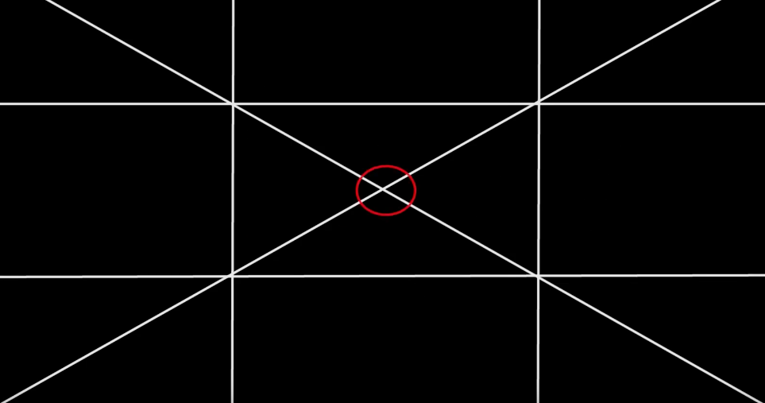

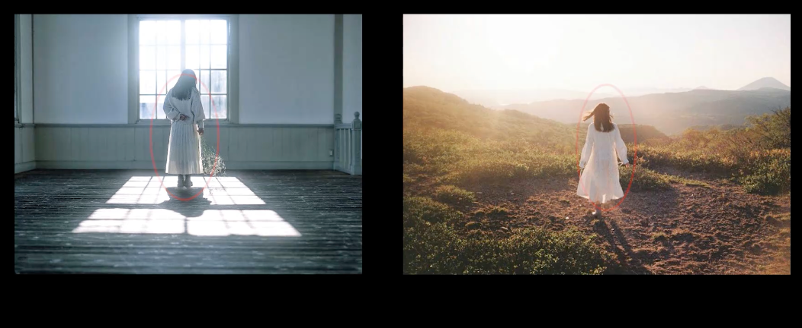

### 三分点构图

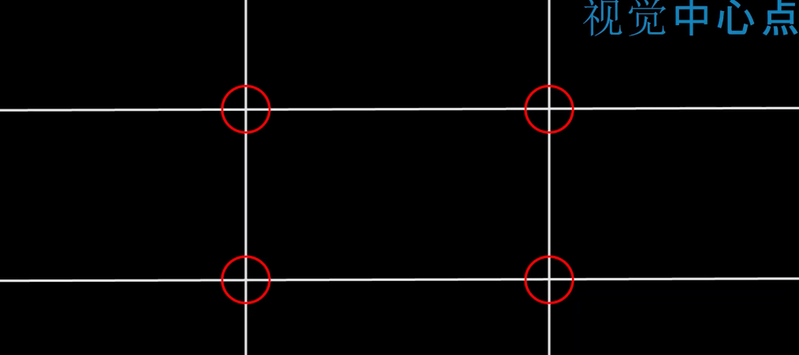

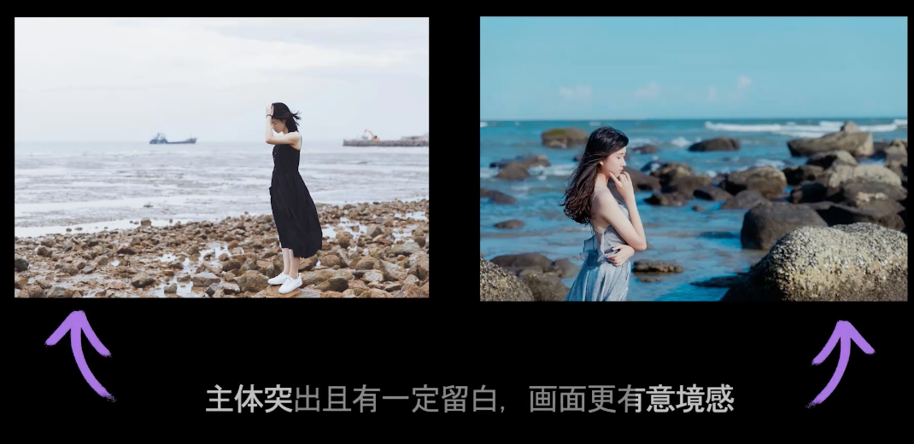

## 线构图

### 对称线构图

可以展示对称的秩序感，常用于风光、风光 + 人文
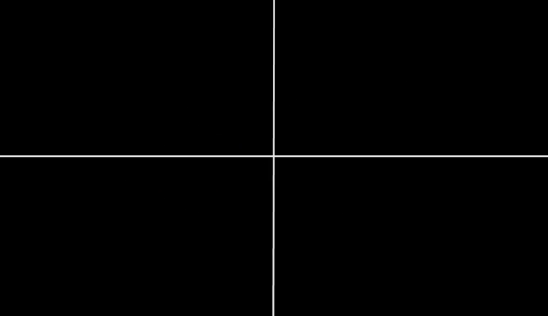

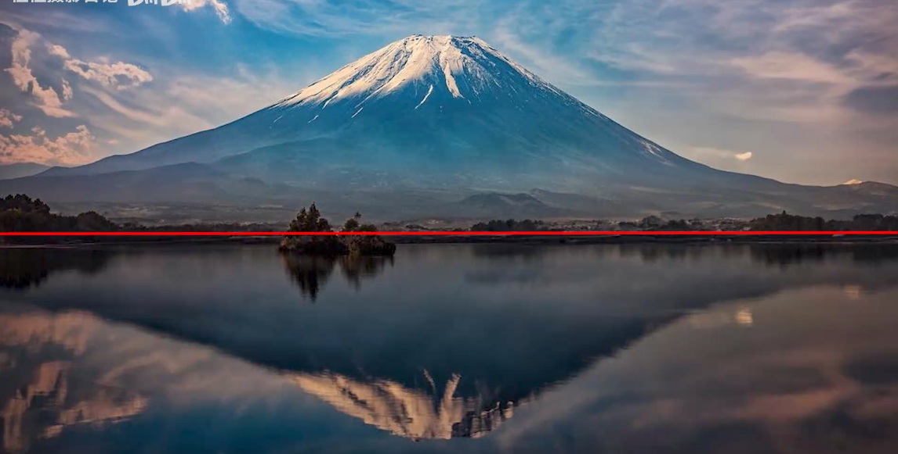

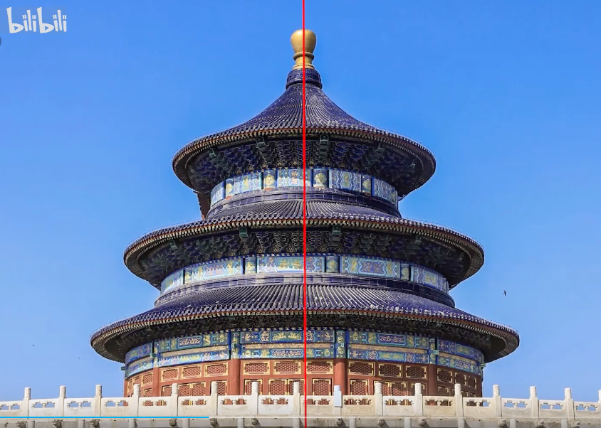

### 对角线构图

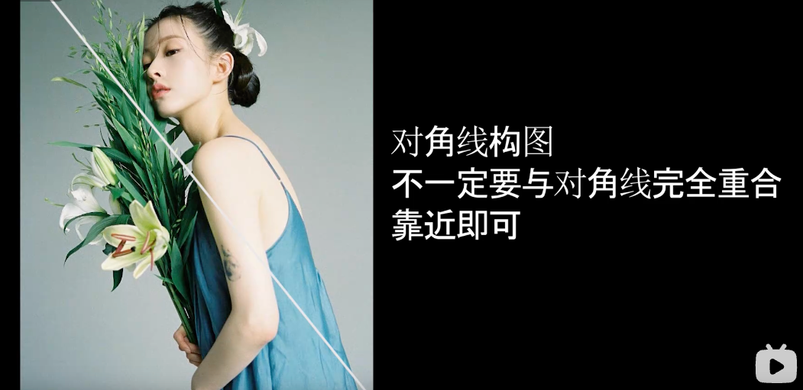

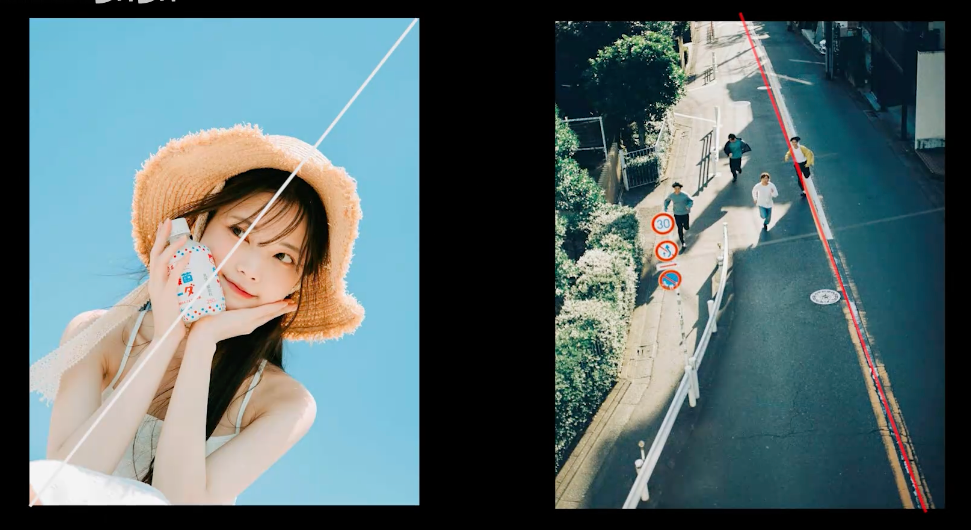

### 引导线构图

充分利用场景中的线条，用于引导观者的注意力落在主体上，并让画面产生深度和透视感
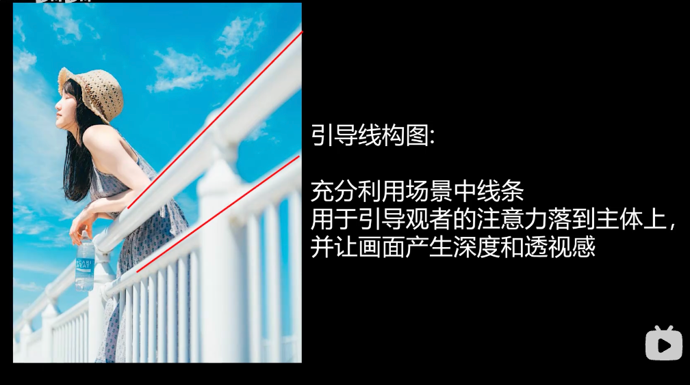

## 面构图

### 前景构图

例如通过树叶、花草、植物等做前景

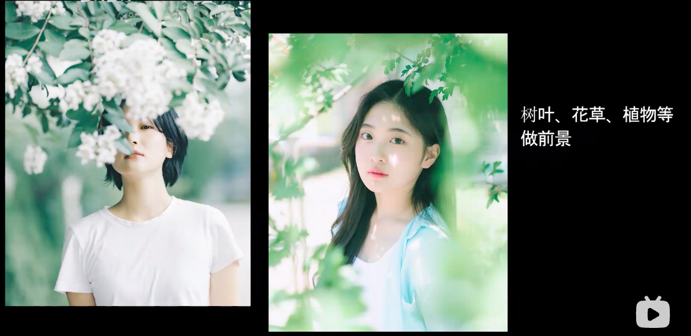

### 框架构图

拍摄中利用框架将主体框起来，突出主体

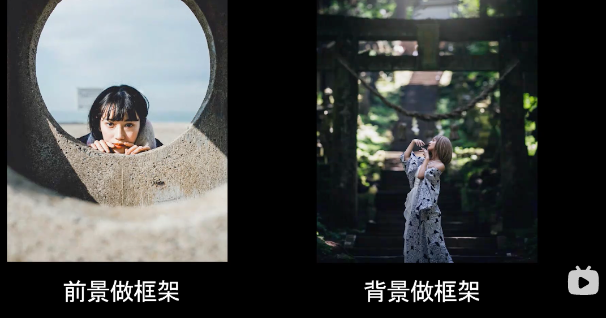

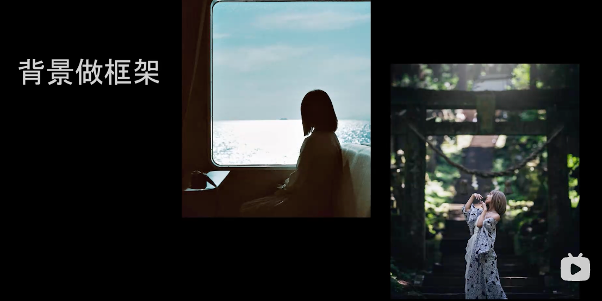

### 留白构图

留有空白，让画面更加简洁，突出主题

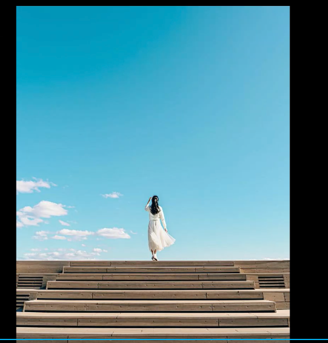