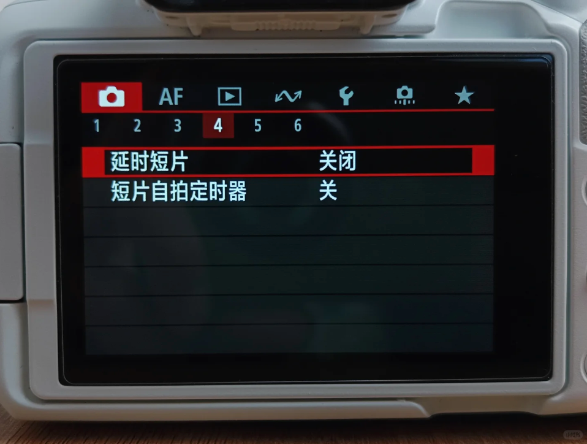
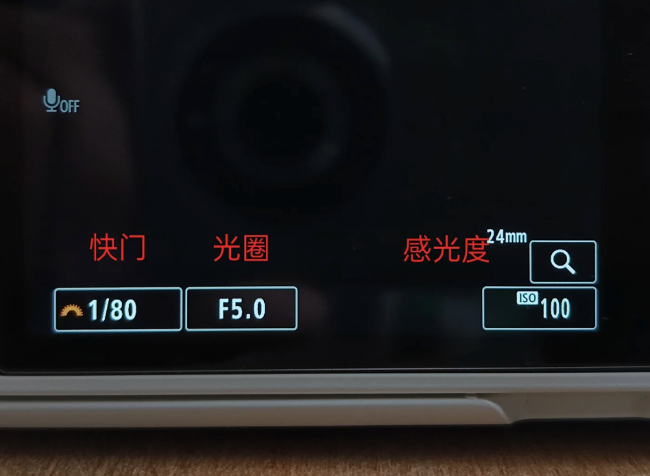
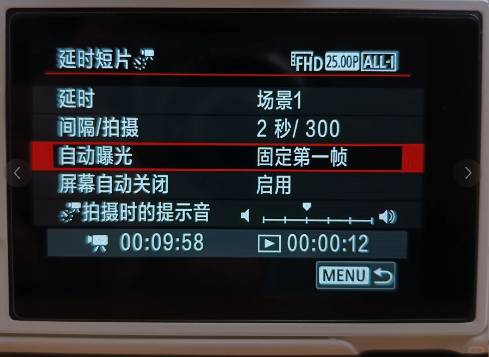

# 延迟摄影

## 如何拍摄

1. 调节到视频模式
2. 打开 Menu 菜单，在第一大项的第4小项中找到延时短片，打开这一功能。之后，回到主屏幕，我们发现左上角摄影机图标旁多出了一个时针图案和一组4位数字，这代表延时摄影已打开成功，准备进入拍摄。
 

3. 此时，主屏幕下方的三个参数均可手动调整，从左到右依次是快门、光圈、感光度ISO
 

4. 自动曝光设置
固定第一帧: 固定第一帧指的是延时短片将始终以第一帧曝光的参数拍摄下去，中途不会发生改变，适用于光源亮度变化不大的场景
每一帧: 延时短片将由相机依据环境光线的变化，自动测光来决定每一帧的曝光值，适用于光源有较大改变的场景，如日转夜或夜转日 (ISO 感光度要设置成 AUTO)

## 参考文章
1. https://www.xiaohongshu.com/explore/651389a3000000001e023777