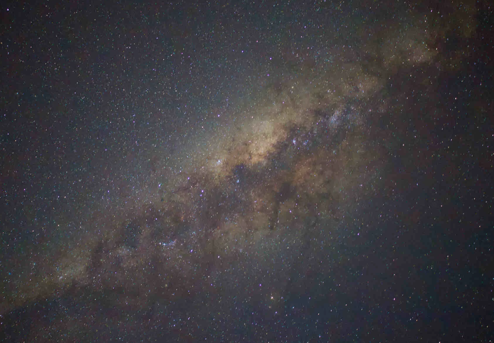
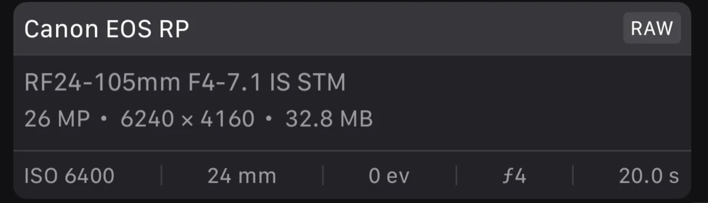

# 拍摄星空

大光圈、感光度、长曝光，这是拍摄星空的三大要素。

## 大光圈
f1.8

## 感光度
ISO：2000 以上（感光度越大、图片越亮，但也容易出现噪点）

## 手动对焦
手动对焦到某一颗星星上，然后锁定对焦

## 长曝光
快门速度 10秒以上，
连续拍10张以上后期堆栈（拍得多更好）

## 脚架
需要使用三脚架

 

 

## 参考文章
1. https://www.xiaohongshu.com/explore/6507b277000000001e02de1a